[TOC]

# 第1章 课程介绍

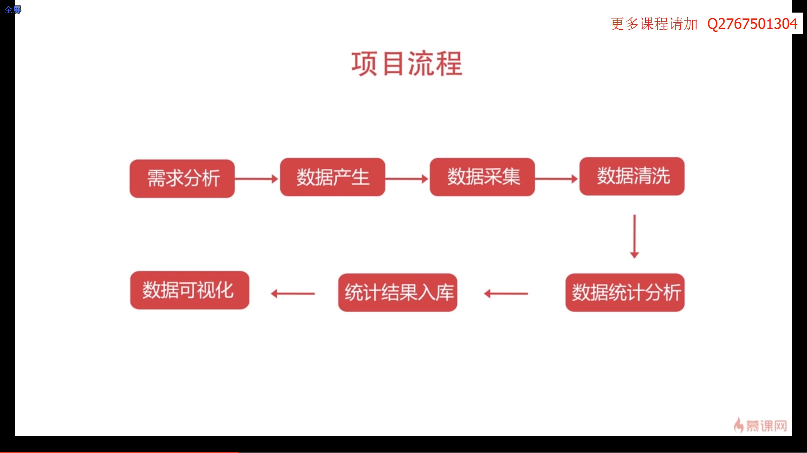

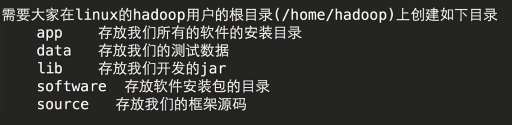

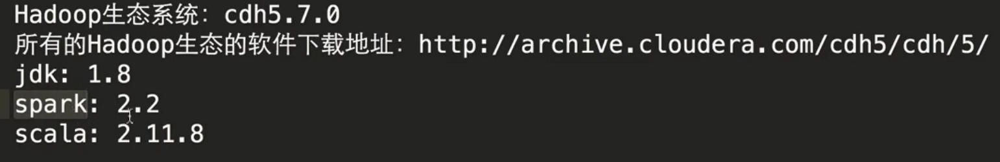

## Spark版本升级

[网址](http://spark.apache.org/docs/latest/building-spark.html)

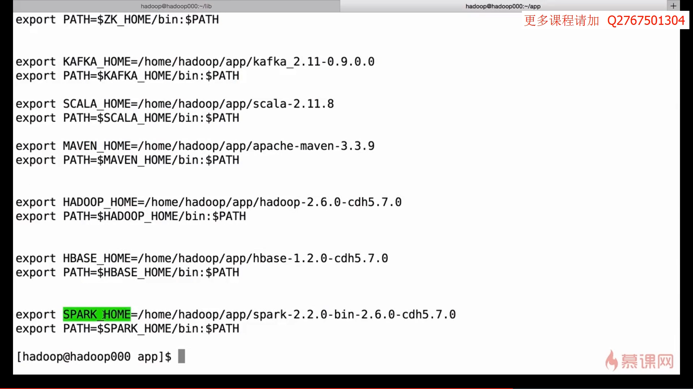

# 第2章 初识实时流处理

## 一、业务现状分析

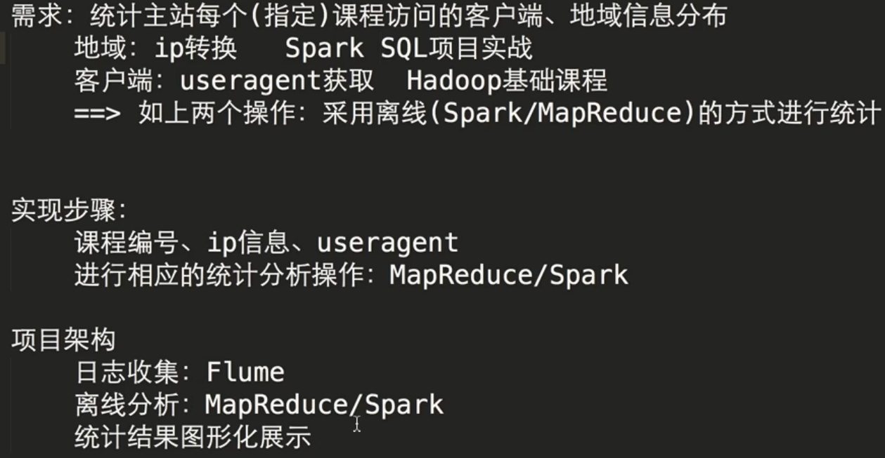

## 二、离线与实时对比

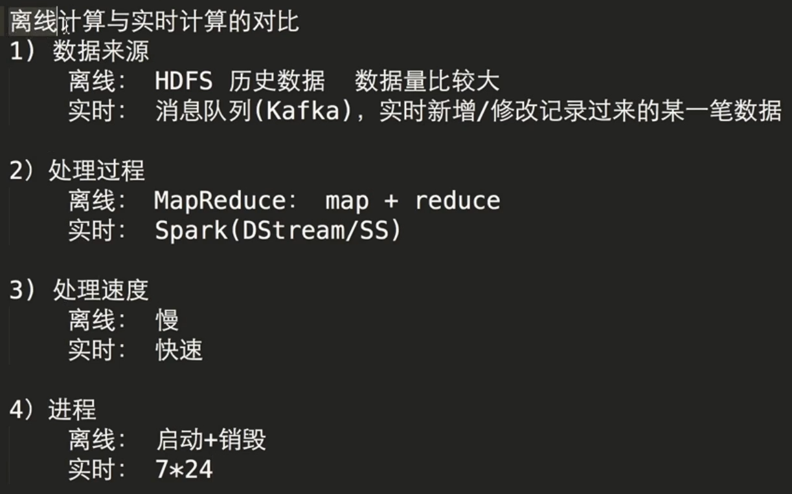

## 三、框架对比

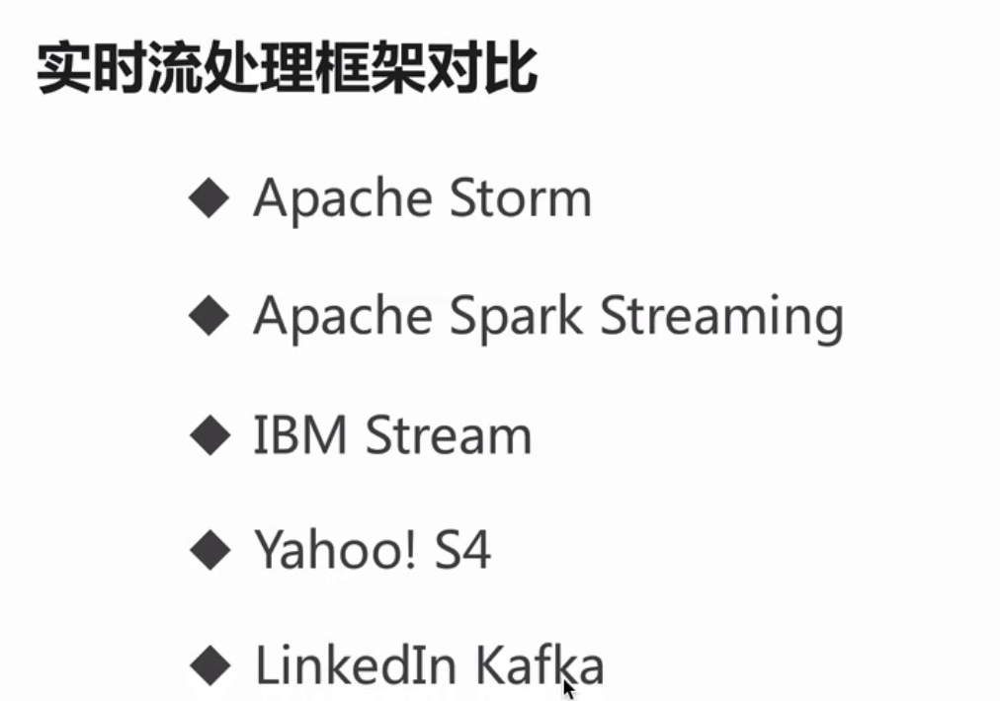

## 四、架构与技术选型

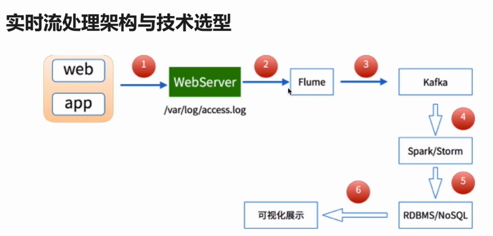

## 五、应用


# 第3章 分布式日志收集框架Flume

## 一、业务现状分析

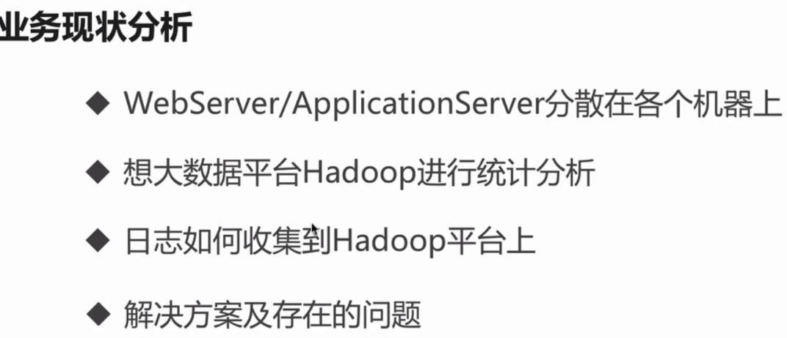

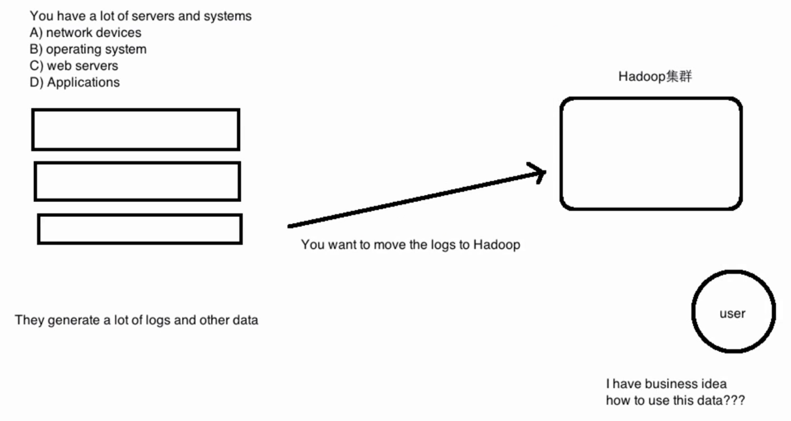

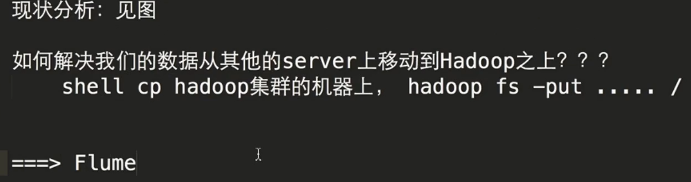

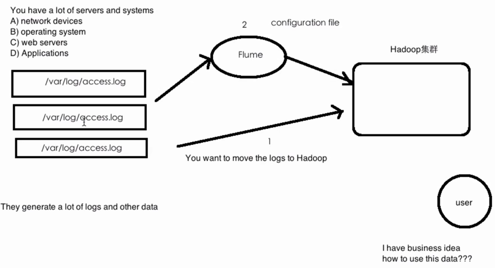

## 二、Flume架构及核心组件

[官网](http://flume.apache.org/FlumeUserGuide.html)

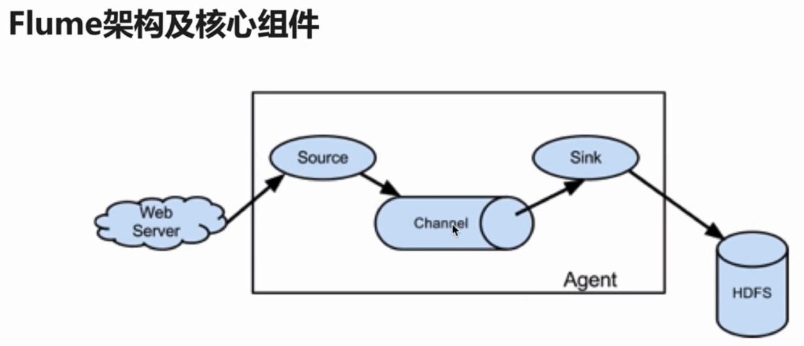


## 三、Flume&JDK环境部署

### 1.前置条件

```
Java Runtime Environment - Java 1.8 or later
Memory - Sufficient memory for configurations used by sources, channels or sinks
Disk Space - Sufficient disk space for configurations used by channels or sinks
Directory Permissions - Read/Write permissions for directories used by agent
```

### 2.安装Flume

[下载](http://archive.cloudera.com/cdh5/cdh/5/)

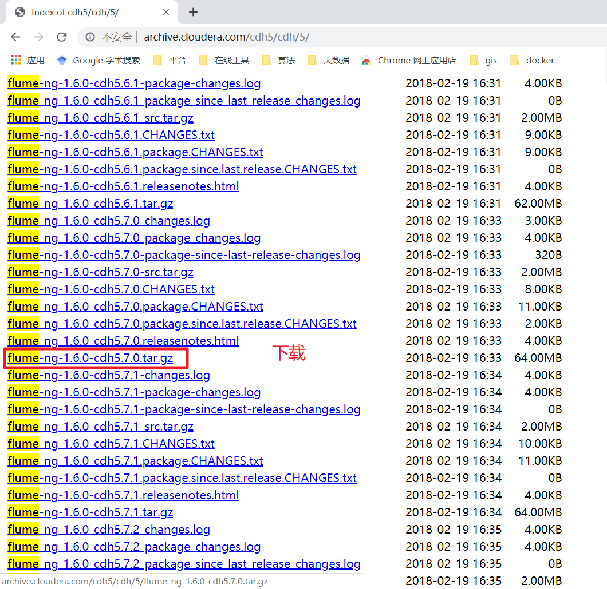

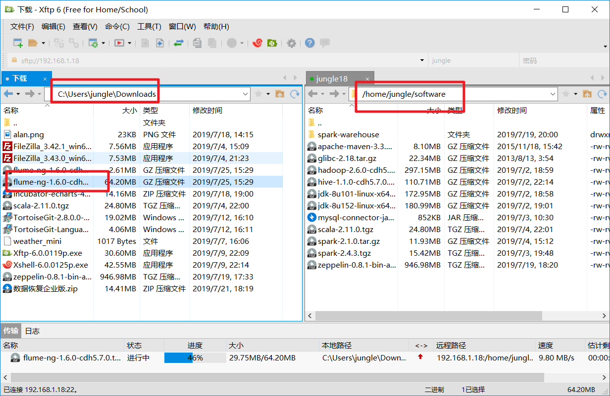

+ 解压

  ```
  tar -zvxf flume-ng-1.6.0-cdh5.7.0.tar.gz -C ~/app/
  ```

+ 配置环境变量

  ```
  cd
  vi .bash_profile
  ```

  ```
  export FLUME_HOME=/home/jungle/app/apache-flume-1.6.0-cdh5.7.0-bin
  export PATH=$FLUME_HOME/bin:$PATH  
  ```

  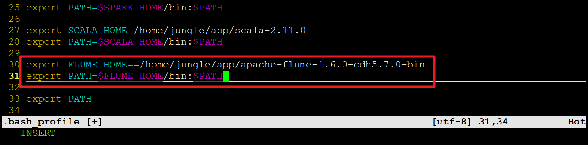

  ```
  source .bash_profile
  ```

+ 配置conf

  ```
  cd $FLUME_HOME
  cd conf/
  ```

  ```
  cp flume-env.sh.template flume-env.sh
  vi flume-env.sh
  ```

  ```
  export JAVA_HOME=/home/jungle/app/jdk1.8.0_152 
  ```

  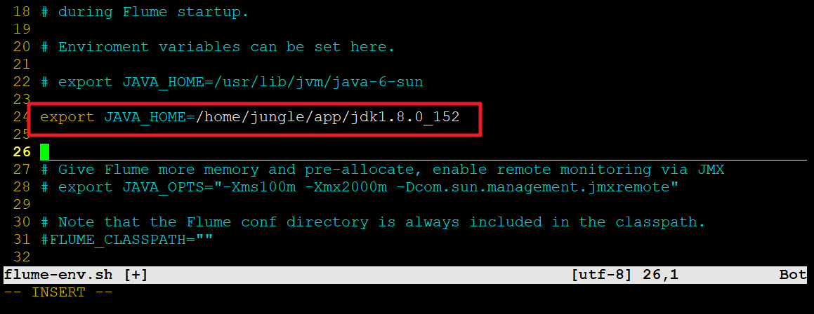

  ```
  cd $FLUME_HOME/bin
  flume-ng version
  ```

  ==检测==

  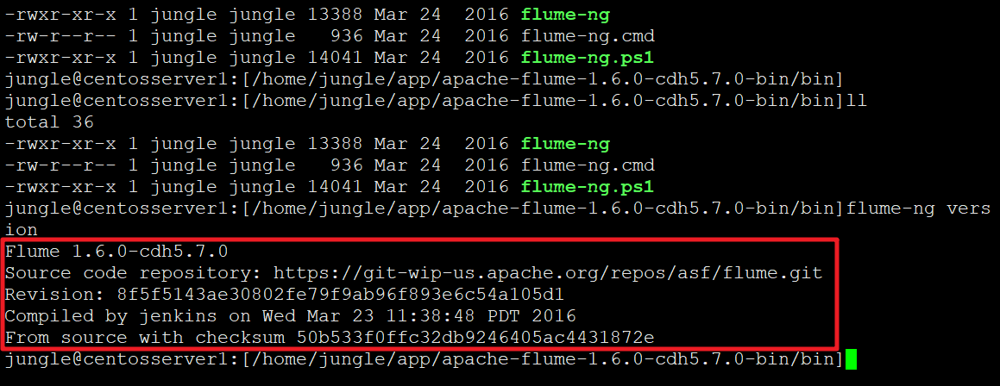

## 四、Flume实战

### 1.案例一


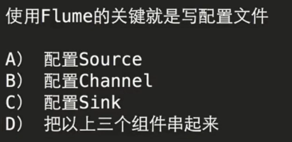


```
# example.conf: A single-node Flume configuration

# Name the components on this agent
a1.sources = r1
a1.sinks = k1
a1.channels = c1

# Describe/configure the source
a1.sources.r1.type = netcat
a1.sources.r1.bind = localhost
a1.sources.r1.port = 44444

# Describe the sink
a1.sinks.k1.type = logger

# Use a channel which buffers events in memory
a1.channels.c1.type = memory

# Bind the source and sink to the channel
a1.sources.r1.channels = c1
a1.sinks.k1.channel = c1
```

+ 配置

  ```
  cd $FLUME_HOME/conf
  vi example.conf
  ```

  ```
  # Name the components on this agent
  a1.sources = r1
  a1.sinks = k1
  a1.channels = c1
  
  # Describe/configure the source
  a1.sources.r1.type = netcat
  a1.sources.r1.bind = localhost
  a1.sources.r1.port = 44444
  
  # Describe the sink
  a1.sinks.k1.type = logger
  
  # Use a channel which buffers events in memory
  a1.channels.c1.type = memory
  
  # Bind the source and sink to the channel
  a1.sources.r1.channels = c1
  a1.sinks.k1.channel = c1
  ```

  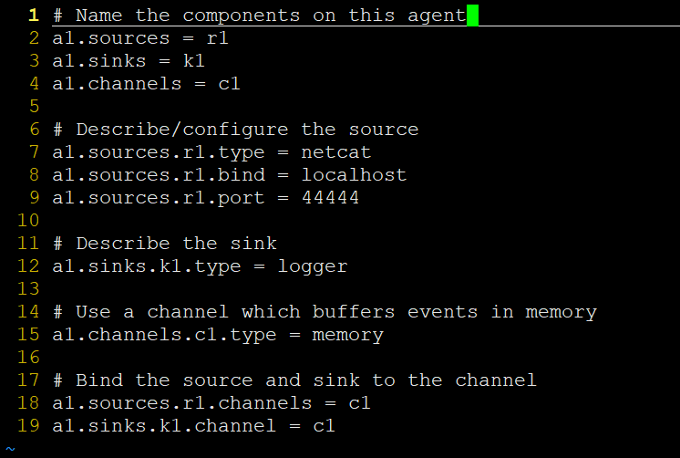

+ 启动agent

  ```
  flume-ng agent \
  --name a1 \
  --conf $FLUME_HOME/conf \
  --conf-file $FLUME_HOME/conf/example.conf \
  -Dflume.root.logger=INFO,console
  ```

  

  ==使用telnet进行测试==：`telnet localhost 44444`

  > 另开一个终端

  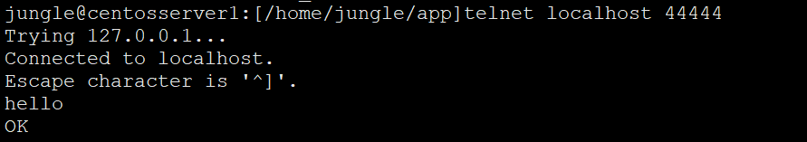

  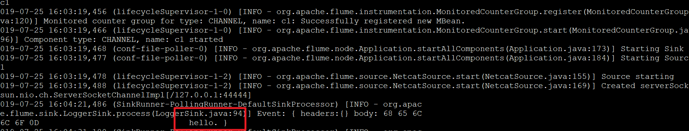

  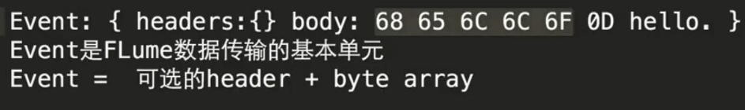

### 2.案例二


==需求二==

> Agent选型：exec source + memory channel + logger sink

​	

```
cd $FLUME_HOME/conf
vi exec-memory-logger.conf
```


```
# Name the components on this agent
a1.sources = r1
a1.sinks = k1
a1.channels = c1

# Describe/configure the source
a1.sources.r1.type = exec
a1.sources.r1.command = tail -F /home/jungle/data/data.log
a1.sources.r1.shell = /bin/sh -c

# Describe the sink
a1.sinks.k1.type = logger

# Use a channel which buffers events in memory
a1.channels.c1.type = memory

# Bind the source and sink to the channel
a1.sources.r1.channels = c1
a1.sinks.k1.channel = c1
```

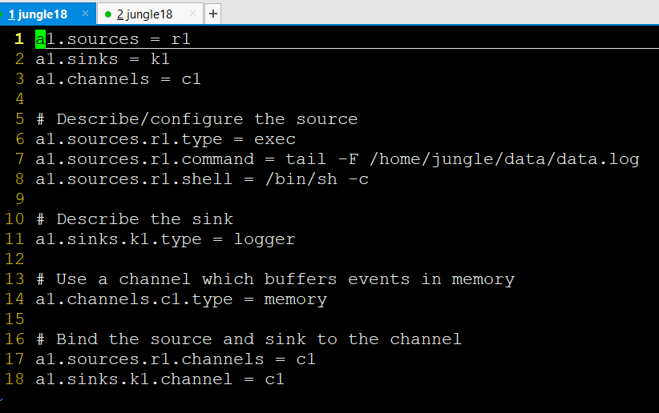

```
flume-ng agent \
--name a1 \
--conf $FLUME_HOME/conf \
--conf-file $FLUME_HOME/conf/exec-memory-logger.conf \
-Dflume.root.logger=INFO,console
```

==测试==

```
echo hello >>data.log 
echo world >>data.log 
echo world >>data.log 
```

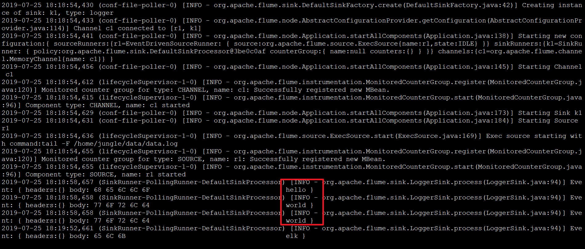

### 3.案例三

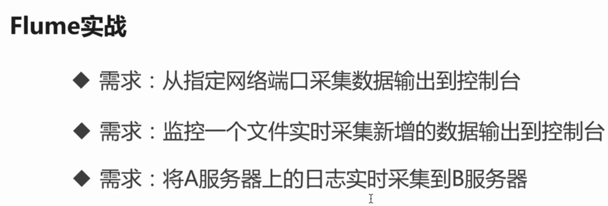

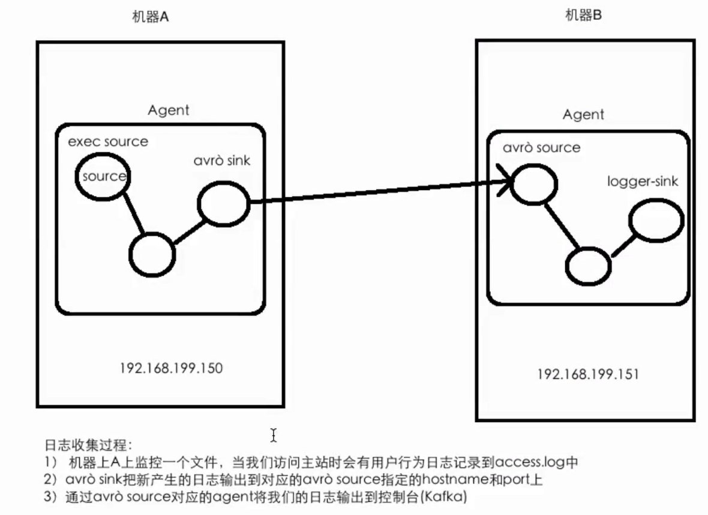

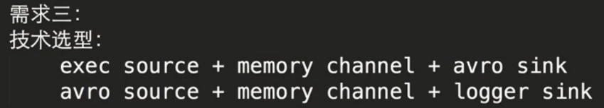

```
cd $FLUME_HOME/conf
vi exec-memory-avro.conf
```

==exec-memory-avro.conf==

```
exec-memory-avro.sources = exec-source
exec-memory-avro.sinks = avro-sink
exec-memory-avro.channels = memory-channel

exec-memory-avro.sources.exec-source.type = exec
exec-memory-avro.sources.exec-source.command = tail -F /home/jungle/data/data.log
exec-memory-avro.sources.exec-source.shell = /bin/sh -c

exec-memory-avro.sinks.avro-sink.type = avro
exec-memory-avro.sinks.avro-sink.hostname = centosserver1
exec-memory-avro.sinks.avro-sink.port = 44444

exec-memory-avro.channels.memory-channel.type = memory

exec-memory-avro.sources.exec-source.channels = memory-channel
exec-memory-avro.sinks.avro-sink.channel = memory-channel
```


```
cd $FLUME_HOME/conf
vi avro-memory-logger.conf
```

==avro-memory-logger.conf==

```
avro-memory-logger.sources = avro-source
avro-memory-logger.sinks = logger-sink
avro-memory-logger.channels = memory-channel

avro-memory-logger.sources.avro-source.type = avro
avro-memory-logger.sources.avro-source.bind = centosserver1
avro-memory-logger.sources.avro-source.port = 44444

avro-memory-logger.sinks.logger-sink.type = logger


avro-memory-logger.channels.memory-channel.type = memory

avro-memory-logger.sources.avro-source.channels = memory-channel
avro-memory-logger.sinks.logger-sink.channel = memory-channel
```

==先启动avro-memory-logger==

```
flume-ng agent \
--name avro-memory-logger \
--conf $FLUME_HOME/conf \
--conf-file $FLUME_HOME/conf/avro-memory-logger.conf \
-Dflume.root.logger=INFO,console
```

==然后启动exec-memory-avro==

```
flume-ng agent \
--name exec-memory-avro \
--conf $FLUME_HOME/conf \
--conf-file $FLUME_HOME/conf/exec-memory-avro.conf \
-Dflume.root.logger=INFO,console
```

==测试==

```
echo jungle >> data.log
```

# 第4章 分布式发布订阅消息系统Kafka

## 一、Kafka概述

[官网](http://kafka.apache.org/)

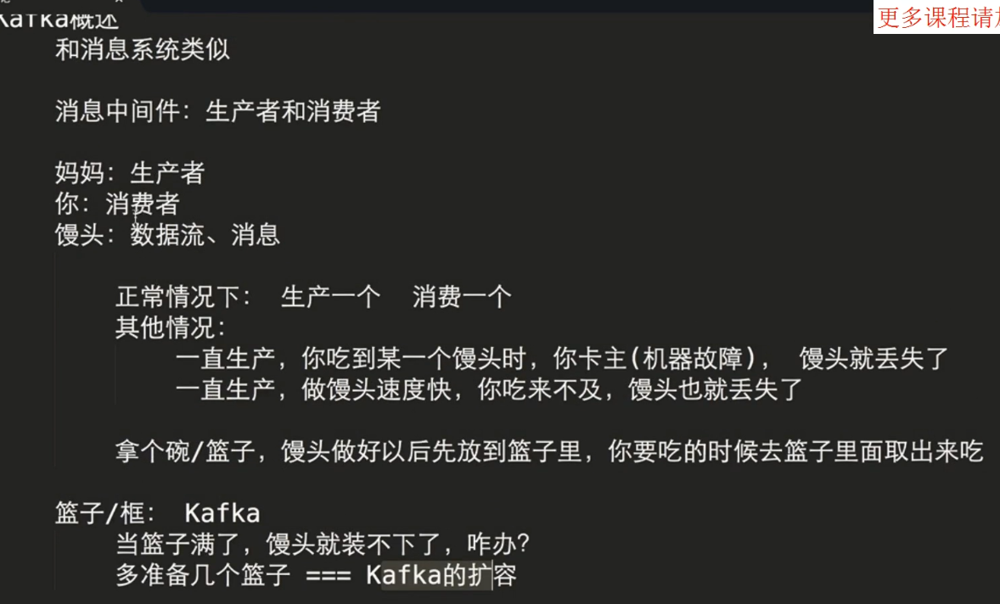

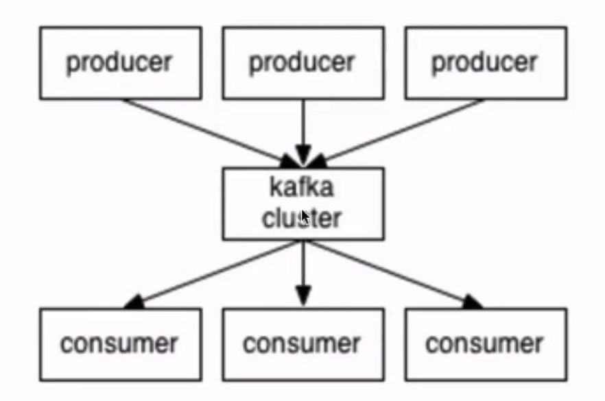

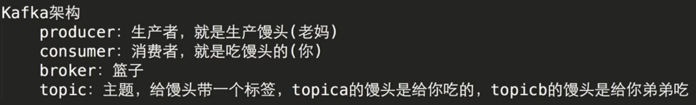

## 二、Kafka单节点单Broker部署

### 1.Zookeeper安装

+ [下载](http://archive.cloudera.com/cdh5/cdh/5/)

  ```
  cd software
  wget http://archive.cloudera.com/cdh5/cdh/5/zookeeper-3.4.5-cdh5.7.0.tar.gz
  ```

+ 解压

  ```
  tar -zxvf zookeeper-3.4.5-cdh5.7.0.tar.gz -C ~/app/
  ```

+ 配置环境变量

  ```
  vi ~/.bash_profile
  ```

  ```
  export ZK_HOME=/home/jungle/app/zookeeper-3.4.5-cdh5.7.0
  export PATH=$ZK_HOME/bin:$PATH  
  ```

  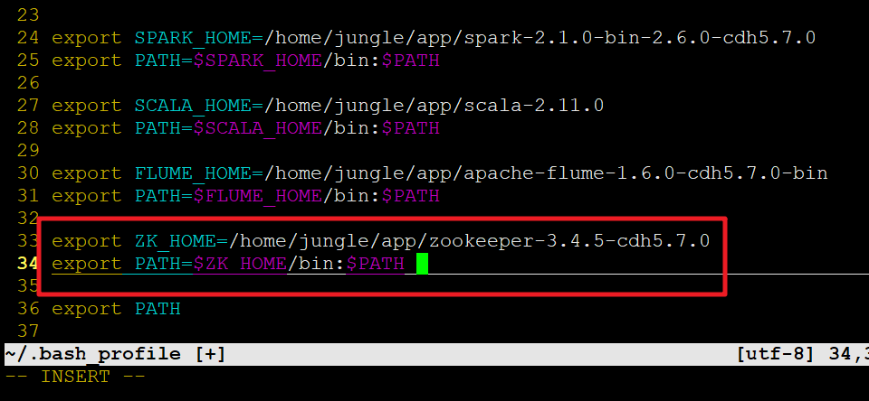

  ```
  source ~/.bash_profile
  ```

+ 配置文件

  ```
  cd $ZK_HOME/conf
  cp zoo_sample.cfg zoo.cfg
  vi zoo.cfg
  ```
```
   dataDir=/home/jungle/app/tmp/zk
```
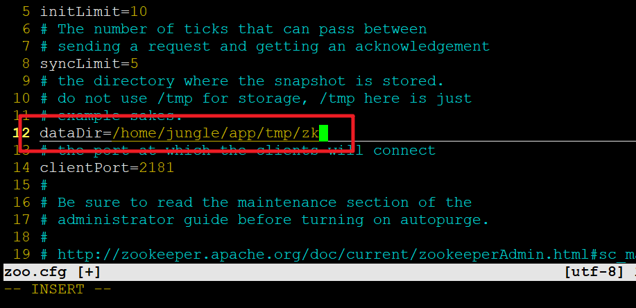
+ 启动

  ```
 cd $ZK_HOME/bin
  ./zkServer.sh start
  ```
==验证==

```
 jps
```

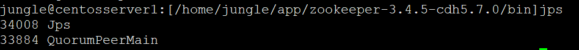
+ 连接

```
./zkCli.sh
```

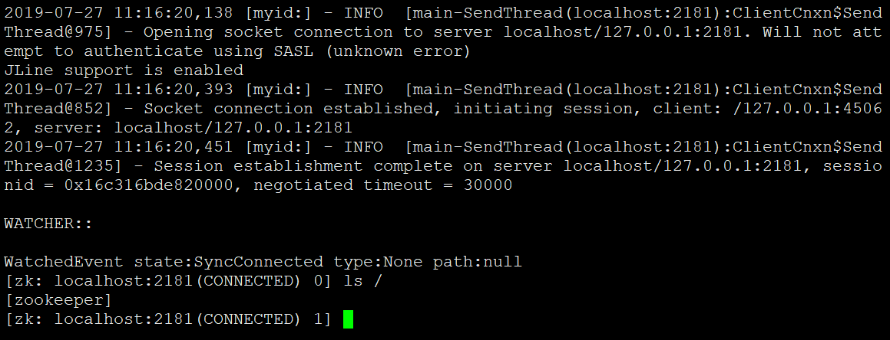

### 2.单节点单broker的部署及使用

+ 下载kafka

  [下载地址](http://kafka.apache.org/downloads)

  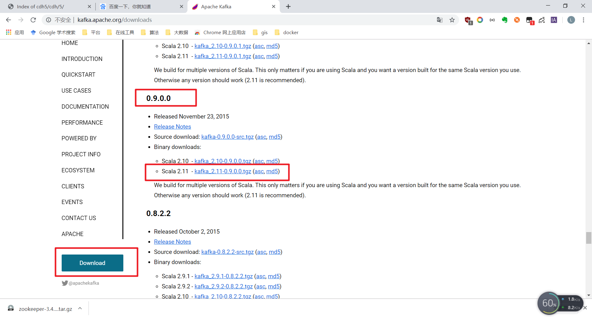

  ```
 wget https://archive.apache.org/dist/kafka/0.9.0.0/kafka_2.11-0.9.0.0.tgz
  ```
+ 解压

  ```
  tar -zxvf kafka_2.11-0.9.0.0.tgz -C ~/app/
  ```
+ 配置环境变量

  ```
  vi ~/.bash_profile
  ```
  ```
  export KAFKA_HOME=/home/jungle/app/kafka_2.11-0.9.0.0
  export PATH=$KAFKA_HOME/bin:$PATH 
  ```
​    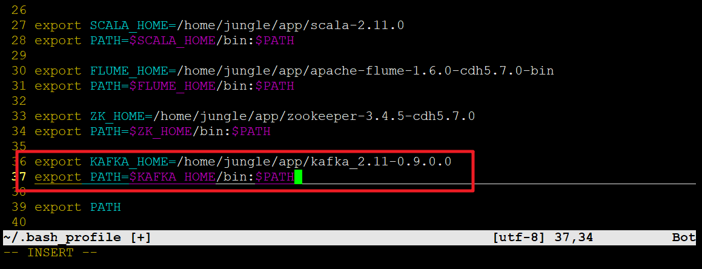
  ```
 source ~/.bash_profile
  ```
+ 修改配置文件

  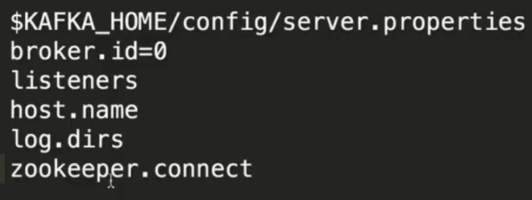

  ```
  cd $KAFKA_HOME/config
  vi server.properties
  ```
  ```
  host.name=centosserver1
  ```
 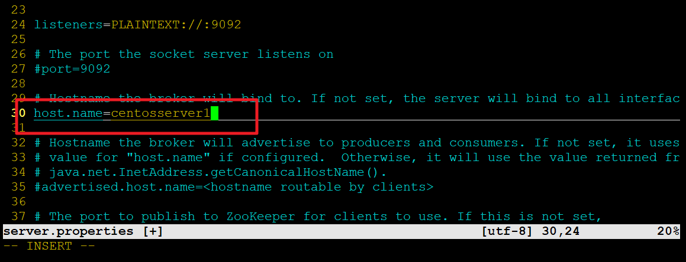
  ```
 log.dirs=/home/jungle/app/tmp/kafka-logs
  ```
 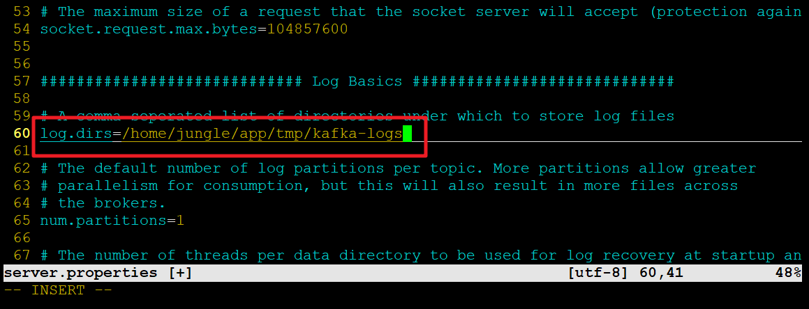
  ```
 zookeeper.connect=centosserver1:2181
  ```
  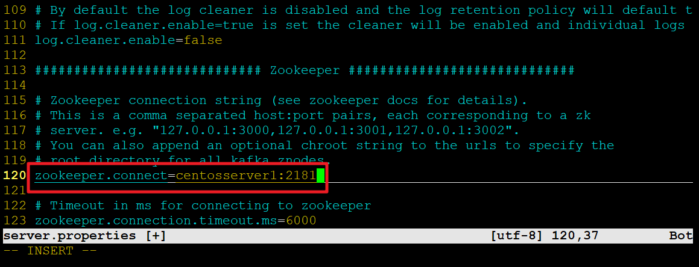

+ 启动kafka

   ==之前要先启动zookeeper==

  ```
cd $KAFKA_HOME/bin
  kafka-server-start.sh $KAFKA_HOME/config/server.properties 
  ```
  ```
  jps
  jps -m
  ```
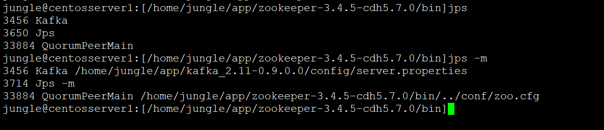

+ 创建topic

  ```
kafka-topics.sh --create --zookeeper centosserver1:2181 --replication-factor 1 --partitions 1 --topic hello_topic 
  ```
 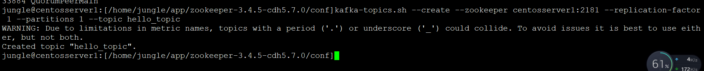

==验证==

  ```
# 查看所有topic
kafka-topics.sh --list --zookeeper centosserver1:2181
  ```
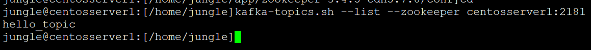

+ 生产消息

  ```
kafka-console-producer.sh --broker-list centosserver1:9092 --topic hello_topic
  ```
+ 消费消息

  ```
kafka-console-consumer.sh --zookeeper centosserver1:2181 --topic hello_topic --from-beginning
  ```
  ==--from-beginning==:表示从头开始消费

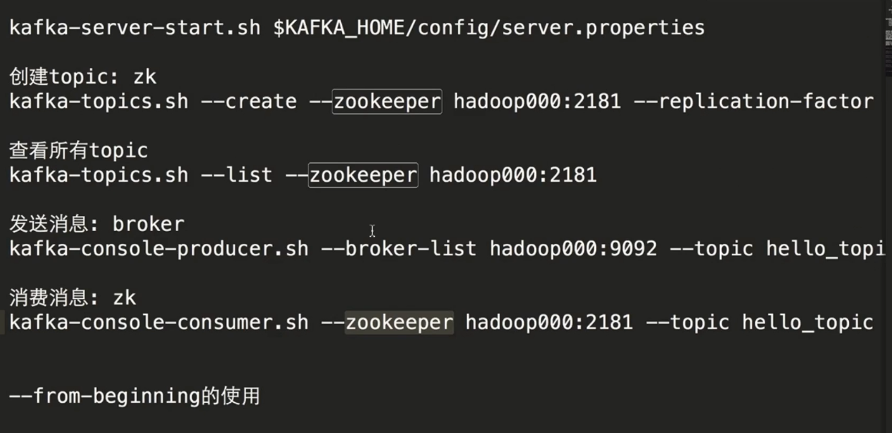

+ 查看topic的详细信息

  ```
  # 所有的topic
    kafka-topics.sh --describe --zookeeper centosserver1:2181
  ```
  ```
  # 指定的topic
    kafka-topics.sh --describe --zookeeper centosserver1:2181 --topic hello_topic
  ```
### 3.单节点多broker部署及使用

+ 复制配置文件

```
cd $KAFKA_HOME/config
cp server.properties server-1.properties
cp server.properties server-2.properties
cp server.properties server-3.properties
```

+ 修改配置文件

  ==server-1.properties==

```
vi server-1.properties
```
  ```
broker.id=1
listeners=PLAINTEXT://:9093 
log.dirs=/home/jungle/app/tmp/kafka-logs-1 
  ```
==server-2.properties==

```
vi server-2.properties
```

```
broker.id=2
listeners=PLAINTEXT://:9094
log.dirs=/home/jungle/app/tmp/kafka-logs-2 
```
 ==server-3.properties==
  ```
vi server-3.properties
  ```
  ```
broker.id=3
listeners=PLAINTEXT://:9095
log.dirs=/home/jungle/app/tmp/kafka-logs-3
  ```
 + 启动

   ==-daemon==：后台启动

  ```
kafka-server-start.sh -daemon $KAFKA_HOME/config/server-1.properties & 
kafka-server-start.sh -daemon $KAFKA_HOME/config/server-2.properties & 
kafka-server-start.sh -daemon $KAFKA_HOME/config/server-3.properties &
  ```
  ```
 jps -m
  ```
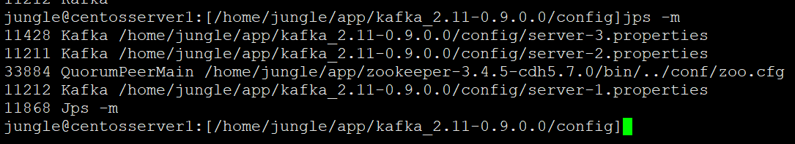

+ 创建topic

  ```
kafka-topics.sh --create --zookeeper centosserver1:2181 --replication-factor 3 --partitions 1 --topic my-replicated-topic
  ```
+ 查看topic

  ```
  # 查看所有topic
  kafka-topics.sh --list --zookeeper centosserver1:2181
  ```


+ 生产消息

  ```
kafka-console-producer.sh --broker-list centosserver1:9093,centosserver1:9094,centosserver1:9095 --topic my-replicated-topic
  ```
+ 消费消息

  ```
 kafka-console-consumer.sh --zookeeper centosserver1:2181 --topic my-replicated-topic
  ```
 ==可以开启多个==、

## 三、Kafka容错性测试

+ 查看指定topic的详细信息

  ```
kafka-topics.sh --describe --zookeeper centosserver1:2181 --topic my-replicated-topic
  ```
 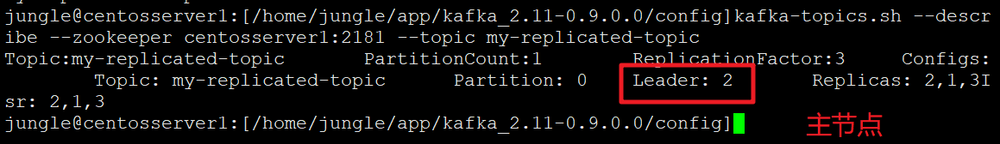

 ==2为主节点==

+ 干掉主节点

```
 jps -m  
```
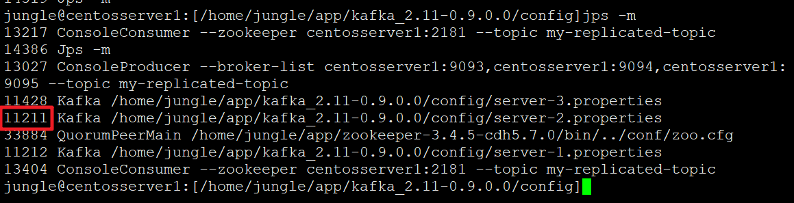
  ```
kill -9 11211
jps -m 
  ```
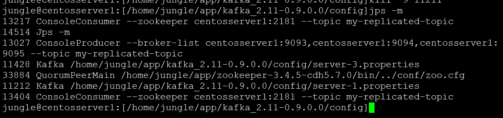

 ==结果==

  还是一样可以运行的

  ```
 kafka-topics.sh --describe --zookeeper centosserver1:2181 --topic my-replicated-topic
  ```
   

  ==1变成了主节点==

## 四、使用IDEA+Maven构建开发环境

+ 新建项目

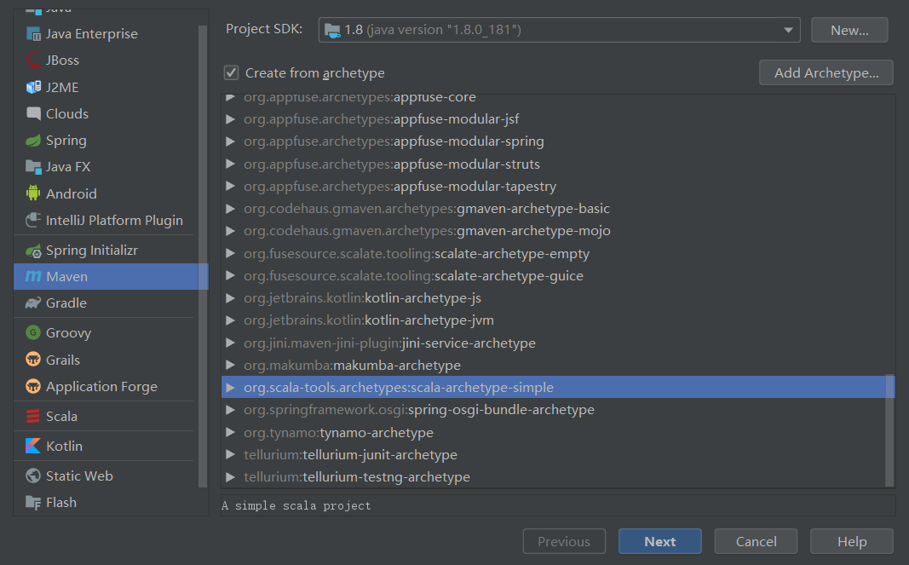

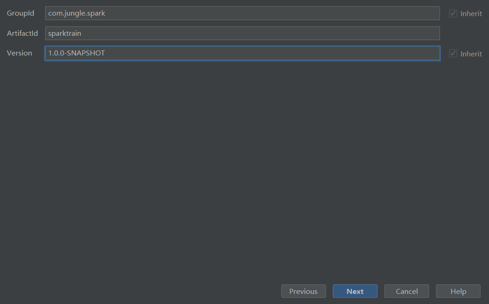

+ 修改pom.xml文件

  ```xml
<properties>
      <scala.version>2.11.8</scala.version>
    </properties>
  ```

+ 引入依赖

  ```xml
  <!-- https://mvnrepository.com/artifact/org.apache.kafka/kafka -->
      <dependency>
        <groupId>org.apache.kafka</groupId>
        <artifactId>kafka_2.11</artifactId>
        <version>0.9.0.0</version>
      </dependency>
  ```

  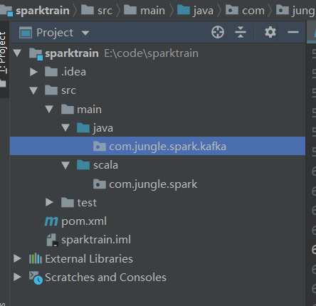

## 五、Kafka  Java API编程

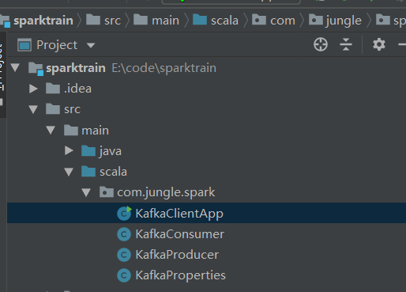

### 1.Producer

#### (1)提供端

+ Kafka常用配置文件

  ```java
  package com.jungle.spark;
  
  /**
   * Kafka常用配置文件
   */
  public class KafkaProperties {
  
      public static final String ZK = "192.168.1.18:2181";
  
      public static final String TOPIC = "hello_topic";
  
      public static final String BROKER_LIST = "192.168.1.18:9092";
  
      public static final String GROUP_ID = "test_group1";
  
  }
  
  ```

+ Kafka生产者

  ```java
  package com.jungle.spark;
  
  import kafka.javaapi.producer.Producer;
  import kafka.producer.KeyedMessage;
  import kafka.producer.ProducerConfig;
  
  import java.util.Properties;
  
  /**
   * Kafka生产者
   */
  public class KafkaProducer extends Thread{
  
      private String topic;
  
      private Producer<Integer, String> producer;
  
      public KafkaProducer(String topic) {
          this.topic = topic;
  
          Properties properties = new Properties();
  
          properties.put("metadata.broker.list",KafkaProperties.BROKER_LIST);
          properties.put("serializer.class","kafka.serializer.StringEncoder");
          properties.put("request.required.acks","1");
  
          producer = new Producer<Integer, String>(new ProducerConfig(properties));
      }
  
  
      @Override
      public void run() {
  
          int messageNo = 1;
  
          while(true) {
              String message = "message_" + messageNo;
              producer.send(new KeyedMessage<Integer, String>(topic, message));
              System.out.println("Sent: " + message);
  
              messageNo ++ ;
  
              try{
                  Thread.sleep(2000);
              } catch (Exception e){
                  e.printStackTrace();
              }
          }
  
      }
  }
  
  ```

+ Kafka Java API测试

  ```java
  package com.jungle.spark;
  
  /**
   * Kafka Java API测试
   */
  public class KafkaClientApp {
  
      public static void main(String[] args) {
          new KafkaProducer(KafkaProperties.TOPIC).start();
  
  //        new KafkaConsumer(KafkaProperties.TOPIC).start();
  
      }
  }
  
  ```


#### (2)消费端

+ 开启zookeeper

  ```
  cd $ZK_HOME/bin
  ./zkServer.sh start
  ```

+ 开启kafka

  ```
  cd $KAFKA_HOME/bin
  kafka-server-start.sh $KAFKA_HOME/config/server.properties 
  ```

+ 消费者

  ```
  kafka-console-consumer.sh --zookeeper centosserver1:2181 --topic hello_topic
  ```

  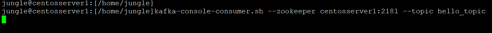

#### (3)测试

启动KafkaClientApp

==遇到报错==

```
 Exception in thread "Thread-0" kafka.common.FailedToSendMessageException: Failed to send messages after 3 tries.
```

==解决==

> 可能是防火墙的原因

查看防火墙状态

```
firewall-cmd --state
```

停掉防火墙

```
systemctl stop firewalld.service
```
禁止开机启动防火墙

```
systemctl disable firewalld.service
```

+ 解决后

  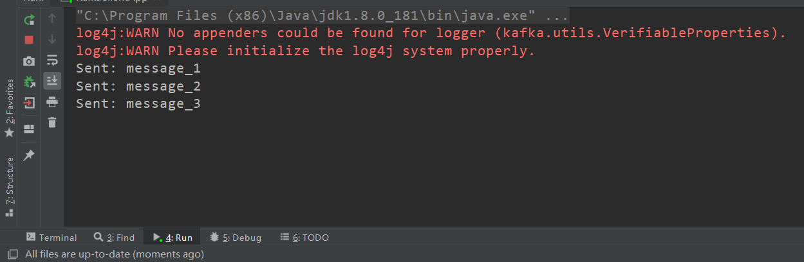

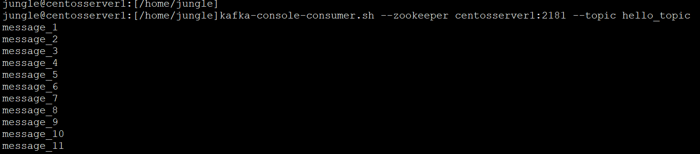

### 2.Consumer

+ Kafka消费者

  ```java
  package com.jungle.spark;
  
  import kafka.consumer.Consumer;
  import kafka.consumer.ConsumerConfig;
  import kafka.consumer.ConsumerIterator;
  import kafka.consumer.KafkaStream;
  import kafka.javaapi.consumer.ConsumerConnector;
  
  import java.util.HashMap;
  import java.util.List;
  import java.util.Map;
  import java.util.Properties;
  
  /**
   * Kafka消费者
   */
  public class KafkaConsumer extends Thread{
  
      private String topic;
  
      public KafkaConsumer(String topic) {
          this.topic = topic;
      }
  
  
      private ConsumerConnector createConnector(){
          Properties properties = new Properties();
          properties.put("zookeeper.connect", KafkaProperties.ZK);
          properties.put("group.id",KafkaProperties.GROUP_ID);
          return Consumer.createJavaConsumerConnector(new ConsumerConfig(properties));
      }
  
      @Override
      public void run() {
          ConsumerConnector consumer = createConnector();
  
          Map<String, Integer> topicCountMap = new HashMap<String, Integer>();
          topicCountMap.put(topic, 1);
  //        topicCountMap.put(topic2, 1);
  //        topicCountMap.put(topic3, 1);
  
          // String: topic
          // List<KafkaStream<byte[], byte[]>>  对应的数据流
          Map<String, List<KafkaStream<byte[], byte[]>>> messageStream =  consumer.createMessageStreams(topicCountMap);
  
          KafkaStream<byte[], byte[]> stream = messageStream.get(topic).get(0);   //获取我们每次接收到的数据
  
          ConsumerIterator<byte[], byte[]> iterator = stream.iterator();
  
  
          while (iterator.hasNext()) {
              String message = new String(iterator.next().message());
              System.out.println("rec: " + message);
          }
      }
  }
  
  ```

  + Kafka Java API测试

    ```java
    package com.jungle.spark;
    
    /**
     * Kafka Java API测试
     */
    public class KafkaClientApp {
    
        public static void main(String[] args) {
            new KafkaProducer(KafkaProperties.TOPIC).start();
    
            new KafkaConsumer(KafkaProperties.TOPIC).start();
    
        }
    }
    
    ```

    启动KafkaClientApp

    ==结果==

    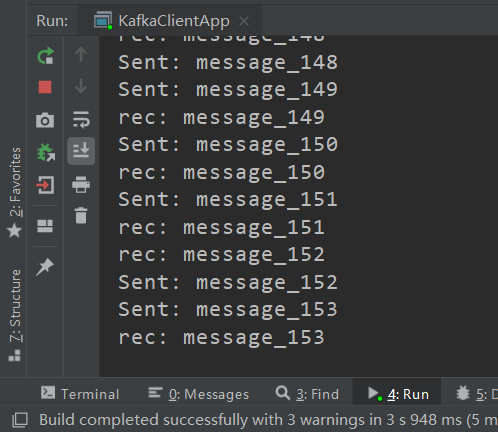

## 六、整合Flume和Kafka完成实时数据采集

### 1.架构图

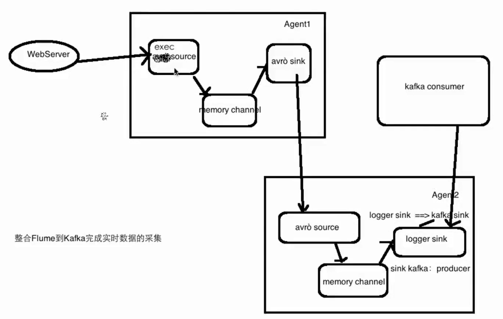

### 2.修改flume相关文件

```
cd /home/jungle/app/apache-flume-1.6.0-cdh5.7.0-bin/conf
vi avro-memory-kafka.conf
```

```
avro-memory-kafka.sources = avro-source                                                                                                     
avro-memory-kafka.sinks = kafka-sink
avro-memory-kafka.channels = memory-channel
 
avro-memory-kafka.sources.avro-source.type = avro
avro-memory-kafka.sources.avro-source.bind = centosserver1
avro-memory-kafka.sources.avro-source.port = 44444
 
avro-memory-kafka.sinks.kafka-sink.type = org.apache.flume.sink.kafka.KafkaSink
avro-memory-kafka.sinks.kafka-sink.brokerList = centosserver1:9092
avro-memory-kafka.sinks.kafka-sink.topic=hello_topic
avro-memory-kafka.sinks.kafka-sink.batchSize=5
avro-memory-kafka.sinks.kafka-sink.requiredAcks=1
 
avro-memory-kafka.channels.memory-channel.type = memory
 
avro-memory-kafka.sources.avro-source.channels = memory-channel
avro-memory-kafka.sinks.kafka-sink.channel = memory-channel
```

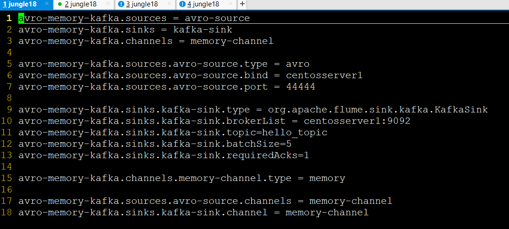

### 3.启动

1. 启动zookeeper，Kafka

2. 启动avro-memory-kafka

   ```
   flume-ng agent \
   --name avro-memory-kafka \
   --conf $FLUME_HOME/conf \
   --conf-file $FLUME_HOME/conf/avro-memory-kafka.conf \
   -Dflume.root.logger=INFO,console
   ```

3. 启动exec-memory-avro

   ```
   flume-ng agent \
   --name exec-memory-avro \
   --conf $FLUME_HOME/conf \
   --conf-file $FLUME_HOME/conf/exec-memory-avro.conf \
   -Dflume.root.logger=INFO,console
   ```

4. 测试

   ```
   jps -m
   ```

   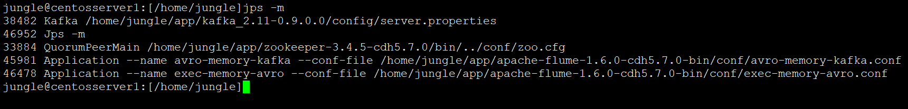

5. kafka消费端

   ```
   kafka-console-consumer.sh --zookeeper centosserver1:2181 --topic hello_topic
   ```

6. 测试传输

   ```
   cd data
   echo hellospark >>data.log
   echo hellospark1 >>data.log
   echo hellospark2 >>data.log
   ```

   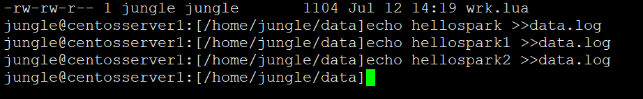

   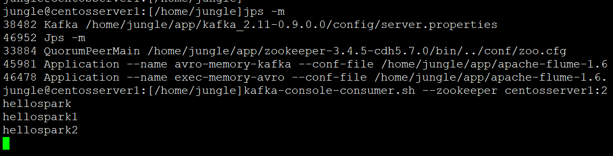

# 第5章 实战环境搭建

## 一、安装Scala、maven、hadoop

更改maven本地仓库

```
cd $MAVEN_HOME/conf
cd settings.xml
```

```
<localRepository>/home/jungle/maven_repos/</localRepository>
```

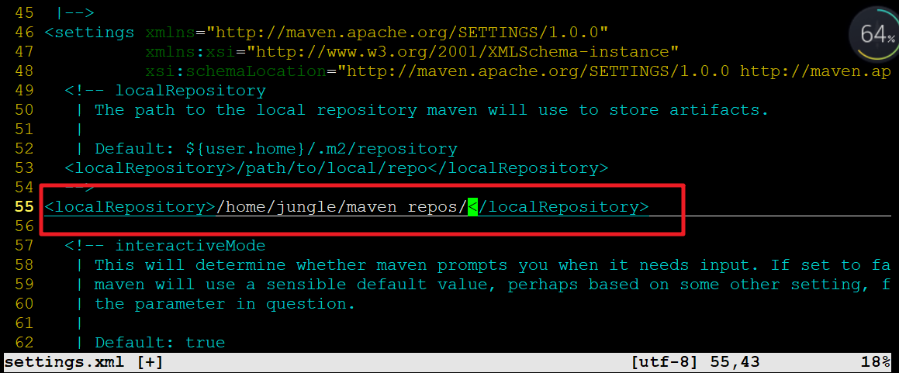

## 二、HBase安装

+ 下载

  [地址](http://archive.cloudera.com/cdh5/cdh/5/)

  ```
  wget http://archive.cloudera.com/cdh5/cdh/5/hbase-1.2.0-cdh5.7.0.tar.gz
  ```

+ 解压

  ```
  tar -zxvf hbase-1.2.0-cdh5.7.0.tar.gz -C ~/app/
  ```

+ 配置环境变量

  ```
  vi ~/.bash_profile
  ```

  ```
  export HBASE_HOME=/home/jungle/app/hbase-1.2.0-cdh5.7.0
  export PATH=$HBASE_HOME/bin:$PATH 
  ```

  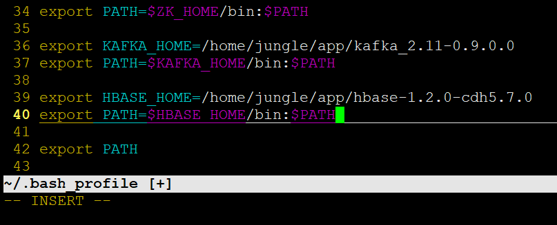

  ```
  source ~/.bash_profile
  ```

+ 配置文件

  ```
  cd $HBASE_HOME/conf
  ```

  ```
  vi hbase-env.sh
  ```

  ```
  export JAVA_HOME=/home/jungle/app/jdk1.8.0_152
  ```

  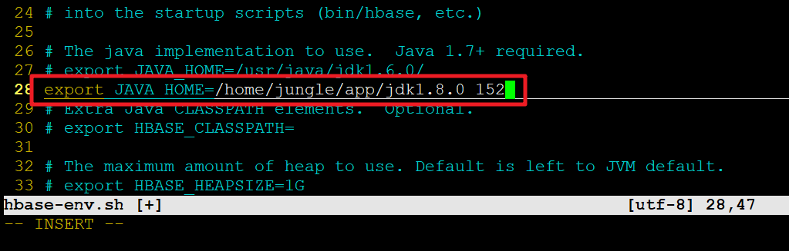

  ```
  export HBASE_MANAGES_ZK=false 
  ```

  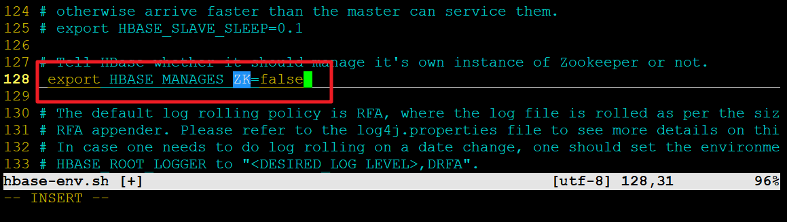

  ```
  vi hbase-site.xml
  ```

  ```xml
  <property>
  <name>hbase.rootdir</name>
  <value>hdfs://centosserver1:8020/hbase</value>
  </property>
  
  <property>
  <name>hbase.cluster.distributed</name>
  <value>true</value>
  </property>
  
  <property>
  <name>hbase.zookeeper.quorum</name>
  <value>centosserver1:2181</value>
  </property>
  ```

  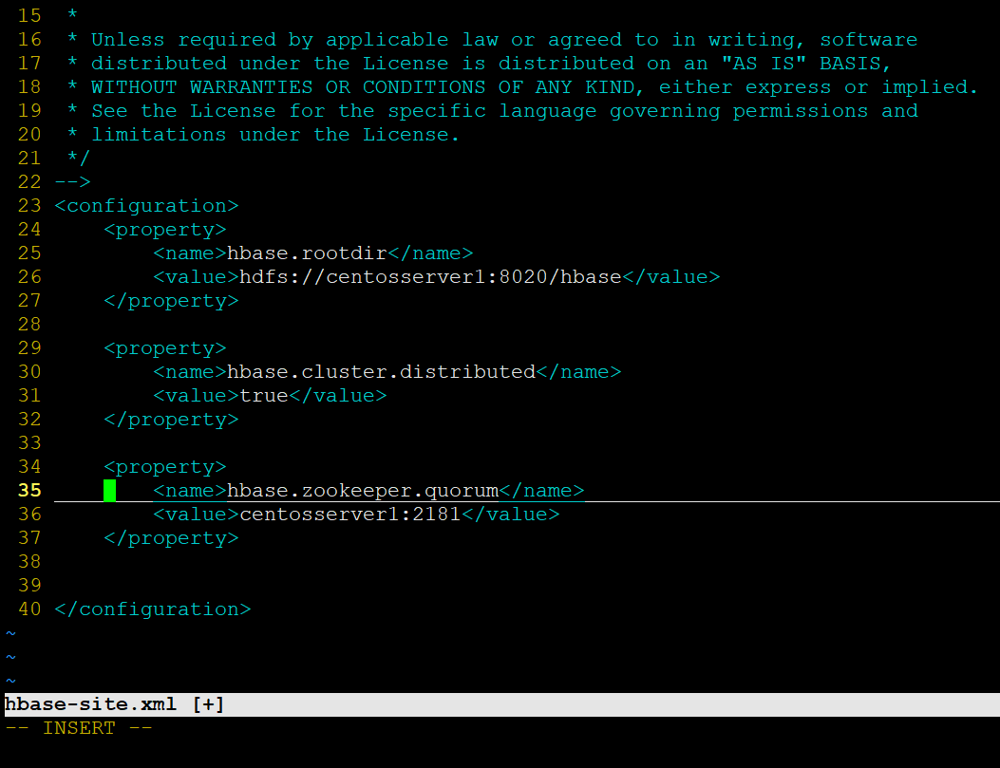

  ```
  vi regionservers
  ```

  ```
  centosserver1
  ```

  

+ 运行

  ==先启动zookeeper==

  ```
  cd $HBASE_HOME/bin
  ./start-hbase.sh
  ```

  ```
  jps
  ```

  

  ```
  http://192.168.1.18:60010
  ```

  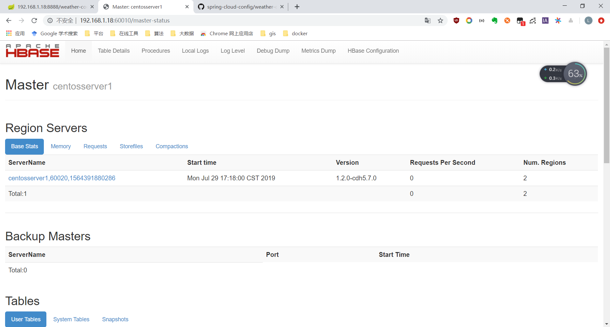

  ==启动命令行==

  ```
  cd $HBASE_HOME/bin
  ./hbase shell
  ```

  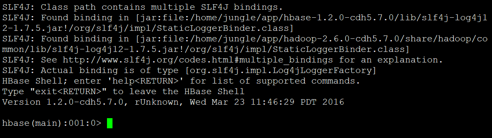

  ```
  version
  status
  ```

  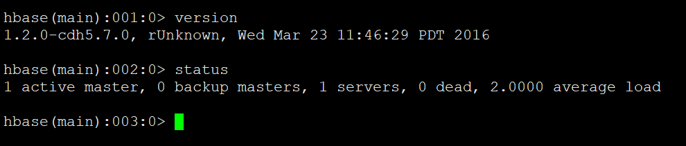

  ```
  create 'member','info','address'
  ```

  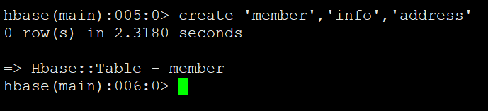

  ```
  list
  ```

  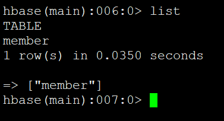

  ```
  describe 'member'
  ```

  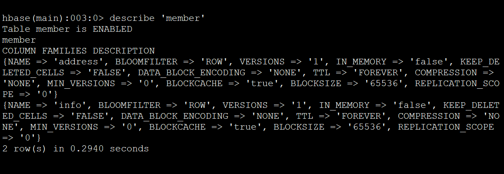

  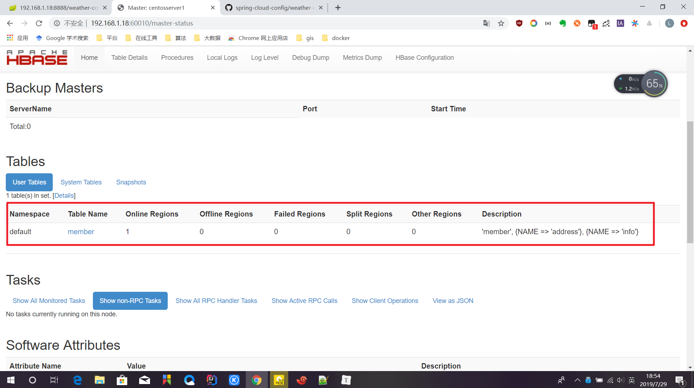

## 二、spark安装

+ 启动

  ```
  spark-shell --master local[2] --driver-class-path /home/jungle/app/hive-1.1.0-cdh5.7.0/lib/mysql-connector-java-5.1.27-bin.jar
  ```

##  三、开发环境搭建

使用IDEA整合 Maven搭建 Spark Streaming开发环境

==在sparktrain中==

◆pom.xml中添加对应的依赖

```xml
<properties>
    <scala.version>2.11.8</scala.version>
    <kafka.version>0.9.0.0</kafka.version>
    <spark.version>2.2.0</spark.version>
    <hadoop.version>2.6.0-cdh5.7.0</hadoop.version>
    <hbase.version>1.2.0-cdh5.7.0</hbase.version>
  </properties>


<repository>
      <id>cloudera</id>
      <name>cloudera Repository</name>
      <url>https://repository.cloudera.com/artifactory/cloudera-repos</url>
</repository>


<dependency>
      <groupId>org.apache.hadoop</groupId>
      <artifactId>hadoop-client</artifactId>
      <version>${hadoop.version}</version>
    </dependency>
    <dependency>
      <groupId>org.apache.hbase</groupId>
      <artifactId>hbase-client</artifactId>
      <version>${hbase.version}</version>
    </dependency>
    <dependency>
      <groupId>org.apache.hbase</groupId>
      <artifactId>hbase-server</artifactId>
      <version>${hbase.version}</version>
    </dependency>
    <dependency>
      <groupId>org.apache.spark</groupId>
      <artifactId>spark-streaming_2.11</artifactId>
      <version>${spark.version}</version>
    </dependency>


```

[spark streaming的依赖](http://spark.apache.org/docs/2.1.0/streaming-programming-guide.html)

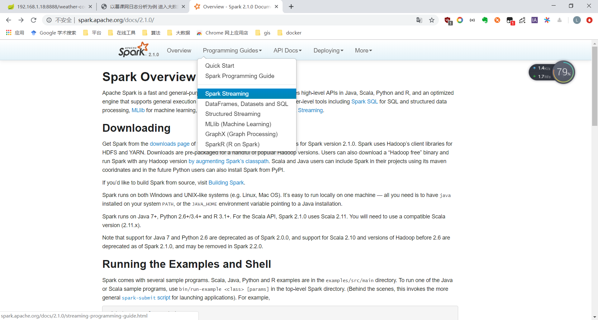

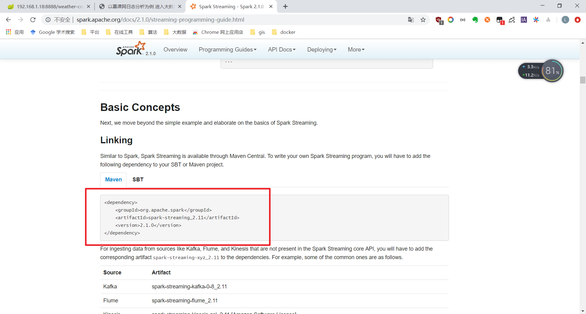

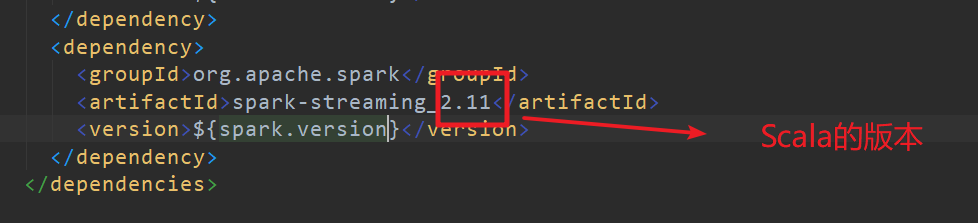

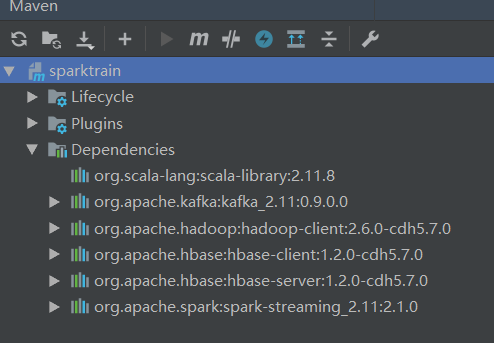

# 第6章 Spark Streaming入门

## 一、Spark Streaming概述

[官网](http://spark.apache.org/docs/2.1.0/streaming-programming-guide.html)

```
Spark Streaming is an extension of the core Spark API that enables scalable, high-throughput, fault-tolerant stream processing of live data streams. 
```


```
Spark Streaming.个人的定义
	将不同的数据源的数据经过 Spark Streaming处理之后将结果输出到外部文件系统
特点
	低延时
	能从错误中高效的恢复: fault- tolerant
	能够运行在成百上千的节点
	能够将批处理、机器学习、图计算等子框架和 Spark Streaming综合起来使用
	
	One stack to rule them all:一栈式
```

## 二、Spark Streaming集成Spark生态系统的使用


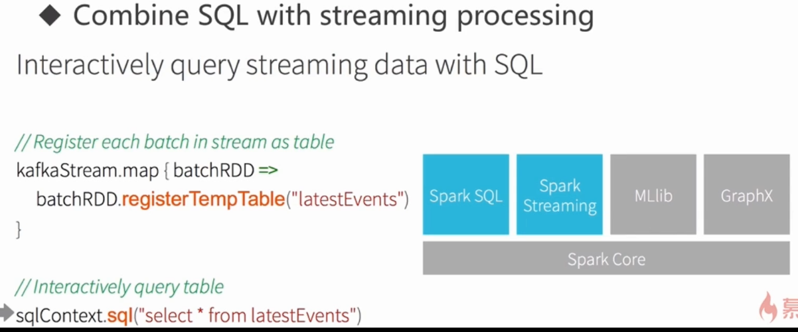

## 三、词频统计功能着手入门Spark Streaming

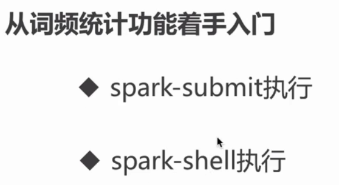

[源码](https://github.com/apache/spark)

[参考案例](https://github.com/apache/spark/blob/master/examples/src/main/scala/org/apache/spark/examples/streaming/NetworkWordCount.scala)

```
nc -lk 9999
```

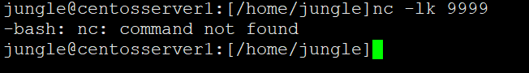

```
yum install -y nc
```

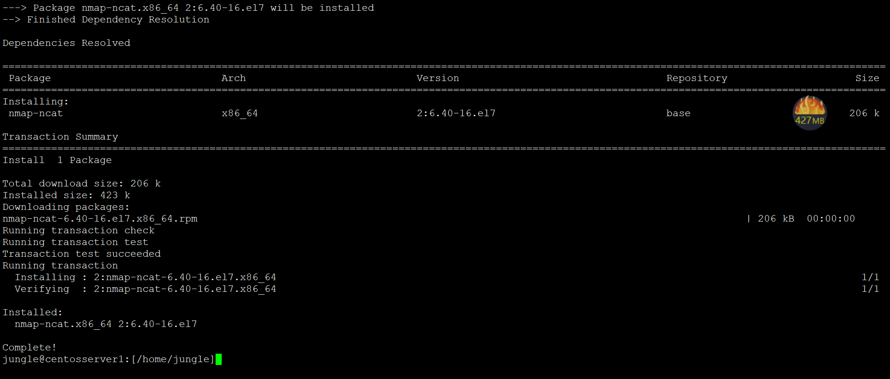


### 1.spark-submit

==spark- submit的使用==

使用 spark- submit来提交我们的 spark应用程序运行的脚本(生产)

```
spark-submit --master local[2] \
--class org.apache.spark.examples.streaming.NetworkWordCount \
--name NetworkWordCount \
/home/jungle/app/spark-2.1.0-bin-2.6.0-cdh5.7.0/examples/jars/spark-examples_2.11-2.1.0.jar centosserver1 9999
```

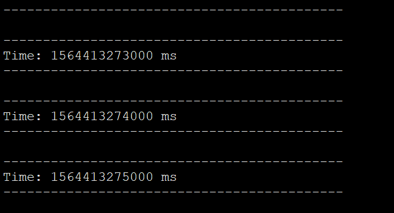

==测试效果==

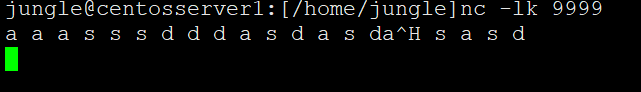

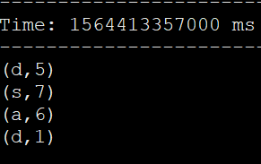

### 2.spark-shell

​	如何使用spark-shell来提交(测试)

```
spark-shell --master local[2] --driver-class-path /home/jungle/app/hive-1.1.0-cdh5.7.0/lib/mysql-connector-java-5.1.27-bin.jar
```

```scala
import org.apache.spark.SparkConf
import org.apache.spark.storage.StorageLevel
import org.apache.spark.streaming.{Seconds, StreamingContext}
val ssc = new StreamingContext(sc, Seconds(1))
val lines = ssc.socketTextStream("centosserver1", 9999)
val words = lines.flatMap(_.split(" "))
val wordCounts = words.map(x => (x, 1)).reduceByKey(_ + _)
wordCounts.print()
ssc.start()
ssc.awaitTermination()
```

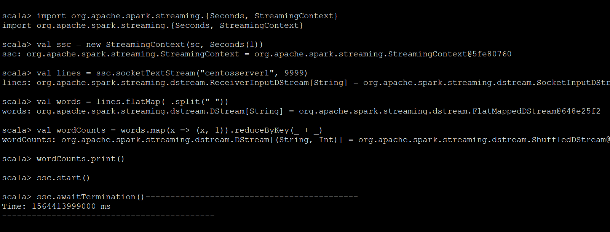

==测试效果==


## 四、Spark Streaming工作原理(粗粒度)

```
工作原理:粗粒度
Spark Streaming接收到实时数据流,把数据按照指定的时间段切成一片片小的数据块,
然后把小的数据块传给 Spark Engine处理。
```

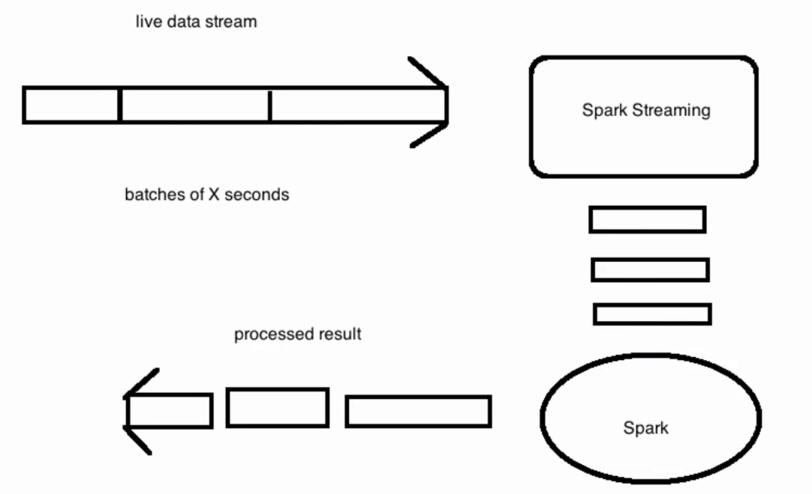

## 五、Spark Streaming工作原理(细粒度)

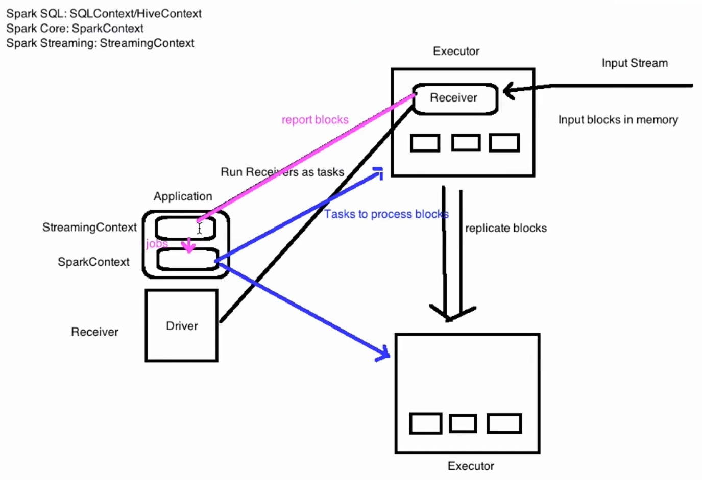

# 第7章 Spark Streaming核心概念与编程

## 一、核心概念

### 1.StreamingContext

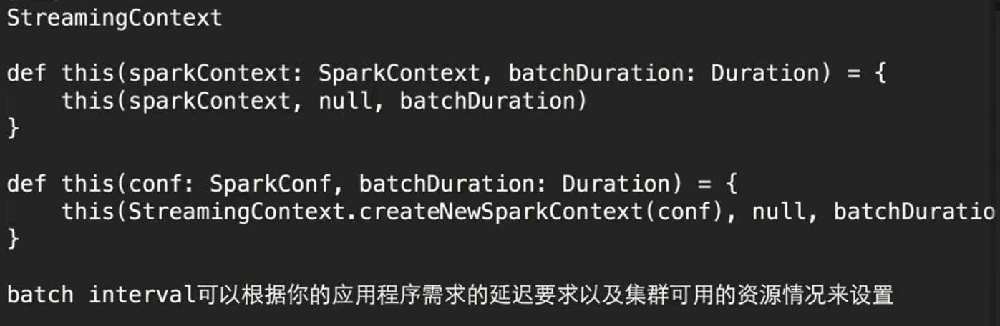

### 2.DStream

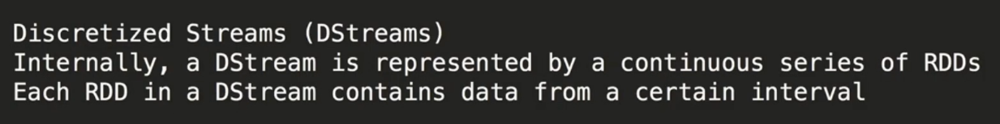

```
对 DStream操作算子,比如map/ flatmap,其实底层会被翻译为对 Dstream中的每个RDD都做相同的操作
```


### 3.Input DStreams和Receivers

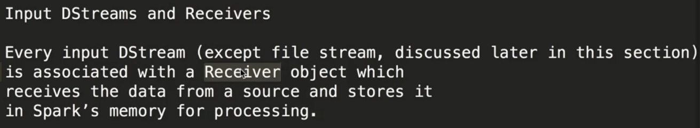

## 二、案例实战

### 1.Spark Streaming处理socket数据

+ NetworkWordCount

```scala
package com.jungle.spark

import org.apache.spark.SparkConf
import org.apache.spark.streaming.{Seconds, StreamingContext}

/**
  * Spark Streaming处理Socket数据
  *
  * 测试： nc
  */
object NetworkWordCount {


  def main(args: Array[String]): Unit = {

    val sparkConf = new SparkConf().setMaster("local[2]").setAppName("NetworkWordCount")

    /**
      * 创建StreamingContext需要两个参数：SparkConf和batch interval
      */
    val ssc = new StreamingContext(sparkConf, Seconds(5))

    val lines = ssc.socketTextStream("192.168.1.18", 6789)

    val result = lines.flatMap(_.split(" ")).map((_,1)).reduceByKey(_+_)

    result.print()

    ssc.start()
    ssc.awaitTermination()
  }
}

```

==出错==

```
Exception in thread "main" java.lang.NoSuchMethodError: com.fasterxml.jackson.module.scala.deser.BigDecimalDeserializer$.handledType()Ljava/lang/Class;
```

解决：

> 手动在pom.xml文件中添加该依赖

```xml
    <dependency>
      <groupId>com.fasterxml.jackson.module</groupId>
      <artifactId>jackson-module-scala_2.11</artifactId>
      <version>2.6.5</version>
    </dependency>
```

+ shell端

  ```
  nc -lk 6789
  ```

  ```
  w q q q w
  ```

  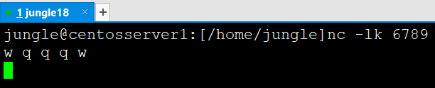

==出错==

```
Caused by: java.lang.NoClassDefFoundError: net/jpountz/util/SafeUtils
```

解决：

​	去maven上查找

​	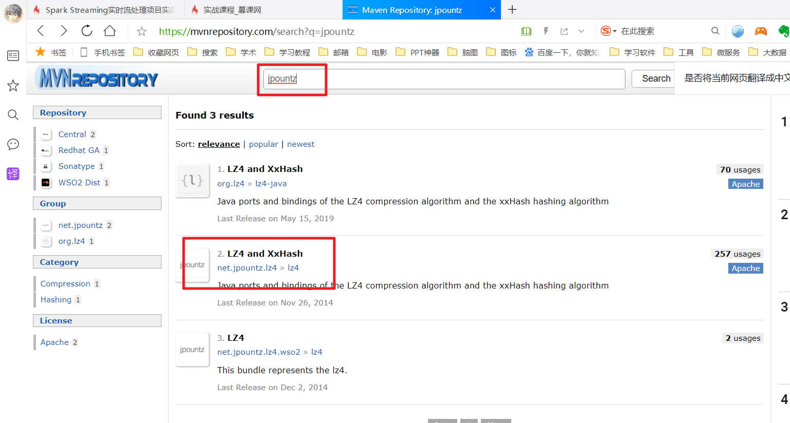

```xml
<!-- https://mvnrepository.com/artifact/net.jpountz.lz4/lz4 -->
<dependency>
    <groupId>net.jpountz.lz4</groupId>
    <artifactId>lz4</artifactId>
    <version>1.3.0</version>
</dependency>

```

==再次运行==

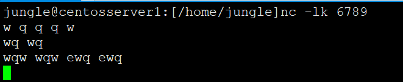

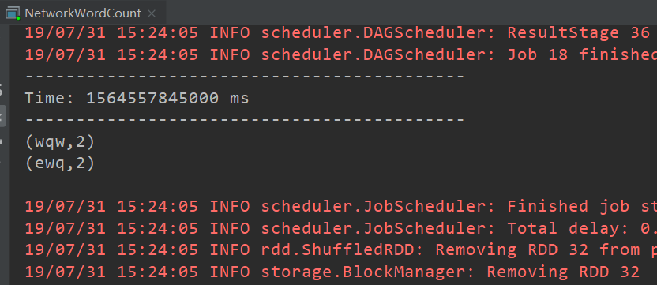

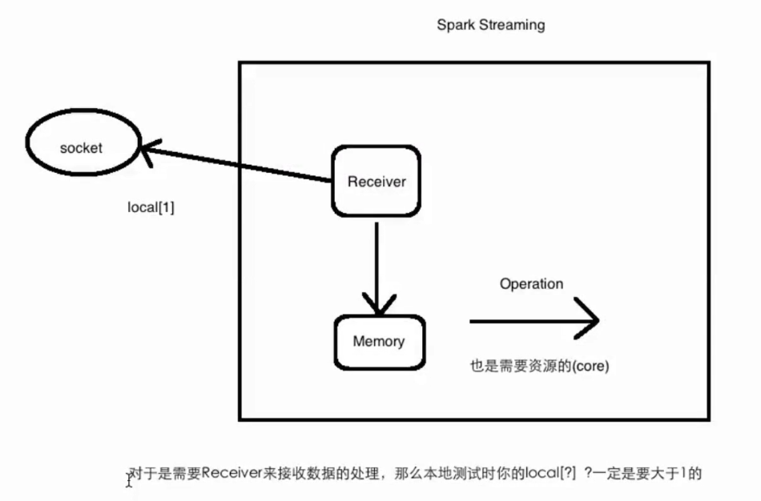

### 2.Spark Streaming处理文件系统数据

+ FileWordCount

  ```scala
  package com.jungle.spark
  
  import org.apache.spark.SparkConf
  import org.apache.spark.streaming.{Seconds, StreamingContext}
  
  /**
    * 使用Spark Streaming处理文件系统(local/hdfs)的数据
    */
  object FileWordCount {
  
    def main(args: Array[String]): Unit = {
  
      val sparkConf = new SparkConf().setMaster("local").setAppName("FileWordCount")
      val ssc = new StreamingContext(sparkConf, Seconds(5))
  
      val lines = ssc.textFileStream("file:///E:/data/clean")
  
      val result = lines.flatMap(_.split(" ")).map((_,1)).reduceByKey(_+_)
      result.print()
  
      ssc.start()
      ssc.awaitTermination()
  
  
    }
  
  }
  
  ```

  ==E:/data/clean文件夹下是空的==

+ 在上述文件下新建文件

  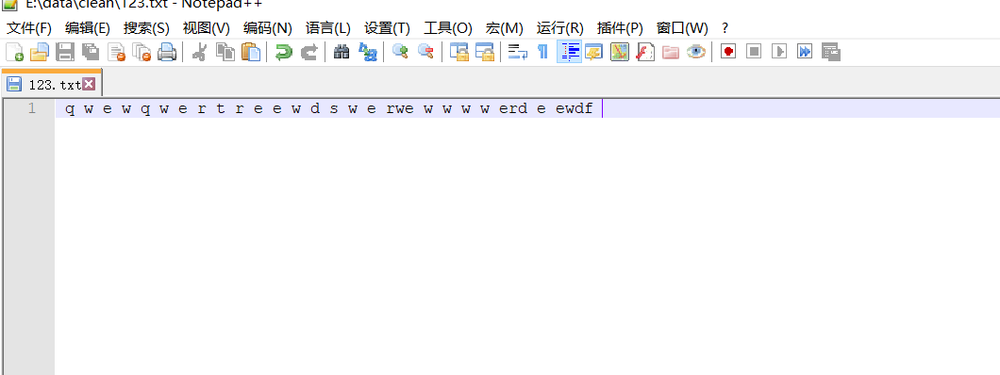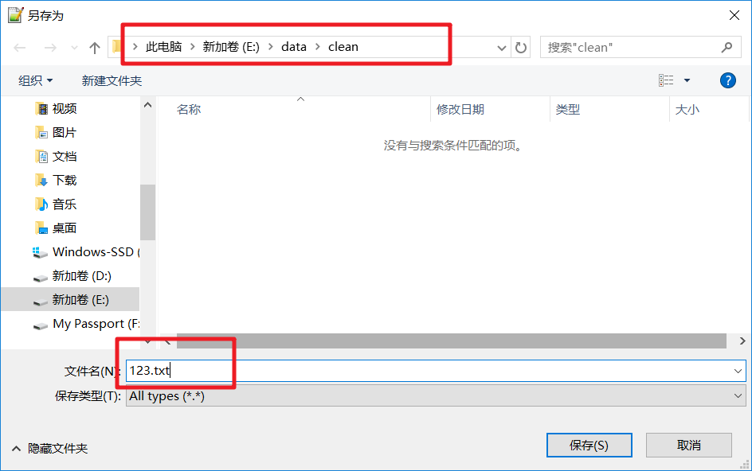

​	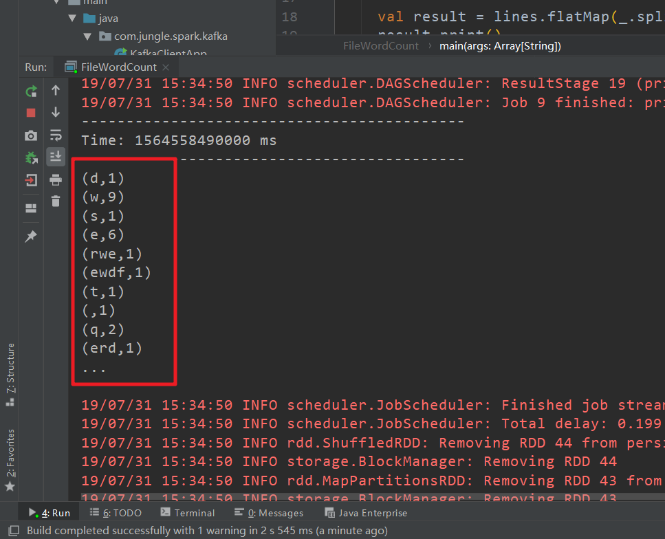

# 第8章 Spark Streaming进阶与案例实战

## 一、目录

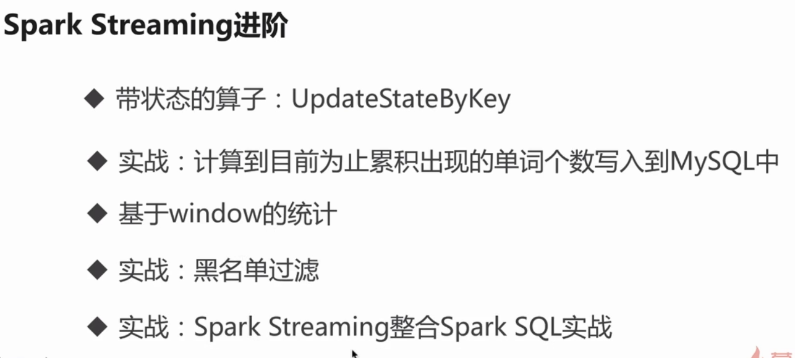

## 二、updateStateByKey算子的使用

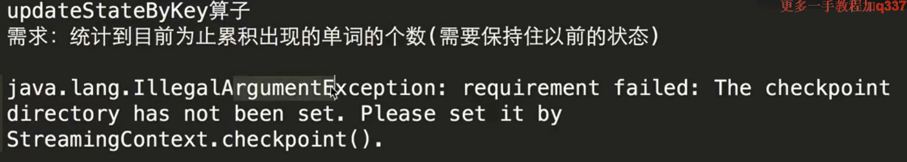

```

    // 如果使用了stateful的算子，必须要设置checkpoint
    // 在生产环境中，建议大家把checkpoint设置到HDFS的某个文件夹中
    //.表示当前目录
    ssc.checkpoint(".")
```

​	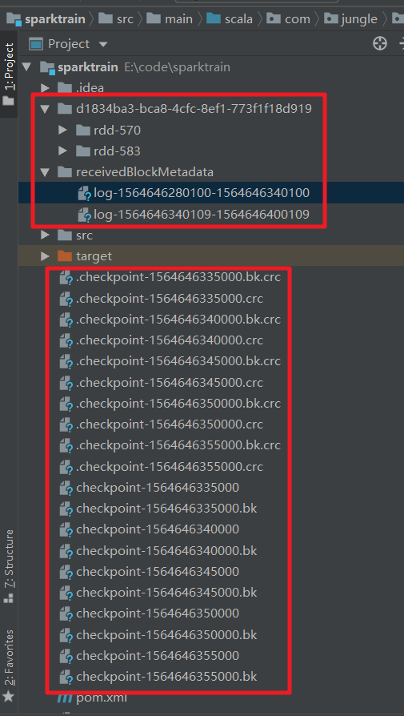

+ StatefulWordCount

  ```scala
  package com.jungle.spark
  
  import org.apache.spark.SparkConf
  import org.apache.spark.streaming.{Seconds, StreamingContext}
  
  /**
    * 使用Spark Streaming完成有状态统计
    */
  object StatefulWordCount {
  
    def main(args: Array[String]): Unit = {
  
  
      val sparkConf = new SparkConf().setAppName("StatefulWordCount").setMaster("local[2]")
      val ssc = new StreamingContext(sparkConf, Seconds(5))
  
      // 如果使用了stateful的算子，必须要设置checkpoint
      // 在生产环境中，建议大家把checkpoint设置到HDFS的某个文件夹中
      //.表示当前目录
      ssc.checkpoint(".")
  
      val lines = ssc.socketTextStream("192.168.1.18", 6789)
  
      val result = lines.flatMap(_.split(" ")).map((_,1))
      val state = result.updateStateByKey[Int](updateFunction _)
  
      state.print()
  
      ssc.start()
      ssc.awaitTermination()
    }
  
  
    /**
      * 把当前的数据去更新已有的或者是老的数据
      * @param currentValues  当前的
      * @param preValues  老的
      * @return
      */
    def updateFunction(currentValues: Seq[Int], preValues: Option[Int]): Option[Int] = {
      val current = currentValues.sum
      val pre = preValues.getOrElse(0)
  
      Some(current + pre)
    }
  }
  
  ```

+ shell

  ```
  nc -lk 6789
  ```

  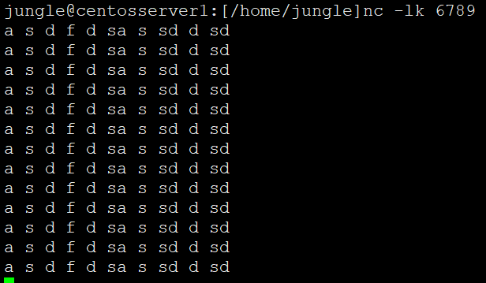

==结果==

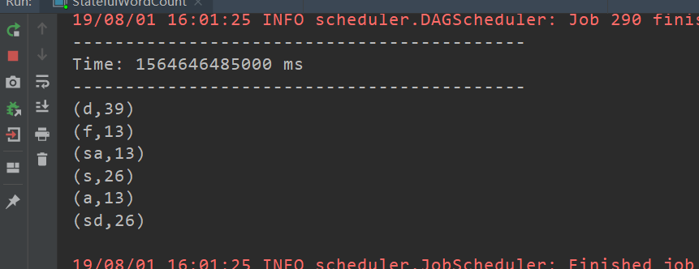

## 三、统计结果写入到MySQL数据库中

```
create database imooc_spark;
use imooc_spark;
```

```
create table wordcount(
word varchar(50) default null,
wordcount int(10) default null
);
```

```
show tables;
```

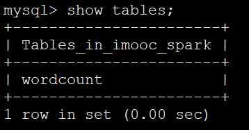

+ 引入依赖

  ```xml
      <!-- https://mvnrepository.com/artifact/mysql/mysql-connector-java -->
      <dependency>
        <groupId>mysql</groupId>
        <artifactId>mysql-connector-java</artifactId>
        <version>8.0.17</version>
      </dependency>
  ```

  + ForeachRDDApp

    ```scala
    package com.jungle.spark
    
    import java.sql.DriverManager
    
    import org.apache.spark.SparkConf
    import org.apache.spark.streaming.{Seconds, StreamingContext}
    
    /**
      * 使用Spark Streaming完成词频统计，并将结果写入到MySQL数据库中
      */
    object ForeachRDDApp {
    
      def main(args: Array[String]): Unit = {
    
        val sparkConf = new SparkConf().setAppName("ForeachRDDApp").setMaster("local[2]")
        val ssc = new StreamingContext(sparkConf, Seconds(5))
    
    
        val lines = ssc.socketTextStream("192.168.1.18", 6789)
    
        val result = lines.flatMap(_.split(" ")).map((_, 1)).reduceByKey(_ + _)
    
        //result.print()  //此处仅仅是将统计结果输出到控制台
    
        //TODO... 将结果写入到MySQL
        //    result.foreachRDD(rdd =>{
        //      val connection = createConnection()  // executed at the driver
        //      rdd.foreach { record =>
        //        val sql = "insert into wordcount(word, wordcount) values('"+record._1 + "'," + record._2 +")"
        //        connection.createStatement().execute(sql)
        //      }
        //    })
    
        result.print()
    
        result.foreachRDD(rdd => {
          rdd.foreachPartition(partitionOfRecords => {
            val connection = createConnection()
            partitionOfRecords.foreach(record => {
              val sql = "insert into wordcount(word, wordcount) values('" + record._1 + "'," + record._2 + ")"
              connection.createStatement().execute(sql)
            })
    
            connection.close()
          })
        })
    
    
        ssc.start()
        ssc.awaitTermination()
      }
    
    
      /**
        * 获取MySQL的连接
        */
      def createConnection() = {
        Class.forName("com.mysql.jdbc.Driver")
        DriverManager.getConnection("jdbc:mysql://192.168.1.18:8806/imooc_spark", "root", "123456")
      }
    
    }
    
    ```

    

  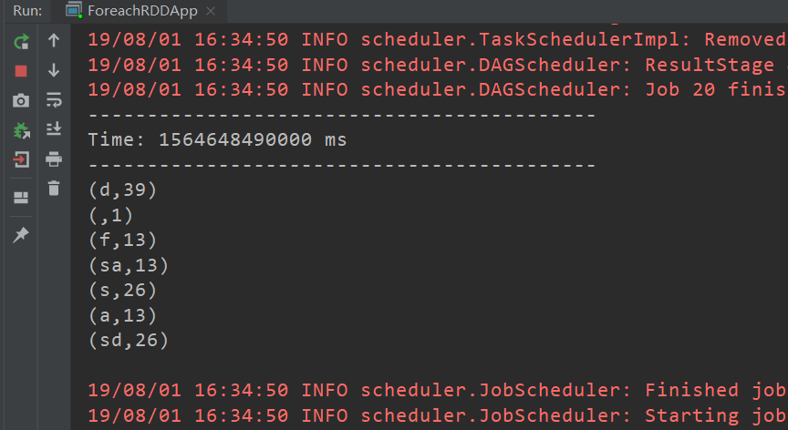

  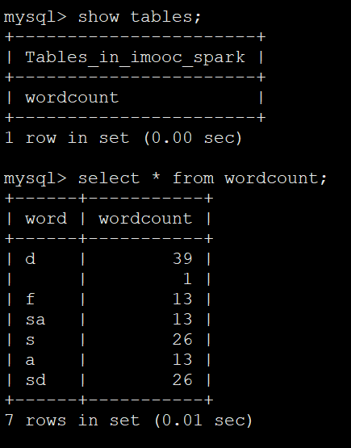

  ==需改进==

  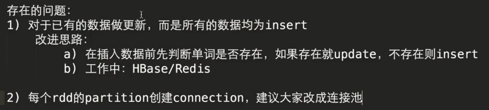

## 四、窗口函数的使用


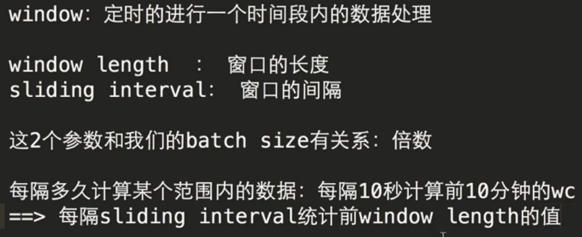

## 五、黑名单过滤

### 1.需求分析

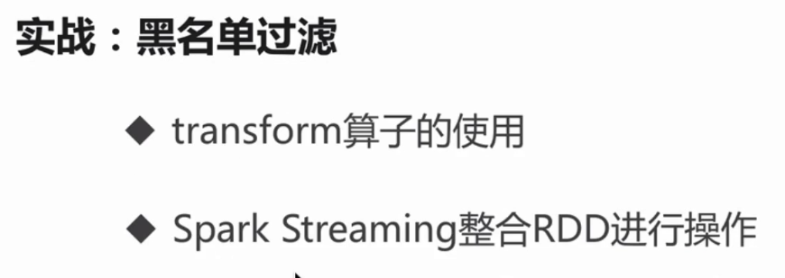

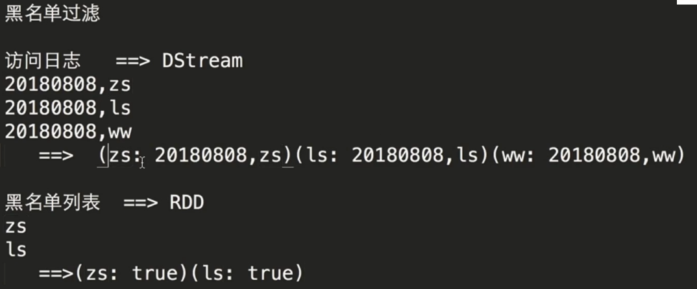

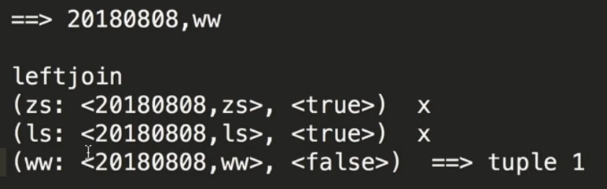

### 2.程序实现

+ TransformApp

  ```scala
  package com.jungle.spark
  
  import org.apache.spark.SparkConf
  import org.apache.spark.streaming.{Seconds, StreamingContext}
  
  /**
    * 黑名单过滤
    */
  object TransformApp {
  
  
    def main(args: Array[String]): Unit = {
  
      val sparkConf = new SparkConf().setMaster("local[2]").setAppName("NetworkWordCount")
  
      /**
        * 创建StreamingContext需要两个参数：SparkConf和batch interval
        */
      val ssc = new StreamingContext(sparkConf, Seconds(5))
  
  
      /**
        * 构建黑名单
        */
      val blacks = List("zs", "ls")
      val blacksRDD = ssc.sparkContext.parallelize(blacks).map(x => (x, true))
  
      val lines = ssc.socketTextStream("192.168.1.18", 6789)
      val clicklog = lines.map(x => (x.split(",")(1), x)).transform(rdd => {
        rdd.leftOuterJoin(blacksRDD)
          .filter(x=> x._2._2.getOrElse(false) != true)
          .map(x=>x._2._1)
      })
  
      clicklog.print()
  
      ssc.start()
      ssc.awaitTermination()
    }
  }
  
  ```

+ shell

  ```
  nc -lk 6789
  ```

  ```
  20160410,zs
  20160410,ls
  20160410,ww
  ```

  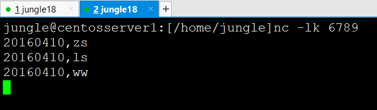

  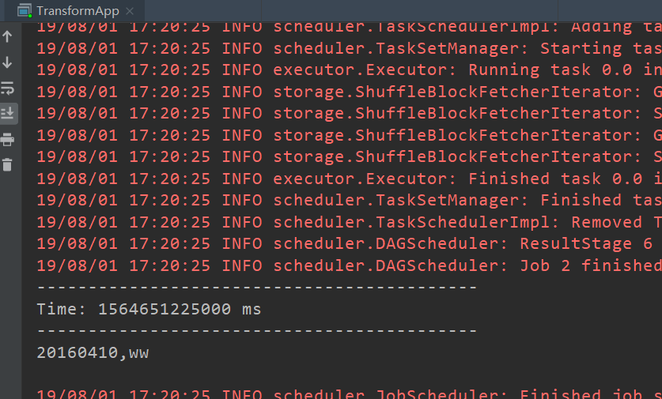

## 六、Spark Streaming整合Spark SQL操作

+ 添加依赖

  ```xml
  <dependency>
        <groupId>org.apache.spark</groupId>
        <artifactId>spark-sql_2.11</artifactId>
        <version>${spark.version}</version>
      </dependency>
  ```

  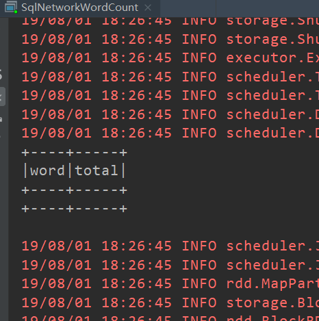

+ SqlNetworkWordCount

  ```scala
  package com.jungle.spark
  
  import org.apache.spark.SparkConf
  import org.apache.spark.rdd.RDD
  import org.apache.spark.sql.SparkSession
  import org.apache.spark.streaming.{Seconds, StreamingContext, Time}
  
  /**
    * Spark Streaming整合Spark SQL完成词频统计操作
    */
  object SqlNetworkWordCount {
  
    def main(args: Array[String]): Unit = {
      val sparkConf = new SparkConf().setAppName("ForeachRDDApp").setMaster("local[2]")
      val ssc = new StreamingContext(sparkConf, Seconds(5))
  
      val lines = ssc.socketTextStream("192.168.1.18", 6789)
      val words = lines.flatMap(_.split(" "))
  
      // Convert RDDs of the words DStream to DataFrame and run SQL query
      words.foreachRDD { (rdd: RDD[String], time: Time) =>
        val spark = SparkSessionSingleton.getInstance(rdd.sparkContext.getConf)
        import spark.implicits._
  
        // Convert RDD[String] to RDD[case class] to DataFrame
        val wordsDataFrame = rdd.map(w => Record(w)).toDF()
  
        // Creates a temporary view using the DataFrame
        wordsDataFrame.createOrReplaceTempView("words")
  
        // Do word count on table using SQL and print it
        val wordCountsDataFrame =
          spark.sql("select word, count(*) as total from words group by word")
        println(s"========= $time =========")
        wordCountsDataFrame.show()
      }
  
  
      ssc.start()
      ssc.awaitTermination()
    }
  
  
    /** Case class for converting RDD to DataFrame */
    case class Record(word: String)
  
  
    /** Lazily instantiated singleton instance of SparkSession */
    object SparkSessionSingleton {
  
      @transient  private var instance: SparkSession = _
  
      def getInstance(sparkConf: SparkConf): SparkSession = {
        if (instance == null) {
          instance = SparkSession
            .builder
            .config(sparkConf)
            .getOrCreate()
        }
        instance
      }
    }
  }
  
  ```

+ shell

  ```
  nc -lk 6789
  ```

  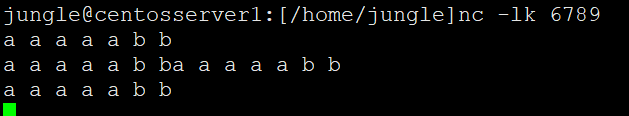

  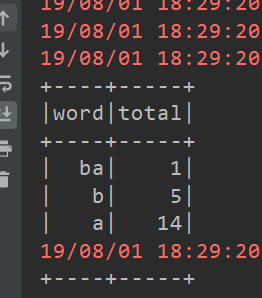

# 第9章 Spark Streaming整合Flume

[官网](http://spark.apache.org/docs/latest/streaming-flume-integration.html)

## 一、Push方式整合之Flume Agent配置开发

+ flume_push_streaming.conf

  ```
  simple-agent.sources = netcat-source                                                                                                       
  simple-agent.sinks = avro-sink
  simple-agent.channels = memory-channel
   
  simple-agent.sources.netcat-source.type = netcat
  simple-agent.sources.netcat-source.bind = centosserver1
  simple-agent.sources.netcat-source.port = 44444
   
  simple-agent.sinks.avro-sink.type = avro
  simple-agent.sinks.avro-sink.hostname = centosserver1
  simple-agent.sinks.avro-sink.port = 41414
   
  simple-agent.channels.memory-channel.type = memory
   
  simple-agent.sources.netcat-source.channels = memory-channel
  simple-agent.sinks.avro-sink.channel = memory-channel
  
  ```

  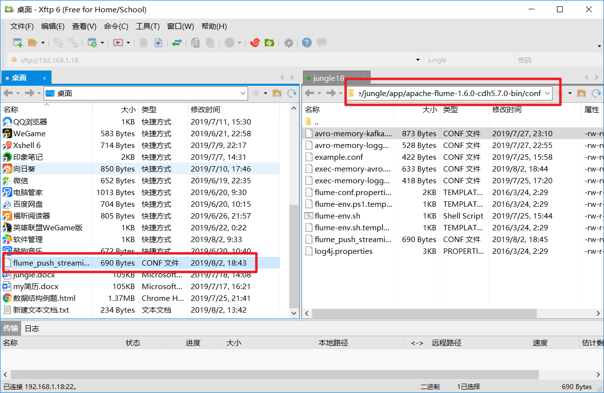

+ 添加依赖

  ```xml
  <dependency>
        <groupId>org.apache.spark</groupId>
        <artifactId>spark-streaming-flume_2.11</artifactId>
        <version>${spark.version}</version>
      </dependency>
  ```

+ FlumePushWordCount

  ```scala
  package com.jungle.spark
  
  import org.apache.spark.SparkConf
  import org.apache.spark.streaming.flume.FlumeUtils
  import org.apache.spark.streaming.{Seconds, StreamingContext}
  
  /**
    * Spark Streaming整合Flume的第一种方式
    */
  object FlumePushWordCount {
  
    def main(args: Array[String]): Unit = {
  
      if(args.length != 2) {
        System.err.println("Usage: FlumePushWordCount <hostname> <port>")
        System.exit(1)
      }
  
      val Array(hostname, port) = args
  
      val sparkConf = new SparkConf()//.setMaster("local[2]").setAppName("FlumePushWordCount")
      val ssc = new StreamingContext(sparkConf, Seconds(5))
  
      //TODO... 如何使用SparkStreaming整合Flume
      val flumeStream = FlumeUtils.createStream(ssc, hostname, port.toInt)
  
      flumeStream.map(x=> new String(x.event.getBody.array()).trim)
        .flatMap(_.split(" ")).map((_,1)).reduceByKey(_+_).print()
  
      ssc.start()
      ssc.awaitTermination()
    }
  }
  
  ```

+ 打包

  ```
  mvn clean package -DskipTests
  ```

  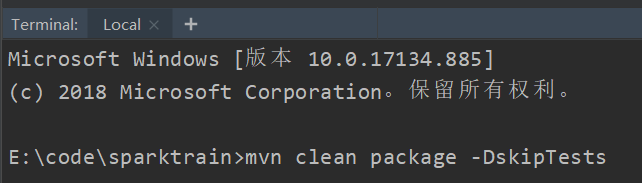

  ​	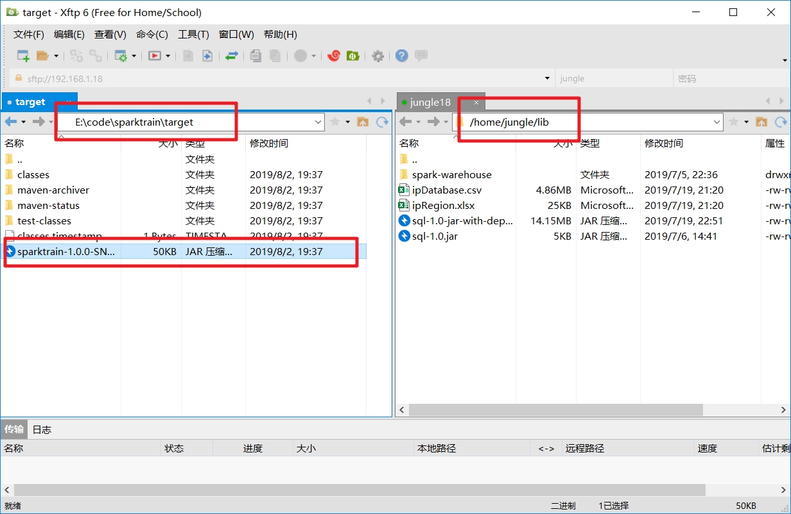

+ 提交任务

  ```
  spark-submit --master local[2] \
  --class com.jungle.spark.FlumePushWordCount \
  --packages org.apache.spark:spark-streaming-flume_2.11:2.2.0  \
  /home/jungle/lib/sparktrain-1.0.0-SNAPSHOT.jar \
  centosserver1 41414
  ```

+ 启动flume

  ```
  flume-ng agent \
  --name simple-agent \
  --conf $FLUME_HOME/conf \
  --conf-file $FLUME_HOME/conf/flume_push_streaming.conf \
  -Dflume.root.logger=INFO,console
  ```

+ 测试

  ```
  telnet localhost 44444
  ```

## 二、Pull方式整合之Flume Agent配置开发

+ flume_pull_streaming.conf

  ```
  simple-agent.sources = netcat-source                                                                                                       
  simple-agent.sinks = spark-sink
  simple-agent.channels = memory-channel
   
  simple-agent.sources.netcat-source.type = netcat
  simple-agent.sources.netcat-source.bind = centosserver1
  simple-agent.sources.netcat-source.port = 44444
   
  simple-agent.sinks.spark-sink.type = org.apache.spark.streaming.flume.sink.SparkSink
  simple-agent.sinks.spark-sink.hostname = centosserver1
  simple-agent.sinks.spark-sink.port = 41414
   
  simple-agent.channels.memory-channel.type = memory
   
  simple-agent.sources.netcat-source.channels = memory-channel
  simple-agent.sinks.spark-sink.channel = memory-channel
  
  ```

  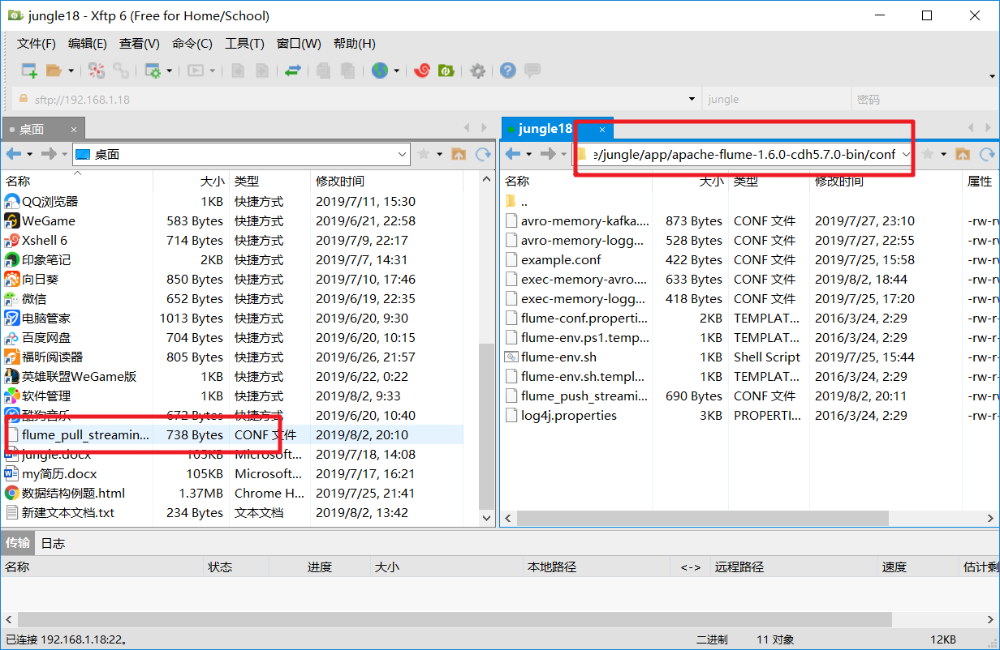

+ 添加依赖

  ```xml
  <dependency>
              <groupId>org.apache.spark</groupId>
              <artifactId>spark-streaming-flume-sink_2.11</artifactId>
              <version>${spark.version}</version>
          </dependency>
          
           <dependency>
              <groupId>org.scala-lang</groupId>
              <artifactId>scala-library</artifactId>
              <version>${scala.version}</version>
          </dependency>
          
          <dependency>
              <groupId>org.apache.commons</groupId>
              <artifactId>commons-lang3</artifactId>
              <version>3.5</version>
          </dependency>
  ```

+ FlumePullWordCount

  ```scala
  package com.jungle.spark
  
  import org.apache.spark.SparkConf
  import org.apache.spark.streaming.flume.FlumeUtils
  import org.apache.spark.streaming.{Seconds, StreamingContext}
  
  /**
    * Spark Streaming整合Flume的第二种方式
    */
  object FlumePullWordCount {
  
    def main(args: Array[String]): Unit = {
  
      if(args.length != 2) {
        System.err.println("Usage: FlumePullWordCount <hostname> <port>")
        System.exit(1)
      }
  
      val Array(hostname, port) = args
  
      val sparkConf = new SparkConf() //.setMaster("local[2]").setAppName("FlumePullWordCount")
      val ssc = new StreamingContext(sparkConf, Seconds(5))
  
      //TODO... 如何使用SparkStreaming整合Flume
      val flumeStream = FlumeUtils.createPollingStream(ssc, hostname, port.toInt)
  
      flumeStream.map(x=> new String(x.event.getBody.array()).trim)
        .flatMap(_.split(" ")).map((_,1)).reduceByKey(_+_).print()
  
      ssc.start()
      ssc.awaitTermination()
    }
  }
  
  ```

+ 打包

  ```
  mvn clean package -DskipTests
  ```

+ 上传至服务器

  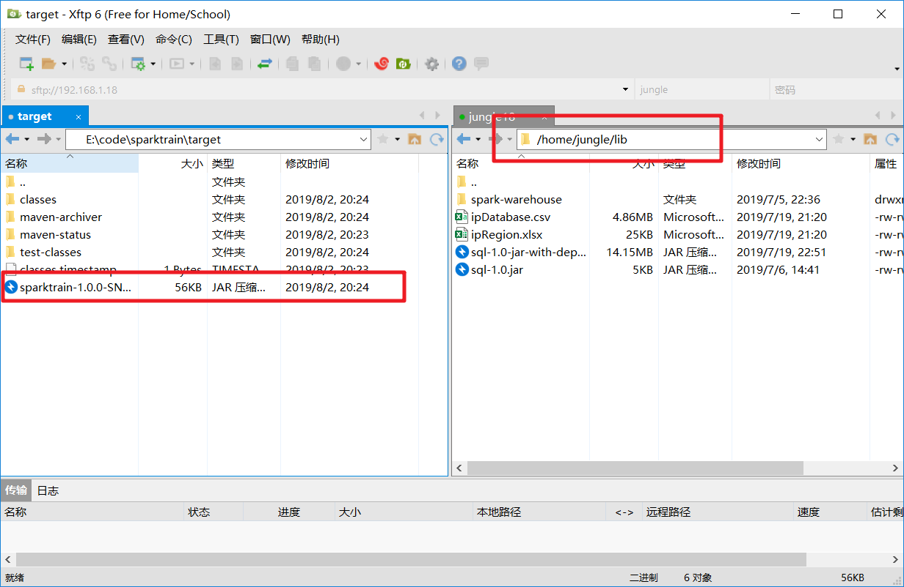

==注意到：先启动发flume，后启动spark streaming应用程序==

+ 启动flume

  ```
  flume-ng agent \
  --name simple-agent \
  --conf $FLUME_HOME/conf \
  --conf-file $FLUME_HOME/conf/flume_pull_streaming.conf \
  -Dflume.root.logger=INFO,console
  ```

+ 启动spark-streaming

  ```
  spark-submit --master local[2] \
  --class com.jungle.spark.FlumePullWordCount \
  --packages org.apache.spark:spark-streaming-flume_2.11:2.2.0  \
  /home/jungle/lib/sparktrain-1.0.0-SNAPSHOT.jar \
  centosserver1 41414
  ```

# 第10章 Spark Streaming整合Kafka

  ## 一、Receiver方式整合之Kafka

1. 开启zookeeper

2. 开启Kafka

3. 创建topic

   ```
   kafka-topics.sh --create --zookeeper centosserver1:2181 --replication-factor 1 --partitions 1 --topic kafka_streaming_topic
   ```

   ```
    cd $KAFKA_HOME/bin
   ./kafka-topics.sh --list --zookeeper centosserver1:2181
   ```

4. 通过控制台测试topic是否能够正常生产和消费

   ```
   kafka-console-producer.sh --broker-list centosserver1:9092 --topic kafka_streaming_topic
   ```

   ```
   kafka-console-consumer.sh --zookeeper centosserver1:2181 --topic kafka_streaming_topic --from-beginning
   ```

## 二、Spark Streaming应用开发

+ 添加依赖

  ```xml
  <dependency>
              <groupId>org.apache.spark</groupId>
              <artifactId>spark-streaming-kafka-0-8_2.11</artifactId>
              <version>${spark.version}</version>
          </dependency>
  ```

+ KafkaReceiverWordCount

  ```scala
  package com.jungle.spark
  
  import org.apache.spark.SparkConf
  import org.apache.spark.streaming.kafka.KafkaUtils
  import org.apache.spark.streaming.{Seconds, StreamingContext}
  
  /**
    * Spark Streaming对接Kafka的方式一
    */
  object KafkaReceiverWordCount {
  
    def main(args: Array[String]): Unit = {
  
      if(args.length != 4) {
        System.err.println("Usage: KafkaReceiverWordCount <zkQuorum> <group> <topics> <numThreads>")
      }
  
      val Array(zkQuorum, group, topics, numThreads) = args
  
      val sparkConf = new SparkConf().setAppName("KafkaReceiverWordCount")
        .setMaster("local[2]")
  
      val ssc = new StreamingContext(sparkConf, Seconds(5))
  
      val topicMap = topics.split(",").map((_, numThreads.toInt)).toMap
  
      // TODO... Spark Streaming如何对接Kafka
      val messages = KafkaUtils.createStream(ssc, zkQuorum, group,topicMap)
  
      // TODO... 自己去测试为什么要取第二个
      messages.map(_._2).flatMap(_.split(" ")).map((_,1)).reduceByKey(_+_).print()
  
      ssc.start()
      ssc.awaitTermination()
    }
  }
  
  ```

### 1.本地测试

  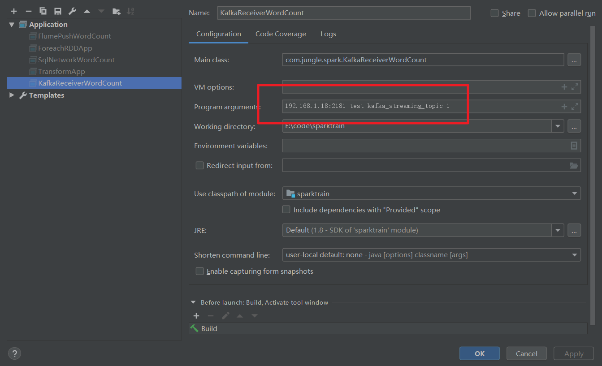

  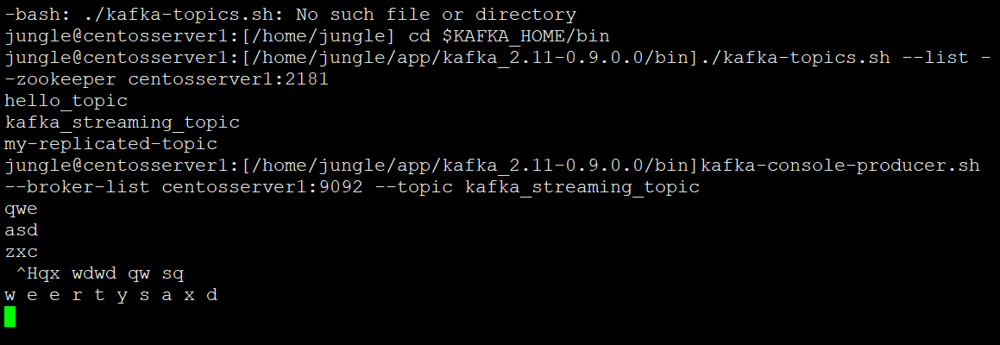

  

  

  ### 2.服务器环境联调

1. 程序

   ```scala
   package com.jungle.spark
   
   import org.apache.spark.SparkConf
   import org.apache.spark.streaming.kafka.KafkaUtils
   import org.apache.spark.streaming.{Seconds, StreamingContext}
   
   /**
     * Spark Streaming对接Kafka的方式一
     */
   object KafkaReceiverWordCount {
   
     def main(args: Array[String]): Unit = {
   
       if(args.length != 4) {
         System.err.println("Usage: KafkaReceiverWordCount <zkQuorum> <group> <topics> <numThreads>")
       }
   
       val Array(zkQuorum, group, topics, numThreads) = args
   
       val sparkConf = new SparkConf()//.setAppName("KafkaReceiverWordCount")
         //.setMaster("local[2]")
   
       val ssc = new StreamingContext(sparkConf, Seconds(5))
   
       val topicMap = topics.split(",").map((_, numThreads.toInt)).toMap
   
       // TODO... Spark Streaming如何对接Kafka
       val messages = KafkaUtils.createStream(ssc, zkQuorum, group,topicMap)
   
       // TODO... 自己去测试为什么要取第二个
       messages.map(_._2).flatMap(_.split(" ")).map((_,1)).reduceByKey(_+_).print()
   
       ssc.start()
       ssc.awaitTermination()
     }
   }
   
   ```

2. 打包

   ```
   mvn clean package -DskipTests
   ```

   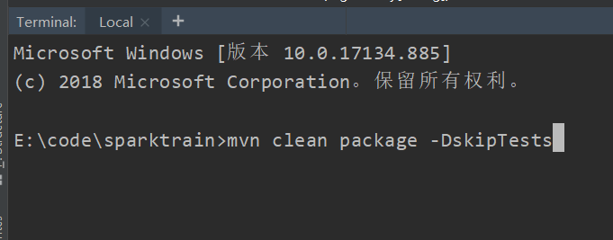

3. 上传服务器

   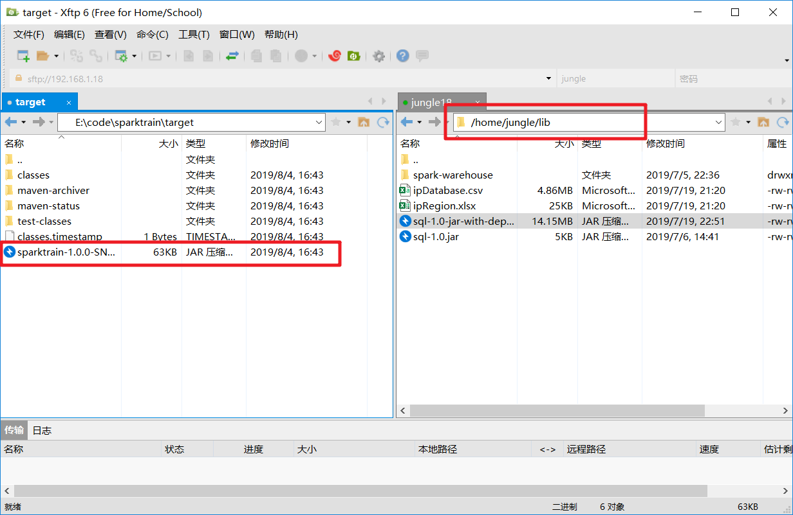

4. 运行脚本

   ```
   spark-submit \
   --class com.jungle.spark.KafkaReceiverWordCount \
   --master local[2] \
   --name KafkaReceiverWordCount \
   --packages org.apache.spark:spark-streaming-kafka-0-8_2.11:2.2.0 \
   /home/jungle/lib/sparktrain-1.0.0-SNAPSHOT.jar centosserver1:2181 test kafka_streaming_topic 1
   ```

   

5. UI界面

   ```
   http://192.168.1.18:4040/jobs/
   ```

   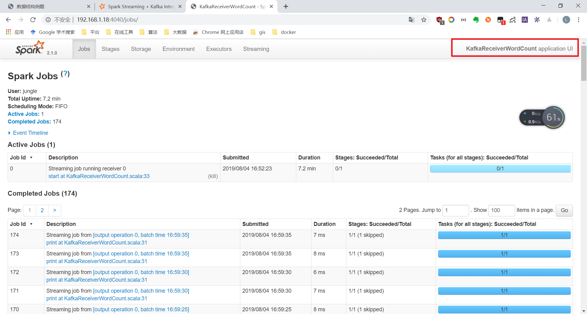

   

## 三、Direct方式整合

   ==服务器环境运行==

   1. 程序

      ```scala
      package com.imooc.spark
      

      import org.apache.spark.SparkConf
      import org.apache.spark.streaming.kafka.KafkaUtils
      import org.apache.spark.streaming.{Seconds, StreamingContext}
      import kafka.serializer.StringDecoder
      /**
        * Spark Streaming对接Kafka的方式二
        */
      object KafkaDirectWordCount {
      
        def main(args: Array[String]): Unit = {
      
          if(args.length != 2) {
            System.err.println("Usage: KafkaDirectWordCount <brokers> <topics>")
            System.exit(1)
          }
      
          val Array(brokers, topics) = args
      
          val sparkConf = new SparkConf() //.setAppName("KafkaReceiverWordCount")
            //.setMaster("local[2]")
      
          val ssc = new StreamingContext(sparkConf, Seconds(5))
      
          val topicsSet = topics.split(",").toSet
          val kafkaParams = Map[String,String]("metadata.broker.list"-> brokers)
      
          // TODO... Spark Streaming如何对接Kafka
          val messages = KafkaUtils.createDirectStream[String,String,StringDecoder,StringDecoder](
          ssc,kafkaParams,topicsSet
          )
      
          // TODO... 自己去测试为什么要取第二个
          messages.map(_._2).flatMap(_.split(" ")).map((_,1)).reduceByKey(_+_).print()
      
          ssc.start()
          ssc.awaitTermination()
        }
      }
      
      ```
      
   2. 打包

      ```
      mvn clean package -DskipTests
      ```

   3. 上传服务器

      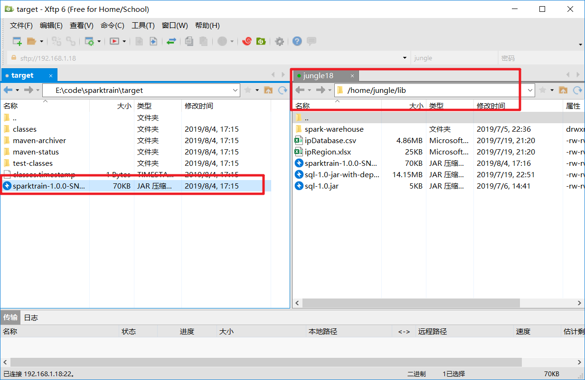   

4. 运行脚本

   ```
   spark-submit \
   --class com.imooc.spark.KafkaDirectWordCount \
   --master local[2] \
   --name KafkaDirectWordCount \
   --packages org.apache.spark:spark-streaming-kafka-0-8_2.11:2.2.0 \
   /home/jungle/lib/sparktrain-1.0.0-SNAPSHOT.jar centosserver1:9092 kafka_streaming_topic
   ```

5. 效果

   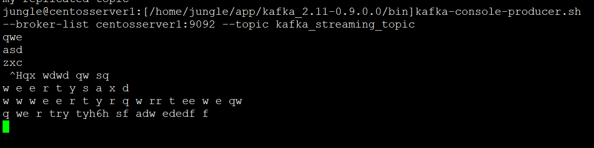

   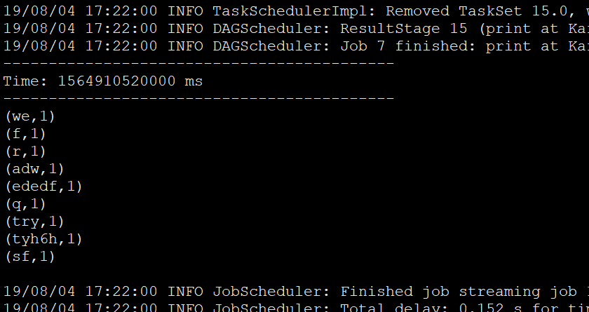

# 第11章 Spark Streaming整合Flume&Kafka打造通用流处理基础

## 一、课程目录

​	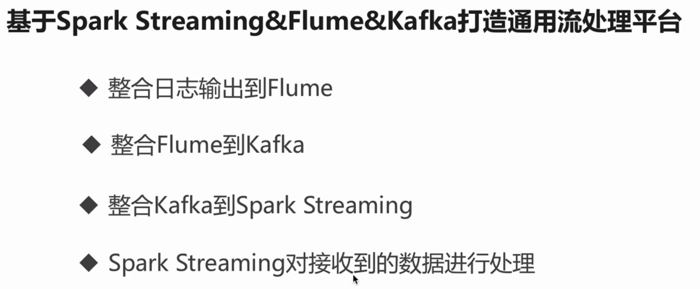

## 二、处理流程画图剖析


## 三、日志产生器开发并结合log4j完成日志的输出

+ 目录结构

  

+ LoggerGenerator

  ```java
  import org.apache.log4j.Logger;
  
  /**
   * 模拟日志产生
   */
  public class LoggerGenerator {
  
      private static Logger logger = Logger.getLogger(LoggerGenerator.class.getName());
  
      public static void main(String[] args) throws Exception{
  
          int index = 0;
          while(true) {
              //启动一个线程，休息一下
              Thread.sleep(1000);
              logger.info("value : " + index++);
          }
      }
  }
  
  ```
  
  
  
+ log4j.properties

  ```properties
  log4j.rootLogger=INFO,stdout
  
  log4j.appender.stdout = org.apache.log4j.ConsoleAppender
  log4j.appender.stdout.target = System.out
  log4j.appender.stdout.layout=org.apache.log4j.PatternLayout
  log4j.appender.stdout.layout.ConversionPattern=%d{yyyy-MM-dd HH:mm:ss,SSS} [%t] [%c] [%p] - %m%n
  
  ```

+ 效果

  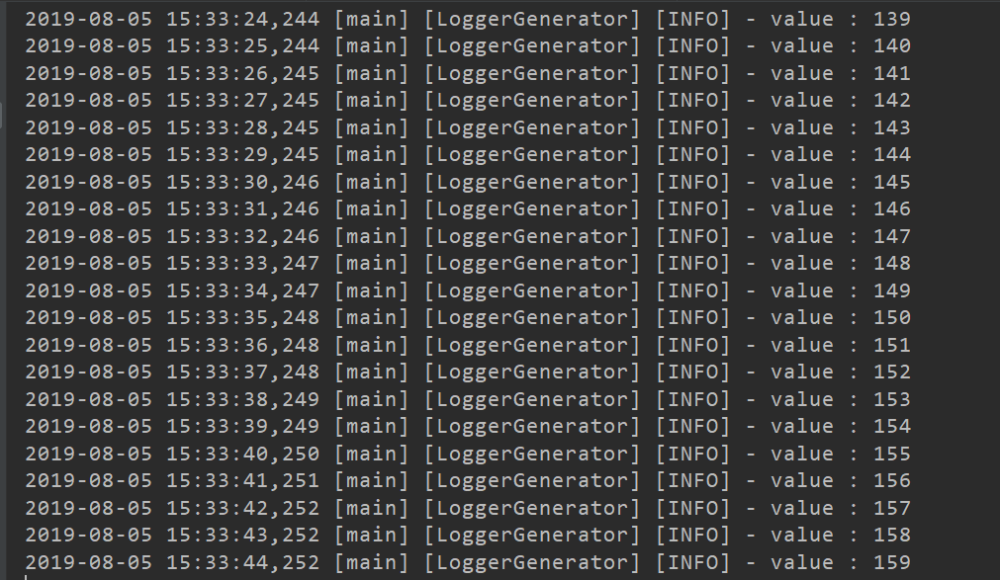

## 四、使用Flume采集Log4j产生的日志


+ streaming.conf

  ```
  agent1.sources=avro-source
  agent1.channels=logger-channel
  agent1.sinks=log-sink
  
  #define source
  agent1.sources.avro-source.type=avro
  agent1.sources.avro-source.bind=0.0.0.0
  agent1.sources.avro-source.port=41414
  
  #define channel
  agent1.channels.logger-channel.type=memory
  
  #define sink
  agent1.sinks.log-sink.type=logger
  
  agent1.sources.avro-source.channels=logger-channel
  agent1.sinks.log-sink.channel=logger-channel
  ```

  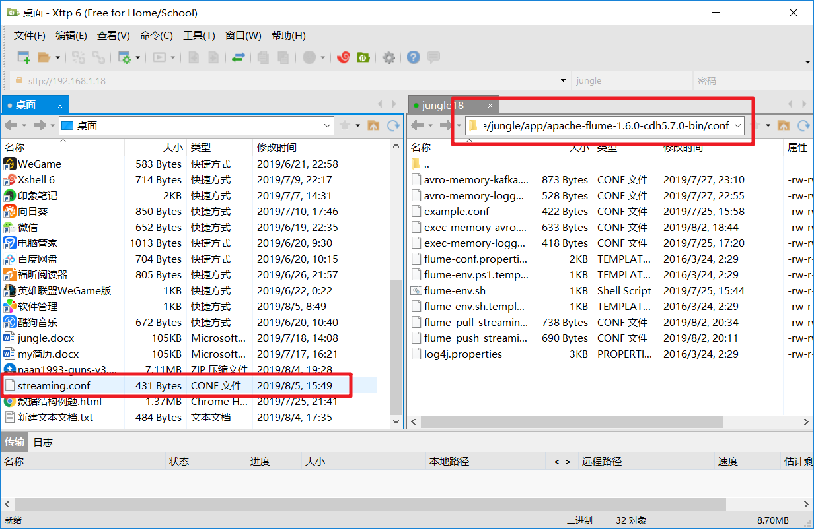

+ 启动flume

```
flume-ng agent \
--conf $FLUME_HOME/conf \
--conf-file $FLUME_HOME/conf/streaming.conf \
--name agent1 \
-Dflume.root.logger=INFO,console
```

+ 修改log4j.properties

  ```properties
  log4j.rootLogger=INFO,stdout,flume
  
  log4j.appender.stdout = org.apache.log4j.ConsoleAppender
  log4j.appender.stdout.target = System.out
  log4j.appender.stdout.layout=org.apache.log4j.PatternLayout
  log4j.appender.stdout.layout.ConversionPattern=%d{yyyy-MM-dd HH:mm:ss,SSS} [%t] [%c] [%p] - %m%n
  
  
  log4j.appender.flume = org.apache.flume.clients.log4jappender.Log4jAppender
  log4j.appender.flume.Hostname = 192.168.1.18
  log4j.appender.flume.Port = 41414
  log4j.appender.flume.UnsafeMode = true
  ```

+ 添加依赖

  ```xml
  <dependency>
              <groupId>org.apache.flume.flume-ng-clients</groupId>
              <artifactId>flume-ng-log4jappender</artifactId>
              <version>1.6.0</version>
          </dependency>
  ```

+ 程序

  ```java
  import org.apache.log4j.Logger;
  
  /**
   * 模拟日志产生
   */
  public class LoggerGenerator {
  
      private static Logger logger = Logger.getLogger(LoggerGenerator.class.getName());
  
      public static void main(String[] args) throws Exception{
  
          int index = 0;
          while(true) {
              //启动一个线程，休息一下
              Thread.sleep(1000);
              logger.info("value : " + index++);
          }
      }
  }
  
  ```

+ 效果

  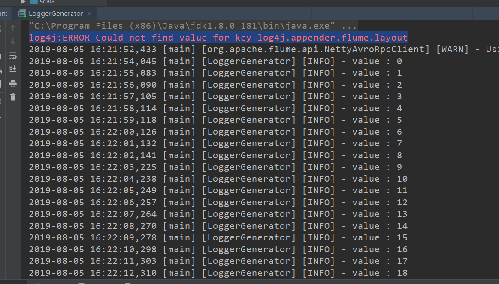

  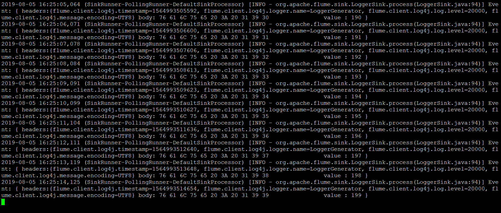

## 五、使用KafkaSInk将Flume收集到的数据输出到Kafka

1. 启动zookeeper

2. 启动Kafka

3. 创建topic

   ```
   kafka-topics.sh --create --zookeeper centosserver1:2181 --replication-factor 1 --partitions 1 --topic streamingtopic
   ```

   ```
   kafka-topics.sh --list --zookeeper centosserver1:2181
   ```

4. streaming2.conf

   ```
   agent1.sources=avro-source
   agent1.channels=logger-channel
   agent1.sinks=kafka-sink
   
   #define source
   agent1.sources.avro-source.type=avro
   agent1.sources.avro-source.bind=0.0.0.0
   agent1.sources.avro-source.port=41414
   
   #define channel
   agent1.channels.logger-channel.type=memory
   
   #define sink
   agent1.sinks.kafka-sink.type=org.apache.flume.sink.kafka.KafkaSink
   agent1.sinks.kafka-sink.topic = streamingtopic
   agent1.sinks.kafka-sink.brokerList = centosserver1:9092
   agent1.sinks.kafka-sink..requiredAcks = 1
   agent1.sinks.kafka-sink.batchSize = 20
   
   
   agent1.sources.avro-source.channels=logger-channel
   agent1.sinks.kafka-sink.channel=logger-channel
   
   ```

   

5. 启动flume

```
flume-ng agent \
--conf $FLUME_HOME/conf \
--conf-file $FLUME_HOME/conf/streaming2.conf \
--name agent1 \
-Dflume.root.logger=INFO,console
```

6. Kafka消费端

   ```
   kafka-console-consumer.sh --zookeeper centosserver1:2181 --topic streamingtopic
   ```

7. 效果

   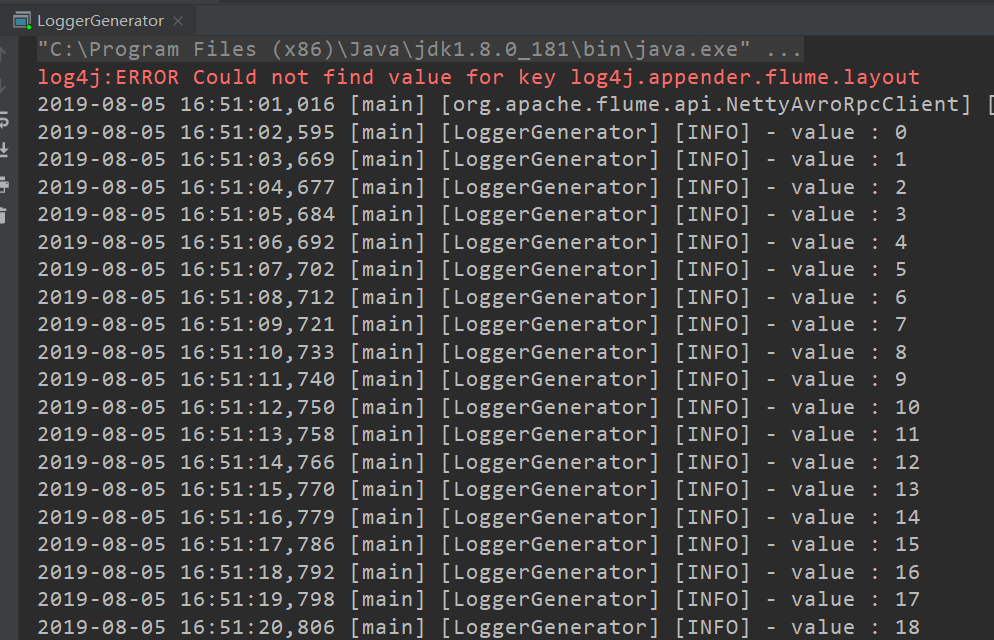

   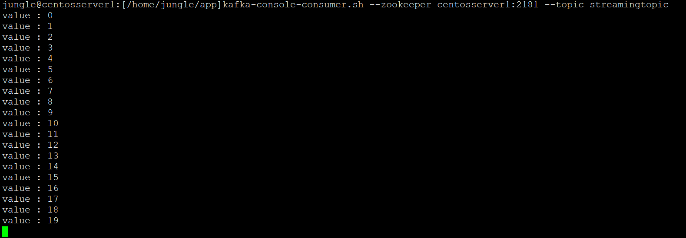

## 六、Spark Streaming消费Kafka的数据进行统计

1. KafkaStreamingApp

   ```scala
   package com.jungle.spark
   
   import org.apache.spark.SparkConf
   import org.apache.spark.streaming.kafka.KafkaUtils
   import org.apache.spark.streaming.{Seconds, StreamingContext}
   
   /**
     * Spark Streaming对接Kafka
     */
   object KafkaStreamingApp {
   
     def main(args: Array[String]): Unit = {
   
       if(args.length != 4) {
         System.err.println("Usage: KafkaStreamingApp <zkQuorum> <group> <topics> <numThreads>")
       }
   
       val Array(zkQuorum, group, topics, numThreads) = args
   
       val sparkConf = new SparkConf().setAppName("KafkaReceiverWordCount")
         .setMaster("local[2]")
   
       val ssc = new StreamingContext(sparkConf, Seconds(5))
   
       val topicMap = topics.split(",").map((_, numThreads.toInt)).toMap
   
       // TODO... Spark Streaming如何对接Kafka
       val messages = KafkaUtils.createStream(ssc, zkQuorum, group,topicMap)
   
       // TODO... 自己去测试为什么要取第二个
       messages.map(_._2).count().print()
   
       ssc.start()
       ssc.awaitTermination()
     }
   }
   
   ```

2. 本地测试

   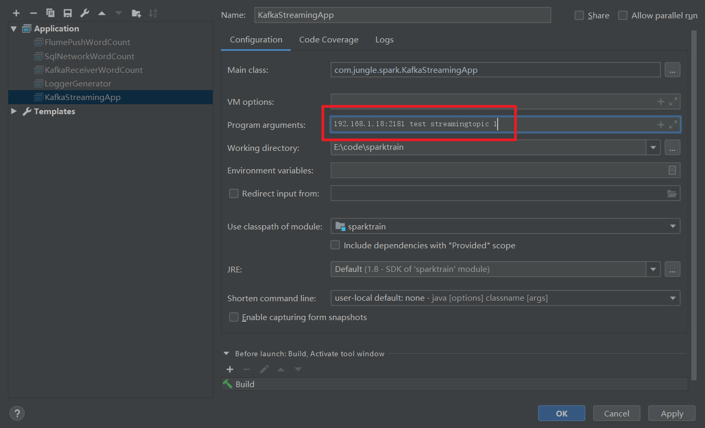

   ```
   192.168.1.18:2181 test streamingtopic 1
   ```

   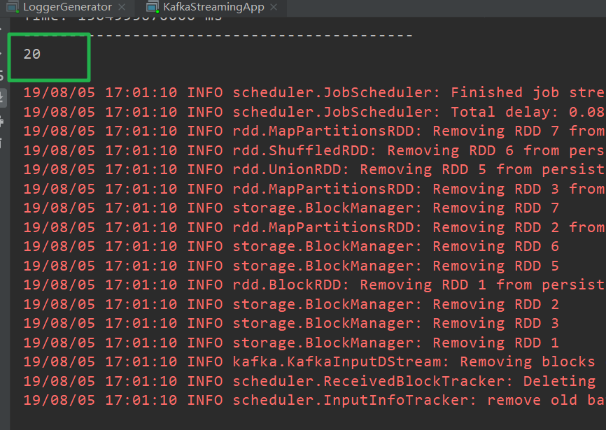

## 七、本地测试和生产环境使用的拓展

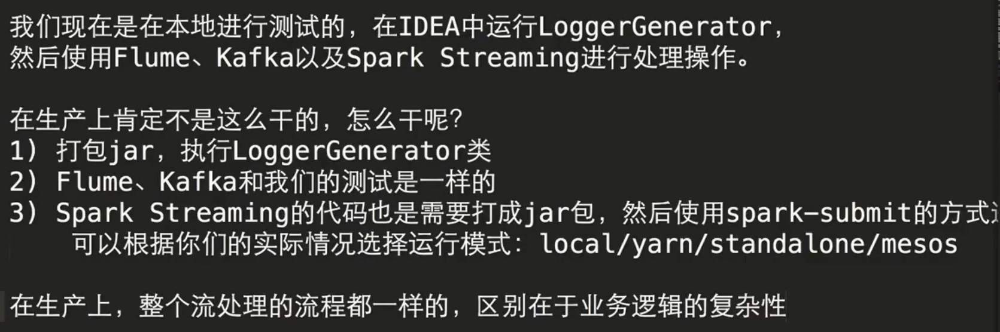

# 第12章 Spark Streaming项目实战

## 一、Python日志产生器开发

### 1.产生访问url和ip信息

```python
#coding=UTF-8
import random

url_paths = [
    "class/112.html",
    "class/118.html",
    "class/145.html",
    "class/146.html",
    "class/131.html",
    "class/110.html",
    "learn/821",
    "course/list"
]

ip_slices = [132,156,124,10,29,167,143,187,30,46,55,63,72,87,98,168]

def sample_url():
    return random.sample(url_paths,1)[0]

def sample_ip():
    slice = random.sample(ip_slices,4)
    return ".".join([str(item) for item in slice])
    
def generate_log(count = 10):
    while count >= 1:
        query_log = "{url}\t{ip}".format(url=sample_url(),ip=sample_ip())
        print(query_log)
        count = count -1
        
if __name__=='__main__':
    generate_log()
```

### 2.产生referer和状态码信息

```python
#coding=UTF-8
import random

url_paths = [
    "class/112.html",
    "class/118.html",
    "class/145.html",
    "class/146.html",
    "class/131.html",
    "class/110.html",
    "learn/821",
    "course/list"
]

ip_slices = [132,156,124,10,29,167,143,187,30,46,55,63,72,87,98,168]

http_referers =[
    "http://www.baidu.com/s?wd={query}",
    "https://www.sogou.com/web?query={query}",
    "http://cn.bing.com/search?q={query}",
    "http://www.baidu.com/s?wd={query}",
    "https://search.yahoo.com/search?p={query}",
]

search_keyword = [
    "Spark实战",
    "Hadoop基础",
    "Storm实战",
    "Spark streaming实战",
    "大数据面试"
]
status_codes = ["200","404","500"]

def sample_url():
    return random.sample(url_paths,1)[0]

def sample_ip():
    slice = random.sample(ip_slices,4)
    return ".".join([str(item) for item in slice])
    
def sample_referer():
    if random.uniform(0,1) > 0.2:
        return "-"
        
    refer_str = random.sample(http_referers,1)
    query_str = random.sample(search_keyword,1)
    return refer_str[0].format(query=query_str[0])
    
def sample_status_code():
    return random.sample(status_codes,1)[0]
    
def generate_log(count = 10):
    while count >= 1:
        query_log = "{url}\t{ip}\t{referer}\t{status_code}".format(url=sample_url(),ip=sample_ip(),referer=sample_referer(),status_code=sample_status_code())
        print(query_log)
        count = count -1
        
if __name__=='__main__':
    generate_log(100)
```

### 3.产生日志访问时间

```python
#coding=UTF-8
import random
import time

url_paths = [
    "class/112.html",
    "class/118.html",
    "class/145.html",
    "class/146.html",
    "class/131.html",
    "class/110.html",
    "learn/821",
    "course/list"
]

ip_slices = [132,156,124,10,29,167,143,187,30,46,55,63,72,87,98,168]

http_referers =[
    "http://www.baidu.com/s?wd={query}",
    "https://www.sogou.com/web?query={query}",
    "http://cn.bing.com/search?q={query}",
    "http://www.baidu.com/s?wd={query}",
    "https://search.yahoo.com/search?p={query}",
]

search_keyword = [
    "Spark实战",
    "Hadoop基础",
    "Storm实战",
    "Spark streaming实战",
    "大数据面试"
]
status_codes = ["200","404","500"]

def sample_url():
    return random.sample(url_paths,1)[0]

def sample_ip():
    slice = random.sample(ip_slices,4)
    return ".".join([str(item) for item in slice])
    
def sample_referer():
    if random.uniform(0,1) > 0.2:
        return "-"
        
    refer_str = random.sample(http_referers,1)
    query_str = random.sample(search_keyword,1)
    return refer_str[0].format(query=query_str[0])
    
def sample_status_code():
    return random.sample(status_codes,1)[0]
    
def generate_log(count = 10):
    time_str = time.strftime("%Y-%m-%d %H:%M:%S",time.localtime())
    while count >= 1:
        query_log = "{local_time}\t{url}\t{ip}\t{referer}\t{status_code}".format(url=sample_url(),ip=sample_ip(),referer=sample_referer(),status_code=sample_status_code(),local_time=time_str)
        print(query_log)
        count = count -1
        
if __name__=='__main__':
    generate_log()
```

### 4.服务器测试并将日志写入到文件中

```python
#coding=UTF-8
import random
import time

url_paths = [
    "class/112.html",
    "class/118.html",
    "class/145.html",
    "class/146.html",
    "class/131.html",
    "class/110.html",
    "learn/821",
    "course/list"
]

ip_slices = [132,156,124,10,29,167,143,187,30,46,55,63,72,87,98,168]

http_referers =[
    "http://www.baidu.com/s?wd={query}",
    "https://www.sogou.com/web?query={query}",
    "http://cn.bing.com/search?q={query}",
    "http://www.baidu.com/s?wd={query}",
    "https://search.yahoo.com/search?p={query}",
]

search_keyword = [
    "Spark实战",
    "Hadoop基础",
    "Storm实战",
    "Spark streaming实战",
    "大数据面试"
]
status_codes = ["200","404","500"]

def sample_url():
    return random.sample(url_paths,1)[0]

def sample_ip():
    slice = random.sample(ip_slices,4)
    return ".".join([str(item) for item in slice])
    
def sample_referer():
    if random.uniform(0,1) > 0.2:
        return "-"
        
    refer_str = random.sample(http_referers,1)
    query_str = random.sample(search_keyword,1)
    return refer_str[0].format(query=query_str[0])
    
def sample_status_code():
    return random.sample(status_codes,1)[0]
    
def generate_log(count = 10):
    time_str = time.strftime("%Y-%m-%d %H:%M:%S",time.localtime())
    f = open("/home/jungle/data/project/logs/access.log","w+")
    while count >= 1:
        query_log = "{local_time}\t{url}\t{ip}\t{referer}\t{status_code}".format(url=sample_url(),ip=sample_ip(),referer=sample_referer(),status_code=sample_status_code(),local_time=time_str)
        print(query_log)
        
        f.write(query_log + "\n")
        count = count -1
        
if __name__=='__main__':
    generate_log()
```

==新建文件夹文件==

```
cd data
sudo mkdir -p ./project/logs
cd  project/logs
touch access.log
```

==上传py脚本==

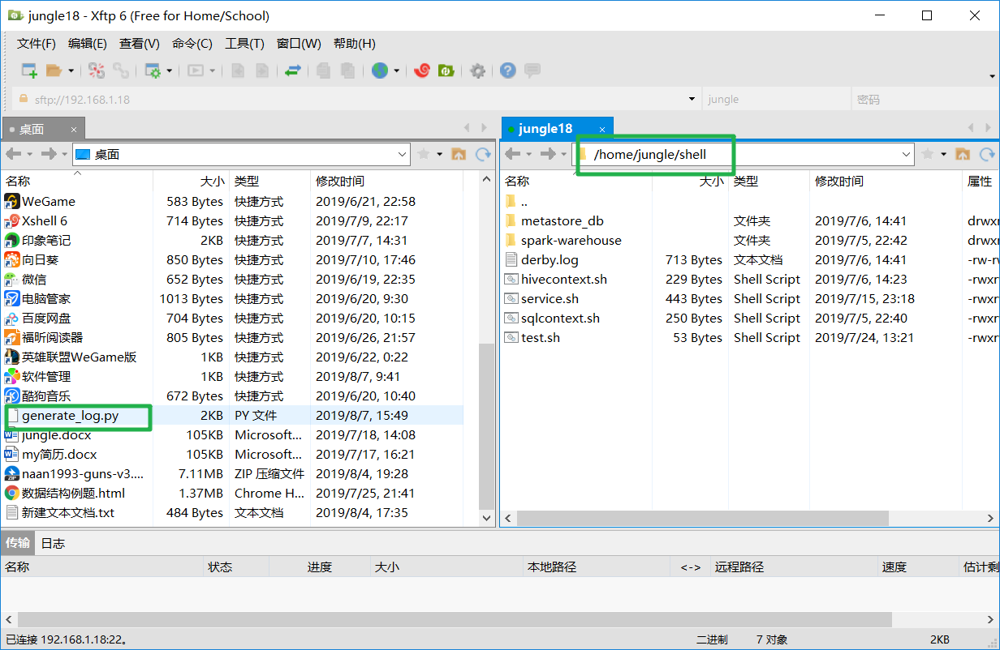

```
python generate_log.py
```

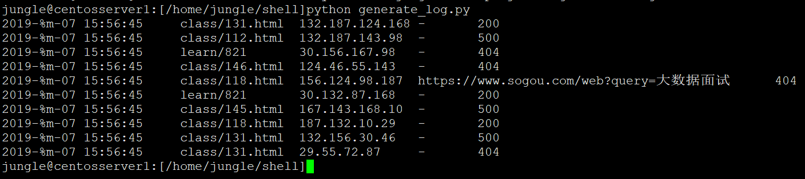

```
# 查看数据条数
wc -l access.log
```

==对日志进行微调==

```python
#coding=UTF-8
import random
import time

url_paths = [
    "class/112.html",
    "class/118.html",
    "class/145.html",
    "class/146.html",
    "class/131.html",
    "class/110.html",
    "learn/821",
    "course/list"
]

ip_slices = [132,156,124,10,29,167,143,187,30,46,55,63,72,87,98,168]

http_referers =[
    "http://www.baidu.com/s?wd={query}",
    "https://www.sogou.com/web?query={query}",
    "http://cn.bing.com/search?q={query}",
    "http://www.baidu.com/s?wd={query}",
    "https://search.yahoo.com/search?p={query}",
]

search_keyword = [
    "Spark实战",
    "Hadoop基础",
    "Storm实战",
    "Spark streaming实战",
    "大数据面试"
]
status_codes = ["200","404","500"]

def sample_url():
    return random.sample(url_paths,1)[0]

def sample_ip():
    slice = random.sample(ip_slices,4)
    return ".".join([str(item) for item in slice])
    
def sample_referer():
    if random.uniform(0,1) > 0.2:
        return "-"
        
    refer_str = random.sample(http_referers,1)
    query_str = random.sample(search_keyword,1)
    return refer_str[0].format(query=query_str[0])
    
def sample_status_code():
    return random.sample(status_codes,1)[0]
    
def generate_log(count = 10):
    time_str = time.strftime("%Y-%m-%d %H:%M:%S",time.localtime())
    f = open("/home/jungle/data/project/logs/access.log","w+")
    while count >= 1:
        query_log = "{ip}\t{local_time}\t\"GET /{url} HTTP/1.1\"\t{status_code}\t{referer}".format(url=sample_url(),ip=sample_ip(),referer=sample_referer(),status_code=sample_status_code(),local_time=time_str)
        print(query_log)
        
        f.write(query_log + "\n")
        count = count -1
        
if __name__=='__main__':
    generate_log()
```

### 5.定时调度工具

==每一分钟产生一批数据==

[crontab](https://tool.lu/crontab)

+ 新建脚本

```
touch log_generator.sh
chmod u+x log_generator.sh
```

```
#!/bin/bash
python /home/jungle/shell/generate_log.py 
```

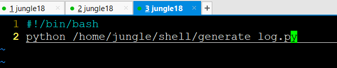

+ 定时任务

  ```
  crontab -e
  ```

  

  ```
  */1 * * * * sh /home/jungle/shell/log_generator.sh
  ```

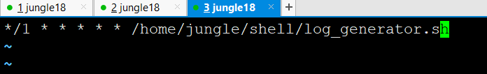

## 二、使用Flume实时收集日志信息

```
选型：access.log ==> 控制台输出
	exec
	memory
	logger
```

+ streaming_project.conf

  ```
  exec-memory-logger.sources = exec-source
  exec-memory-logger.sinks = logger-sink
  exec-memory-logger.channels = memory-channel
  
  exec-memory-logger.sources.exec-source.type = exec
  exec-memory-logger.sources.exec-source.command = tail -F /home/jungle/data/project/logs/access.log
  exec-memory-logger.sources.exec-source.shell = /bin/sh -c
  
  exec-memory-logger.channels.memory-channel.type = memory
  
  exec-memory-logger.sinks.logger-sink.type = logger
  
  exec-memory-logger.sources.exec-source.channels = memory-channel
  exec-memory-logger.sinks.logger-sink.channel = memory-channel
  ```

==上传服务器==

```
cd $FLUME_HOME/conf
```

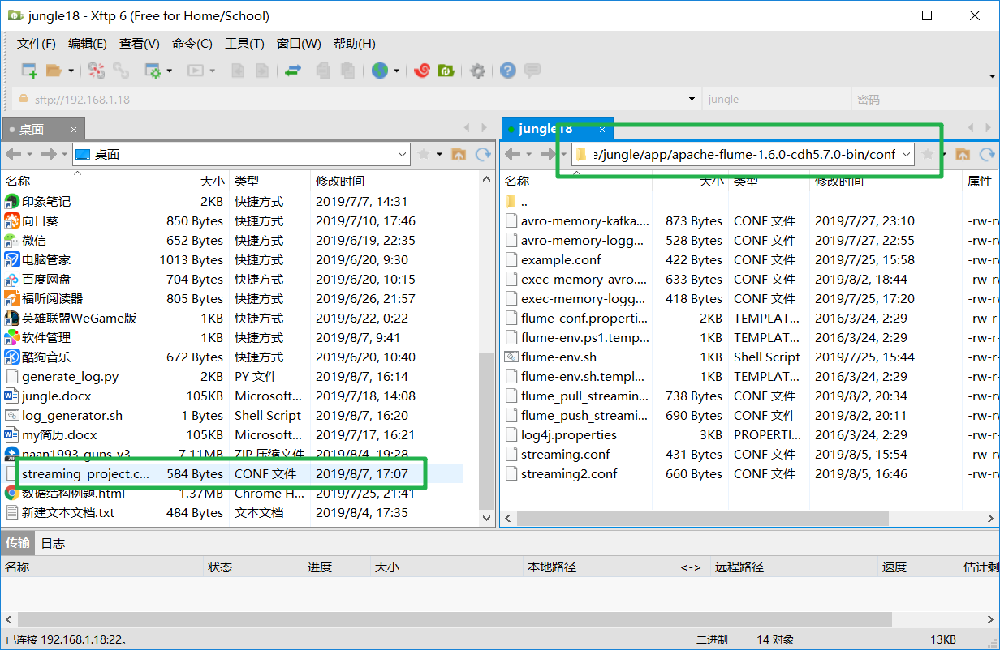

+ 启动flume

  ```
  flume-ng agent \
  --conf $FLUME_HOME/conf \
  --conf-file $FLUME_HOME/conf/streaming_project.conf \
  --name exec-memory-logger \
  -Dflume.root.logger=INFO,console
  ```

  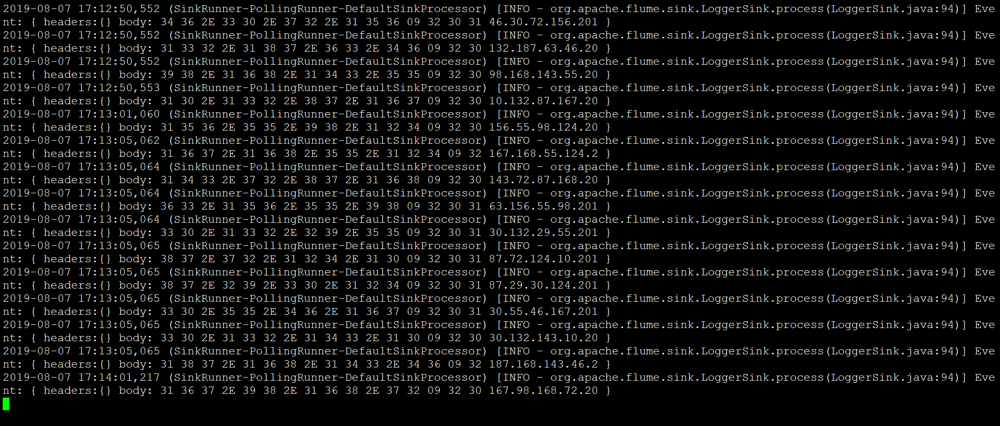

## 三、对接实时日志数据到Kafka并输出到控制台测试

1. 启动zookeeper

2. 启动kafka

3. 修改flume配置文件（对接kafka）

   + streaming_project2.conf

     ```
     exec-memory-kafka.sources = exec-source
     exec-memory-kafka.sinks = kafka-sink
     exec-memory-kafka.channels = memory-channel
     
     exec-memory-kafka.sources.exec-source.type = exec
     exec-memory-kafka.sources.exec-source.command = tail -F /home/jungle/data/project/logs/access.log
     exec-memory-kafka.sources.exec-source.shell = /bin/sh -c
     
     exec-memory-kafka.channels.memory-channel.type = memory
     
     exec-memory-kafka.sinks.kafka-sink.type = org.apache.flume.sink.kafka.KafkaSink
     exec-memory-kafka.sinks.kafka-sink.brokerList = centosserver1:9092
     exec-memory-kafka.sinks.kafka-sink.topic = streamingtopic
     exec-memory-kafka.sinks.kafka-sink.batchSize = 5
     exec-memory-kafka.sinks.kafka-sink.requiredAcks = 1
     
     exec-memory-kafka.sources.exec-source.channels = memory-channel
     exec-memory-kafka.sinks.kafka-sink.channel = memory-channel
     ```

     

   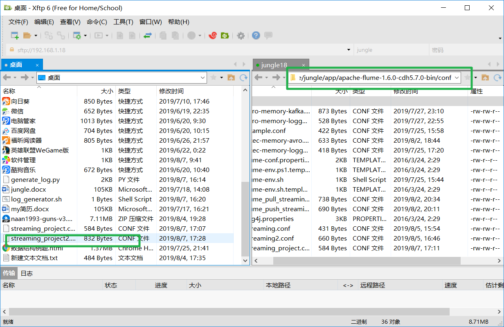

4. Kafka消费者

   ```
   kafka-console-consumer.sh --zookeeper centosserver1:2181 --topic streamingtopic
   ```

5. 启动flume

   ```
   flume-ng agent \
   --conf $FLUME_HOME/conf \
   --conf-file $FLUME_HOME/conf/streaming_project2.conf \
   --name exec-memory-kafka \
   -Dflume.root.logger=INFO,console
   ```

   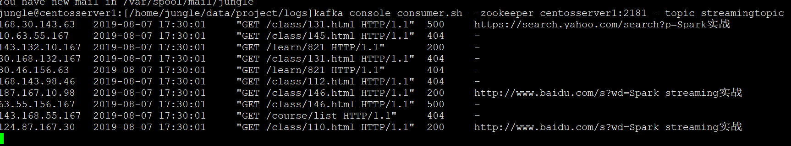

## 四、Spark Streaming对接Kafka的数据进行消费


+ 程序

  ```scala
  package com.jungle.spark.project
  
  import org.apache.spark.SparkConf
  import org.apache.spark.streaming.StreamingContext
  import org.apache.spark.streaming.Seconds
  import org.apache.spark.streaming.kafka.KafkaUtils
  
  
  /**
    * 使用Spark Streaming处理Kafka过来的数据
    */
  object ImoocStatStreamingApp {
  
    def main(args: Array[String]): Unit = {
  
      if (args.length != 4) {
        println("Usage: ImoocStatStreamingApp <zkQuorum> <group> <topics> <numThreads>")
        System.exit(1)
      }
  
      val Array(zkQuorum, groupId, topics, numThreads) = args
  
      val sparkConf = new SparkConf().setAppName("ImoocStatStreamingApp").setMaster("local[2]")
      val ssc = new StreamingContext(sparkConf, Seconds(60))
  
      val topicMap = topics.split(",").map((_, numThreads.toInt)).toMap
  
      val messages = KafkaUtils.createStream(ssc, zkQuorum, groupId, topicMap)
  
      // 测试步骤一：测试数据接收
      messages.map(_._2).count().print
  
      ssc.start()
      ssc.awaitTermination()
    }
  }
  ```

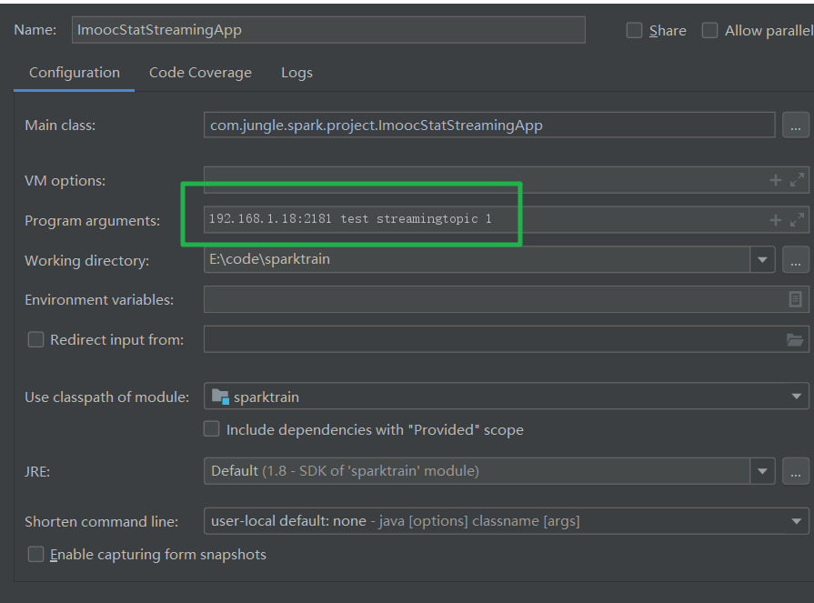

```
192.168.1.18:2181 test streamingtopic 1
```

==效果==

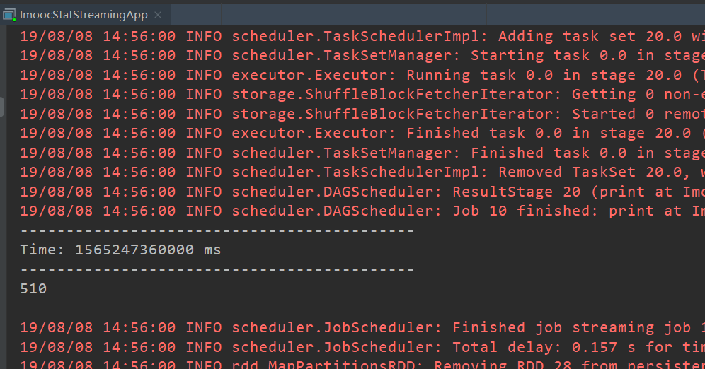

## 五、使用Spark Streaming完成数据清洗操作

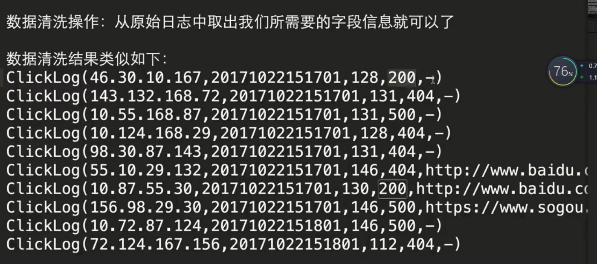

+ 目录结构

  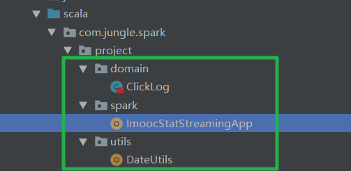

+ ImoocStatStreamingApp

  ```scala
  package com.jungle.spark.project.spark
  
  import com.jungle.spark.project.domain.ClickLog
  import com.jungle.spark.project.utils.DateUtils
  import org.apache.spark.SparkConf
  import org.apache.spark.streaming.kafka.KafkaUtils
  import org.apache.spark.streaming.{Seconds, StreamingContext}
  
  /**
    * 使用Spark Streaming处理Kafka过来的数据
    */
  object ImoocStatStreamingApp {
  
    def main(args: Array[String]): Unit = {
  
      if (args.length != 4) {
        println("Usage: ImoocStatStreamingApp <zkQuorum> <group> <topics> <numThreads>")
        System.exit(1)
      }
  
      val Array(zkQuorum, groupId, topics, numThreads) = args
  
      val sparkConf = new SparkConf().setAppName("ImoocStatStreamingApp").setMaster("local[2]")
      val ssc = new StreamingContext(sparkConf, Seconds(60))
  
      val topicMap = topics.split(",").map((_, numThreads.toInt)).toMap
  
      val messages = KafkaUtils.createStream(ssc, zkQuorum, groupId, topicMap)
  
  //    messages.print
  
      // 测试步骤一：测试数据接收
  //    messages.map(_._2).count().print
  //    messages.map(_._2).print
  
      // 测试步骤二：数据清洗
      val logs = messages.map(_._2)
      val cleanData = logs.map(line => {
        val infos = line.split("\t")
  
        // infos(2) = "GET /class/130.html HTTP/1.1"
        // url = /class/130.html
        val url = infos(2).split(" ")(1)
        var courseId = 0
  
        // 把实战课程的课程编号拿到了
        if (url.startsWith("/class")) {
          val courseIdHTML = url.split("/")(2)
          courseId = courseIdHTML.substring(0, courseIdHTML.lastIndexOf(".")).toInt
        }
  
        ClickLog(infos(0), DateUtils.parseToMinute(infos(1)), courseId, infos(3).toInt, infos(4))
      }).filter(clicklog => clicklog.courseId != 0)
  
  
          cleanData.print()
  
      ssc.start()
      ssc.awaitTermination()
  
  
    }
  }
  
  ```

  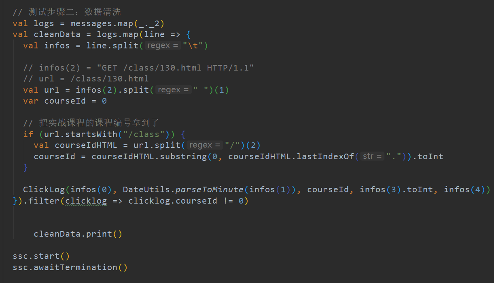

+ DateUtils

  ```scala
  package com.jungle.spark.project.utils
  
  import java.util.Date
  
  import org.apache.commons.lang3.time.FastDateFormat
  
  /**
    * 日期时间工具类
    */
  object DateUtils {
  
    val YYYYMMDDHHMMSS_FORMAT = FastDateFormat.getInstance("yyyy-MM-dd HH:mm:ss")
    val TARGE_FORMAT = FastDateFormat.getInstance("yyyyMMddHHmmss")
  
  
    def getTime(time: String) = {
      YYYYMMDDHHMMSS_FORMAT.parse(time).getTime
    }
  
    def parseToMinute(time :String) = {
      TARGE_FORMAT.format(new Date(getTime(time)))
    }
    def main(args: Array[String]): Unit = {
      println(parseToMinute("2017-10-22 14:46:01"))
    }
  }
  ```

+ ClickLog

  ```scala
  package com.jungle.spark.project.domain
  
  /**
    * 清洗后的日志信息
    * @param ip  日志访问的ip地址
    * @param time  日志访问的时间
    * @param courseId  日志访问的实战课程编号
    * @param statusCode 日志访问的状态码
    * @param referer  日志访问的referer
    */
  case class ClickLog(ip:String, time:String, courseId:Int, statusCode:Int, referer:String)
  
  ```

  ==效果==

  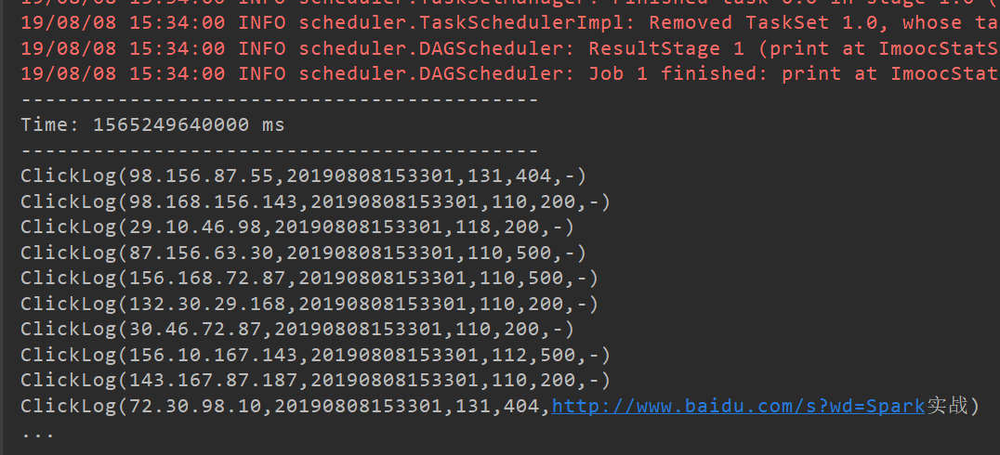

到数据清洗完为止，日志中只包含了实战课程的日志

## 六、功能一

### 1.需求分析及存储结果技术选型分析

```
功能1:今天到现在为止实战课程的访问量
yyyymmdd courseid
使用数据库来进行存储我们的统计结果
Spark Streaming把统计结果写入到数据库里面
可视化前端根据: yyyymmdd courseid把数据库里面的统计结果展示出来
```

```
选择什么数据库作为统计结果的存储呢?
1.RDBMS: MYSQL、 Oracle
	day			courseid 	click count
	20171111	1			10
	20171111	1			10
	下ー个批次数据进来以后
	20171111+1==> click_ count+下ー个批次的统计结果 ==>写入到数据库中
2.NOSQL: Hbase、 Redis
	Hbase:一个APⅠ就能搞定,非常方便
	20171111+1=> click_ count+下一个批次的统计结果
	本次课程为什么要选择 Hbasel的一个原因所在
	前提：
		HDFS
		Zookeeper
		Hbase
```

+ 启动hbase

  ```
  cd $HBASE_HOME/bin
  ./start-hbase.sh
  ```

  ==进入hbase命令行==

  ```
  cd $HBASE_HOME/bin
  ./hbase shell
  ```

  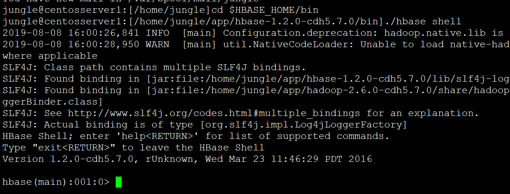

  ```
  # 查看表的数量
  list
  ```

  

  ==Hbase表设计==

  ```
  create 'imooc_course_clickcount','info'
  ```

  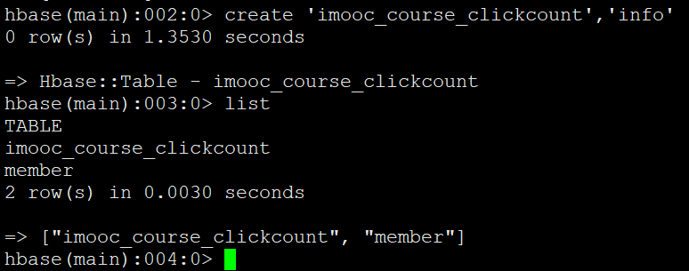

  ```
  desc 'imooc_course_clickcount'
  ```

  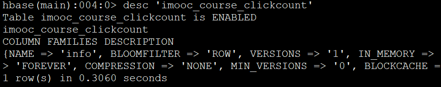

  ```
  scan 'imooc_course_clickcount'
  ```

  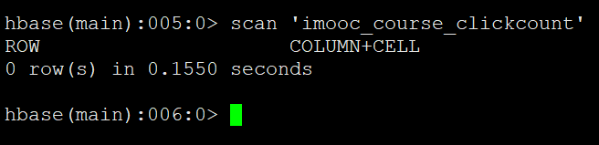

  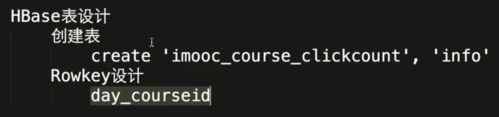

### 2.数据库访问DAO层方法定义

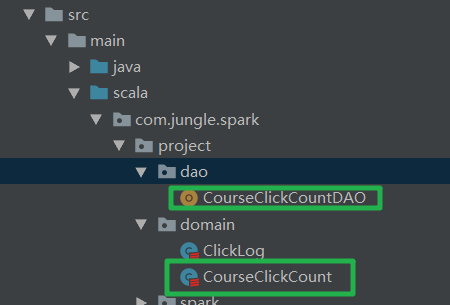

+ CourseClickCount

  ```scala
  package com.jungle.spark.project.domain
  
  /**
    * 实战课程点击数实体类
    * @param day_course  对应的就是HBase中的rowkey，20171111_1
    * @param click_count 对应的20171111_1的访问总数
    */
  case class CourseClickCount(day_course:String, click_count:Long)
  ```

+ CourseClickCountDAO

  ```scala
  package com.jungle.spark.project.dao
  
  import com.jungle.spark.project.domain.CourseClickCount
  
  import scala.collection.mutable.ListBuffer
  
  /**
    * 实战课程点击数-数据访问层
    */
  object CourseClickCountDAO {
  
    val tableName = "imooc_course_clickcount"
    val cf = "info"
    val qualifer = "click_count"
  
    /**
      * 保存数据到HBase
      * @param list  CourseClickCount集合
      */
    def save(list: ListBuffer[CourseClickCount]): Unit = {
  
    }
  
    /**
      * 根据rowkey查询值
      */
    def count(day_course: String):Long = {
     0l
    }
  }
  
  ```

### 3.HBase操作工具类开发

> 这是个Java类

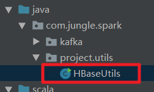

+ HBaseUtils

  ```java
  package com.jungle.spark.project.utils;
  
  import org.apache.hadoop.conf.Configuration;
  import org.apache.hadoop.hbase.client.HBaseAdmin;
  import org.apache.hadoop.hbase.client.HTable;
  import org.apache.hadoop.hbase.client.Put;
  import org.apache.hadoop.hbase.util.Bytes;
  
  import java.io.IOException;
  
  /**
   * HBase操作工具类：Java工具类建议采用单例模式封装
   */
  public class HBaseUtils {
  
  
      HBaseAdmin admin = null;
      Configuration configuration = null;
  
  
      /**
       * 私有改造方法
       */
      private HBaseUtils(){
          configuration = new Configuration();
          configuration.set("hbase.zookeeper.quorum", "centosserver1:2181");
          configuration.set("hbase.rootdir", "hdfs://centosserver1:8020/hbase");
  
          try {
              admin = new HBaseAdmin(configuration);
          } catch (IOException e) {
              e.printStackTrace();
          }
      }
  
      private static HBaseUtils instance = null;
  
      public  static synchronized HBaseUtils getInstance() {
          if(null == instance) {
              instance = new HBaseUtils();
          }
          return instance;
      }
  
  
      /**
       * 根据表名获取到HTable实例
       */
      public HTable getTable(String tableName) {
  
          HTable table = null;
  
          try {
              table = new HTable(configuration, tableName);
          } catch (IOException e) {
              e.printStackTrace();
          }
  
          return table;
      }
  
      /**
       * 添加一条记录到HBase表
       * @param tableName HBase表名
       * @param rowkey  HBase表的rowkey
       * @param cf HBase表的columnfamily
       * @param column HBase表的列
       * @param value  写入HBase表的值
       */
      public void put(String tableName, String rowkey, String cf, String column, String value) {
          HTable table = getTable(tableName);
  
          Put put = new Put(Bytes.toBytes(rowkey));
          put.add(Bytes.toBytes(cf), Bytes.toBytes(column), Bytes.toBytes(value));
  
          try {
              table.put(put);
          } catch (IOException e) {
              e.printStackTrace();
          }
      }
  
      public static void main(String[] args) {
  
          //HTable table = HBaseUtils.getInstance().getTable("imooc_course_clickcount");
          //System.out.println(table.getName().getNameAsString());
  
          String tableName = "imooc_course_clickcount" ;
          String rowkey = "20171111_88";
          String cf = "info" ;
          String column = "click_count";
          String value = "2";
  
          HBaseUtils.getInstance().put(tableName, rowkey, cf, column, value);
      }
  
  }
  
  ```

  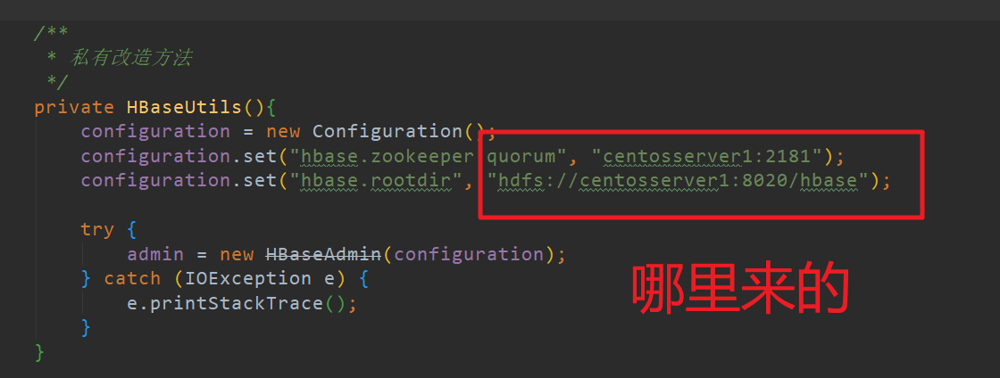

```
vi $HBASE_HOME/conf/hbase-site.xml
```

  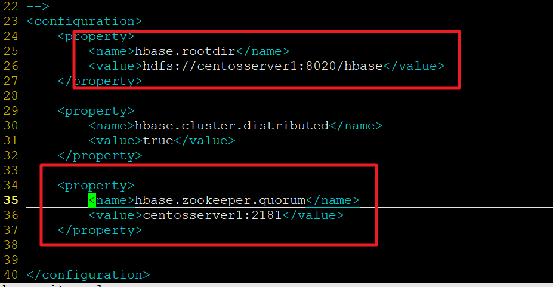

==执行HBaseUtils==

```
scan 'imooc_course_clickcount'
```

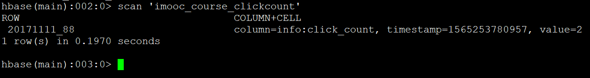

### 4.数据库访问DAO层方法实现

==补全CourseClickCountDAO代码==

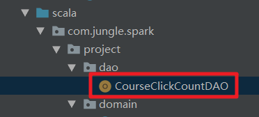

```scala
package com.jungle.spark.project.dao

import com.jungle.spark.project.domain.CourseClickCount
import com.jungle.spark.project.utils.HBaseUtils
import org.apache.hadoop.hbase.client.Get
import org.apache.hadoop.hbase.util.Bytes

import scala.collection.mutable.ListBuffer

/**
  * 实战课程点击数-数据访问层
  */
object CourseClickCountDAO {

  val tableName = "imooc_course_clickcount"
  val cf = "info"
  val qualifer = "click_count"


  /**
    * 保存数据到HBase
    * @param list  CourseClickCount集合
    */
  def save(list: ListBuffer[CourseClickCount]): Unit = {

    val table = HBaseUtils.getInstance().getTable(tableName)

    for(ele <- list) {
      table.incrementColumnValue(Bytes.toBytes(ele.day_course),
        Bytes.toBytes(cf),
        Bytes.toBytes(qualifer),
        ele.click_count)
    }

  }


  /**
    * 根据rowkey查询值
    */
  def count(day_course: String):Long = {
    val table = HBaseUtils.getInstance().getTable(tableName)

    val get = new Get(Bytes.toBytes(day_course))
    val value = table.get(get).getValue(cf.getBytes, qualifer.getBytes)

    if(value == null) {
      0L
    }else{
      Bytes.toLong(value)
    }
  }

  def main(args: Array[String]): Unit = {


    val list = new ListBuffer[CourseClickCount]
    list.append(CourseClickCount("20171111_8",8))
    list.append(CourseClickCount("20171111_9",9))
    list.append(CourseClickCount("20171111_1",100))

    save(list)

    println(count("20171111_8") + " : " + count("20171111_9")+ " : " + count("20171111_1"))
  }

}

```


==运行程序==

运行3次

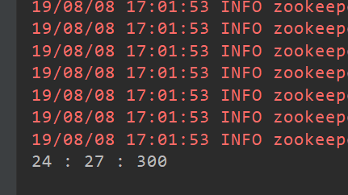

运行4次

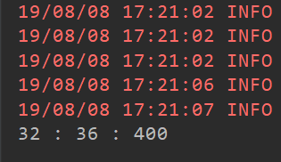

### 5.Spark Streaming的处理结果写入到HBase中

+ 代码

```SCALA
package com.jungle.spark.project.spark

import com.jungle.spark.project.dao.CourseClickCountDAO
import com.jungle.spark.project.domain.{ClickLog, CourseClickCount}
import com.jungle.spark.project.utils.DateUtils
import org.apache.spark.SparkConf
import org.apache.spark.streaming.kafka.KafkaUtils
import org.apache.spark.streaming.{Seconds, StreamingContext}

import scala.collection.mutable.ListBuffer

/**
  * 使用Spark Streaming处理Kafka过来的数据
  */
object ImoocStatStreamingApp {

  def main(args: Array[String]): Unit = {

    if (args.length != 4) {
      println("Usage: ImoocStatStreamingApp <zkQuorum> <group> <topics> <numThreads>")
      System.exit(1)
    }

    val Array(zkQuorum, groupId, topics, numThreads) = args

    val sparkConf = new SparkConf().setAppName("ImoocStatStreamingApp").setMaster("local[2]")
    val ssc = new StreamingContext(sparkConf, Seconds(60))

    val topicMap = topics.split(",").map((_, numThreads.toInt)).toMap

    val messages = KafkaUtils.createStream(ssc, zkQuorum, groupId, topicMap)

    //    messages.print

    // 测试步骤一：测试数据接收
    //    messages.map(_._2).count().print
    //    messages.map(_._2).print

    // 测试步骤二：数据清洗
    val logs = messages.map(_._2)
    val cleanData = logs.map(line => {
      val infos = line.split("\t")

      // infos(2) = "GET /class/130.html HTTP/1.1"
      // url = /class/130.html
      val url = infos(2).split(" ")(1)
      var courseId = 0

      // 把实战课程的课程编号拿到了
      if (url.startsWith("/class")) {
        val courseIdHTML = url.split("/")(2)
        courseId = courseIdHTML.substring(0, courseIdHTML.lastIndexOf(".")).toInt
      }

      ClickLog(infos(0), DateUtils.parseToMinute(infos(1)), courseId, infos(3).toInt, infos(4))
    }).filter(clicklog => clicklog.courseId != 0)


    //        cleanData.print()

    // 测试步骤三：统计今天到现在为止实战课程的访问量

    cleanData.map(x => {

      // HBase rowkey设计： 20171111_88

      (x.time.substring(0, 8) + "_" + x.courseId, 1)
    }).reduceByKey(_ + _).foreachRDD(rdd => {
      rdd.foreachPartition(partitionRecords => {
        val list = new ListBuffer[CourseClickCount]

        partitionRecords.foreach(pair => {
          list.append(CourseClickCount(pair._1, pair._2))
        })

        CourseClickCountDAO.save(list)
      })
    })

    ssc.start()
    ssc.awaitTermination()


  }
}

```

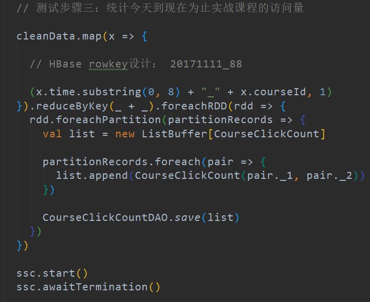

==运行==

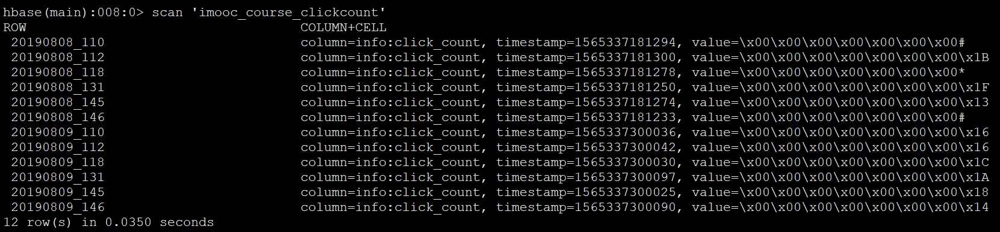

## 七、功能二

### 1.需求分析及HBase设计&HBase数据访问层开发

```
功能二:功能一+从搜索引擎引流过来的
```

```
# Hbase表设计
create 'imooc_course_search_clickcount','info'
```

```
# rowley设计:也是根据我们的业务需求来的
20171111+ search+1
```


+ CourseSearchClickCount

  ```scala
  package com.jungle.spark.project.domain
  
  /**
    * 从搜索引擎过来的实战课程点击数实体类
    * @param day_search_course
    * @param click_count
    */
  case class CourseSearchClickCount(day_search_course:String, click_count:Long)
  
  ```

+ CourseSearchClickCountDAO

  ```scala
  package com.jungle.spark.project.dao
  
  import com.jungle.spark.project.domain.{CourseClickCount, CourseSearchClickCount}
  import com.jungle.spark.project.utils.HBaseUtils
  import org.apache.hadoop.hbase.client.Get
  import org.apache.hadoop.hbase.util.Bytes
  
  import scala.collection.mutable.ListBuffer
  
  /**
    * 从搜索引擎过来的实战课程点击数-数据访问层
    */
  object CourseSearchClickCountDAO {
  
    val tableName = "imooc_course_search_clickcount"
    val cf = "info"
    val qualifer = "click_count"
  
  
    /**
      * 保存数据到HBase
      *
      * @param list  CourseSearchClickCount集合
      */
    def save(list: ListBuffer[CourseSearchClickCount]): Unit = {
  
      val table = HBaseUtils.getInstance().getTable(tableName)
  
      for(ele <- list) {
        table.incrementColumnValue(Bytes.toBytes(ele.day_search_course),
          Bytes.toBytes(cf),
          Bytes.toBytes(qualifer),
          ele.click_count)
      }
  
    }
  
  
    /**
      * 根据rowkey查询值
      */
    def count(day_search_course: String):Long = {
      val table = HBaseUtils.getInstance().getTable(tableName)
  
      val get = new Get(Bytes.toBytes(day_search_course))
      val value = table.get(get).getValue(cf.getBytes, qualifer.getBytes)
  
      if(value == null) {
        0L
      }else{
        Bytes.toLong(value)
      }
    }
  
    def main(args: Array[String]): Unit = {
  
  
      val list = new ListBuffer[CourseSearchClickCount]
      list.append(CourseSearchClickCount("20171111_www.baidu.com_8",8))
      list.append(CourseSearchClickCount("20171111_cn.bing.com_9",9))
  
      save(list)
  
      println(count("20171111_www.baidu.com_8") + " : " + count("20171111_cn.bing.com_9"))
    }
  
  }
  
  ```

  ==运行CourseSearchClickCountDAO==

  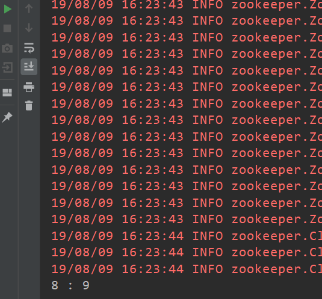

  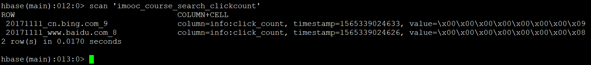

### 2.功能实现及本地测试

==清空hbase表数据==

```
truncate 'imooc_course_search_clickcount'
```

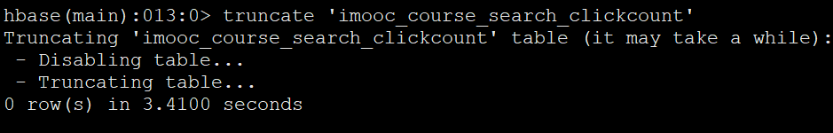

+ ImoocStatStreamingApp

```scala
 package com.jungle.spark.project.spark

import com.jungle.spark.project.dao.{CourseClickCountDAO, CourseSearchClickCountDAO}
import com.jungle.spark.project.domain.{ClickLog, CourseClickCount, CourseSearchClickCount}
import com.jungle.spark.project.utils.DateUtils
import org.apache.spark.SparkConf
import org.apache.spark.streaming.kafka.KafkaUtils
import org.apache.spark.streaming.{Seconds, StreamingContext}

import scala.collection.mutable.ListBuffer

/**
  * 使用Spark Streaming处理Kafka过来的数据
  */
object ImoocStatStreamingApp {

  def main(args: Array[String]): Unit = {

    if (args.length != 4) {
      println("Usage: ImoocStatStreamingApp <zkQuorum> <group> <topics> <numThreads>")
      System.exit(1)
    }

    val Array(zkQuorum, groupId, topics, numThreads) = args

    val sparkConf = new SparkConf().setAppName("ImoocStatStreamingApp").setMaster("local[2]")
    val ssc = new StreamingContext(sparkConf, Seconds(60))

    val topicMap = topics.split(",").map((_, numThreads.toInt)).toMap

    val messages = KafkaUtils.createStream(ssc, zkQuorum, groupId, topicMap)

    //    messages.print

    // 测试步骤一：测试数据接收
    //    messages.map(_._2).count().print
    //    messages.map(_._2).print

    // 测试步骤二：数据清洗
    val logs = messages.map(_._2)
    val cleanData = logs.map(line => {
      val infos = line.split("\t")

      // infos(2) = "GET /class/130.html HTTP/1.1"
      // url = /class/130.html
      val url = infos(2).split(" ")(1)
      var courseId = 0

      // 把实战课程的课程编号拿到了
      if (url.startsWith("/class")) {
        val courseIdHTML = url.split("/")(2)
        courseId = courseIdHTML.substring(0, courseIdHTML.lastIndexOf(".")).toInt
      }

      ClickLog(infos(0), DateUtils.parseToMinute(infos(1)), courseId, infos(3).toInt, infos(4))
    }).filter(clicklog => clicklog.courseId != 0)


    //        cleanData.print()

    // 测试步骤三：统计今天到现在为止实战课程的访问量

    cleanData.map(x => {

      // HBase rowkey设计： 20171111_88

      (x.time.substring(0, 8) + "_" + x.courseId, 1)
    }).reduceByKey(_ + _).foreachRDD(rdd => {
      rdd.foreachPartition(partitionRecords => {
        val list = new ListBuffer[CourseClickCount]

        partitionRecords.foreach(pair => {
          list.append(CourseClickCount(pair._1, pair._2))
        })

        CourseClickCountDAO.save(list)
      })
    })
    // 测试步骤四：统计从搜索引擎过来的今天到现在为止实战课程的访问量
    cleanData.map(x => {
      /**
        * https://www.sogou.com/web?query=Spark SQL实战
        *
        * ==>
        *
        * https:/www.sogou.com/web?query=Spark SQL实战
        */
      val referer = x.referer.replaceAll("//", "/")
      val splits = referer.split("/")
      var host = ""
      if (splits.length > 2) {
        host = splits(1)
      }
      (host, x.courseId, x.time)
    }).filter(_._1 != "").map(x => {
      (x._3.substring(0, 8) + "_" + x._1 + "_" + x._2, 1)
    }).reduceByKey(_ + _).foreachRDD(rdd => {
      rdd.foreachPartition(partitionRecords => {
        val list = new ListBuffer[CourseSearchClickCount]
        partitionRecords.foreach(pair => {
          list.append(CourseSearchClickCount(pair._1, pair._2))
        })
        CourseSearchClickCountDAO.save(list)
      })
    })
    ssc.start()
    ssc.awaitTermination()


  }
}
 
```

  

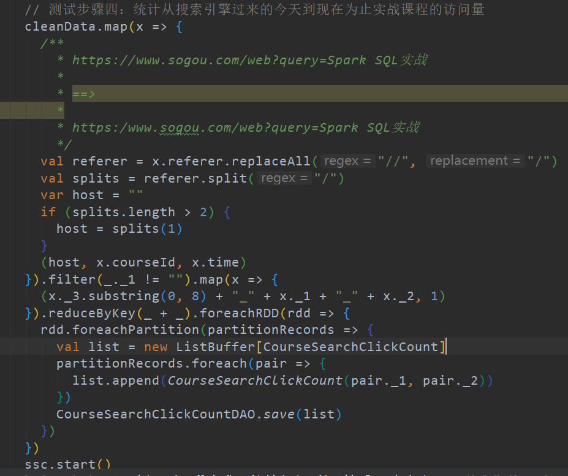

==运行结果==

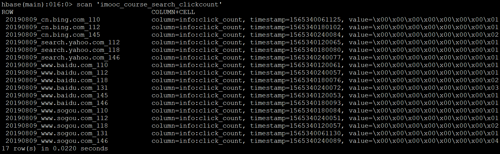

## 八、将项目运行在服务器环境中

1. 简单修改代码

   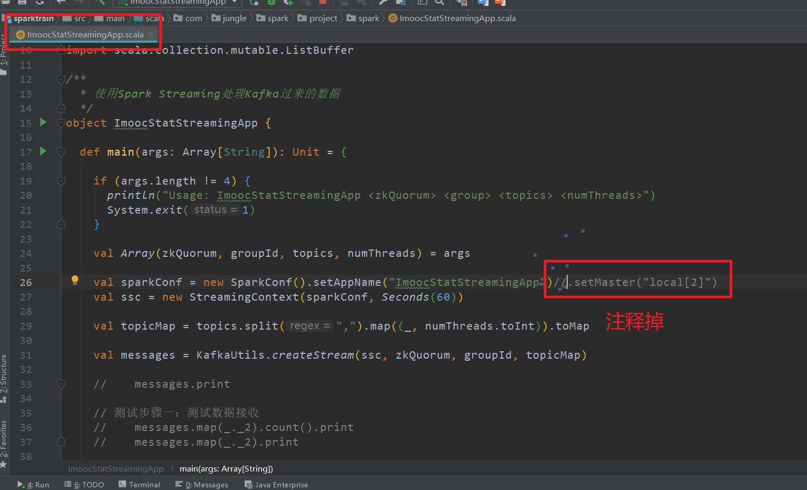

2. 打包编译

   ```
   mvn clean package -DskipTests
   ```

   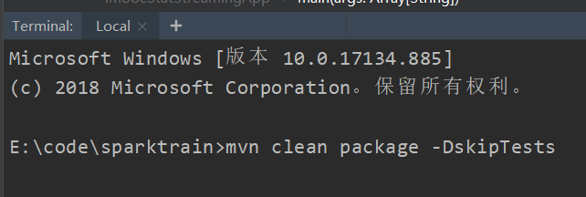

   ==报错==

   > [ERROR] E:\code\sparktrain\src\main\scala\com\jungle\spark\project\dao\CourseClickCountDAO.scala:4: error: object HBaseUtils is not a member of package com.jungle.spark.project.utils

   --解决：

   

   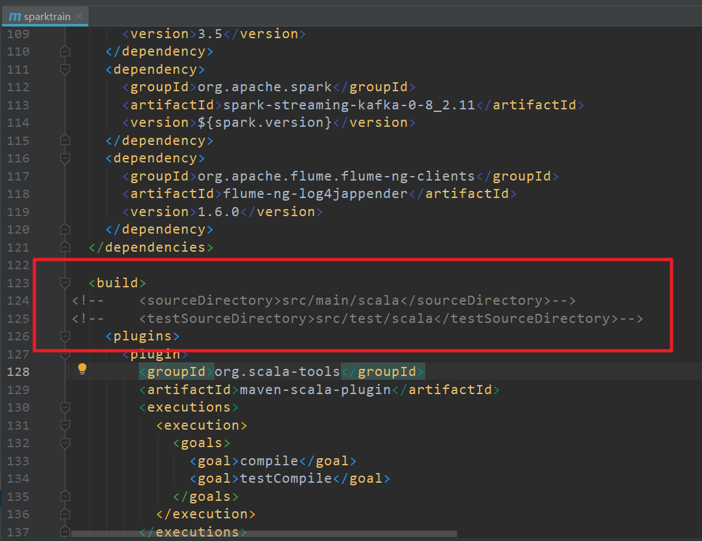

3. 上传至服务器

   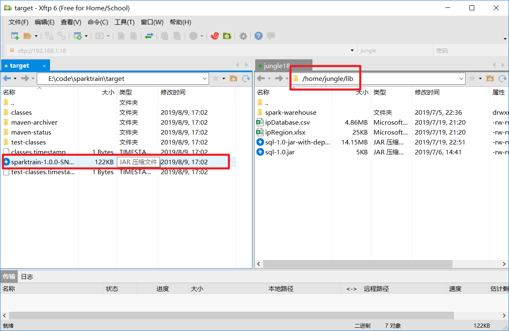

4. 提交任务

   ```
   spark-submit --master local[5] \
   --class com.jungle.spark.project.spark.ImoocStatStreamingApp \
   /home/jungle/lib/sparktrain-1.0.0-SNAPSHOT.jar \
   centosserver1:2181 test streamingtopic 1
   ```

   ==报错==

   > Caused by: java.lang.ClassNotFoundException: org.apache.spark.streaming.kafka.KafkaUtils$

   找不到spark-streaming-kafka-0-8_2.11这个依赖

   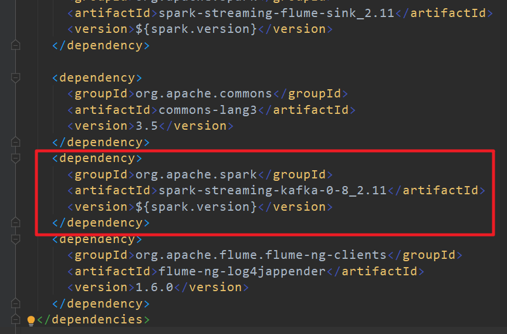

   --解压：

   ```
   spark-submit --master local[5] \
   --class com.jungle.spark.project.spark.ImoocStatStreamingApp \
   --packages org.apache.spark:spark-streaming-kafka-0-8_2.11:2.1.0 \
   /home/jungle/lib/sparktrain-1.0.0-SNAPSHOT.jar \
   centosserver1:2181 test streamingtopic 1
   ```

   ==报错==

   > java.lang.NoClassDefFoundError: org/apache/hadoop/hbase/client/HBaseAdmin

   缺少包

   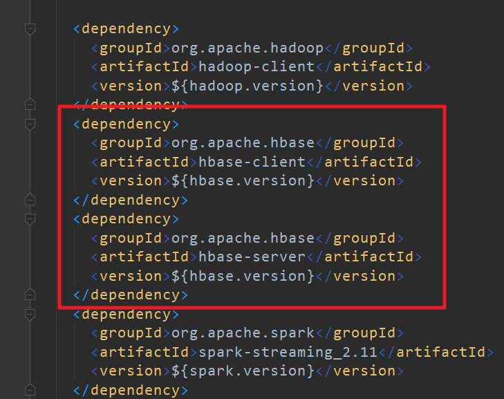

   ==修正==

   ```
   spark-submit --master local[5] \
   --jars $(echo /home/jungle/app/hbase-1.2.0-cdh5.7.0/lib/*.jar | tr ' ' ',' ) \
   --class com.jungle.spark.project.spark.ImoocStatStreamingApp \
   --packages org.apache.spark:spark-streaming-kafka-0-8_2.11:2.1.0 \
   /home/jungle/lib/sparktrain-1.0.0-SNAPSHOT.jar \
   centosserver1:2181 test streamingtopic 1
   ```

   

# 第13章 可视化实战

## 一、构建Spring Boot项目

​	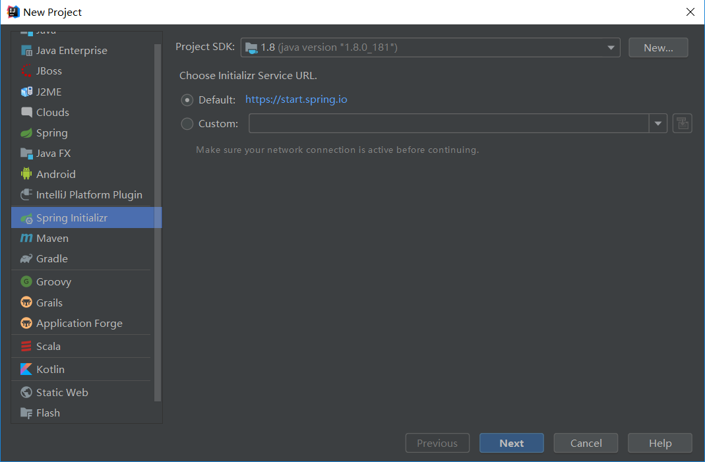

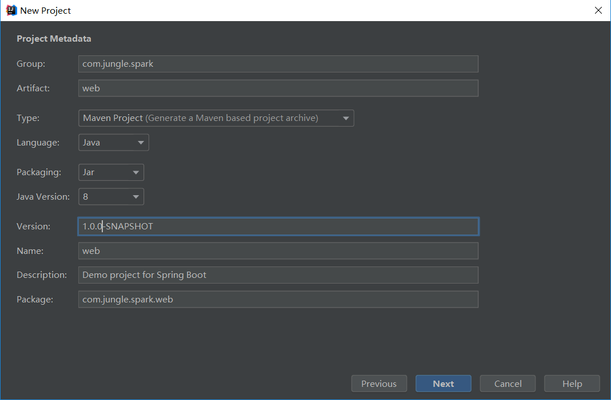

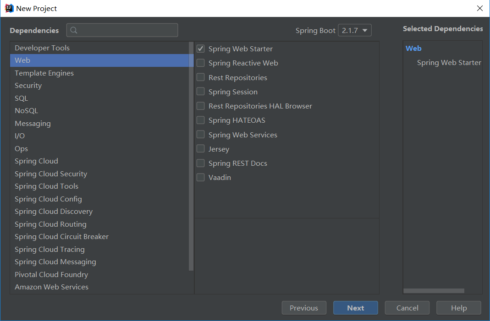

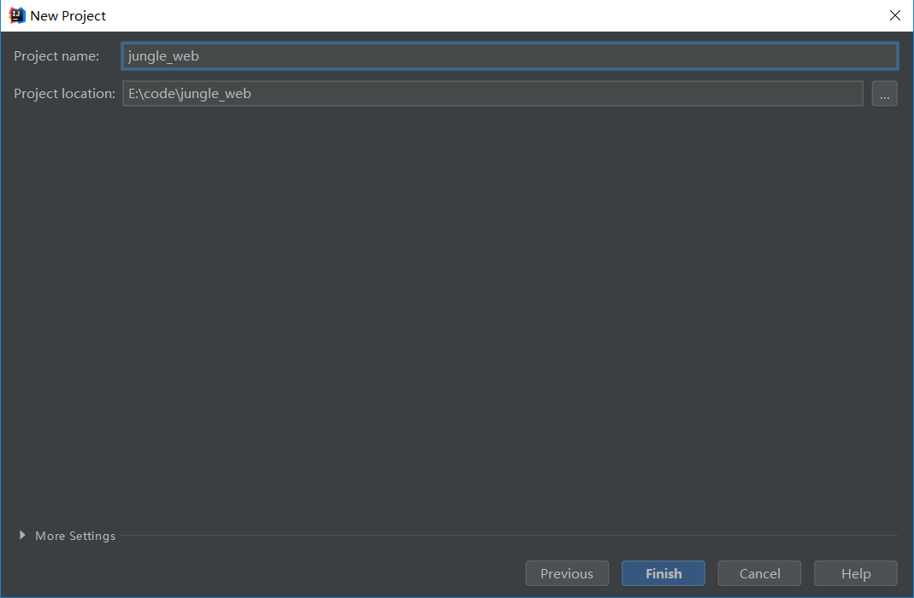

## 二、Spring Boot整合Echarts

### 1.下载

[官网](https://www.echartsjs.com/download.html)

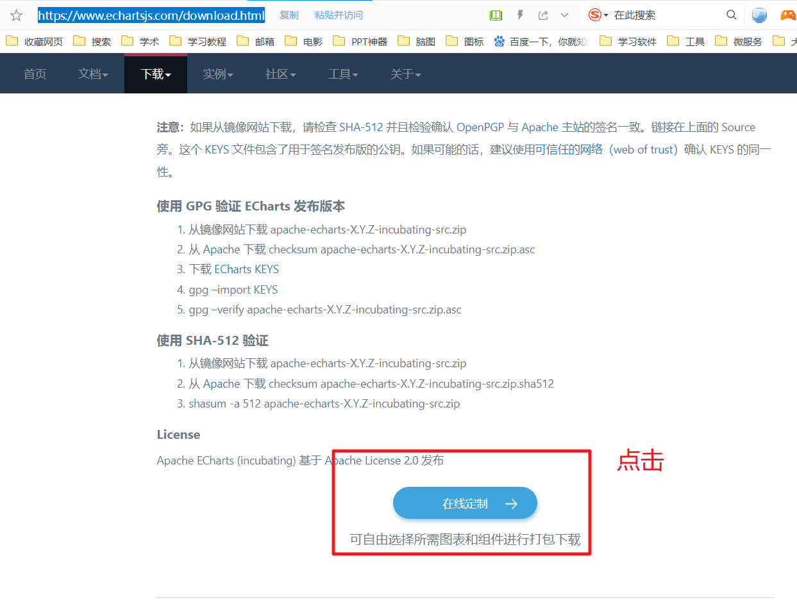

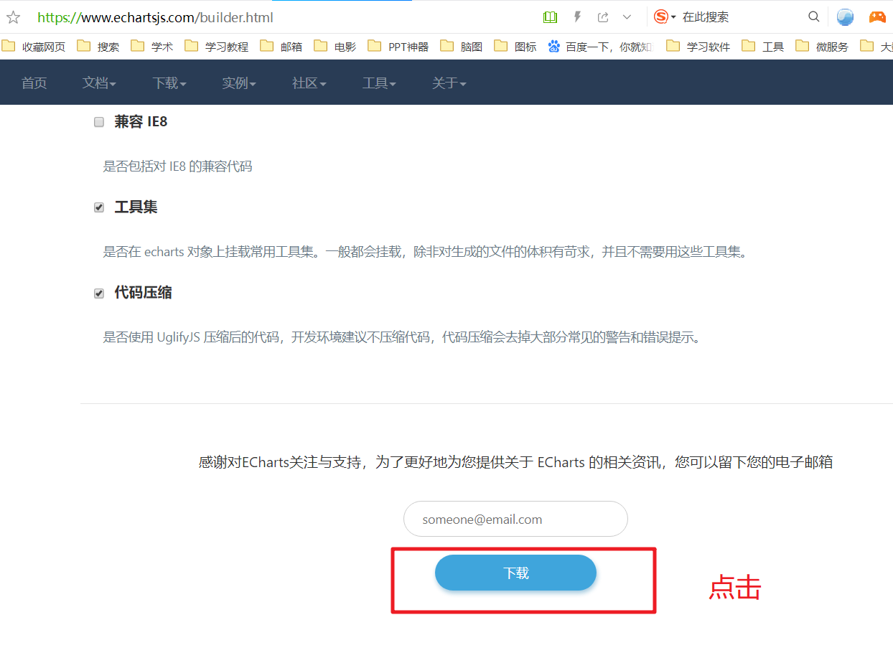

### 2.绘制静态数据柱状图

+ 添加依赖

  ```xml
  <dependency>
  			<groupId>org.springframework.boot</groupId>
  			<artifactId>spring-boot-starter-thymeleaf</artifactId>
  		</dependency>
  ```

+ 目录结构

  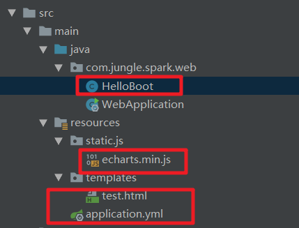

+ HelloBoot

  ```java
  package com.jungle.spark.web;
  
  import org.springframework.web.bind.annotation.RequestMapping;
  import org.springframework.web.bind.annotation.RequestMethod;
  import org.springframework.web.bind.annotation.RestController;
  import org.springframework.web.servlet.ModelAndView;
  
  /**
   * 这是我们的第一个Boot应用
   */
  @RestController
  public class HelloBoot {
  
      @RequestMapping(value = "/hello", method = RequestMethod.GET)
      public String sayHello() {
  
          return "Hello World Spring Boot...";
      }
  
      @RequestMapping(value = "/first", method = RequestMethod.GET)
      public ModelAndView firstDemo() {
          return new ModelAndView("test");
      }
  
  }
  ```

  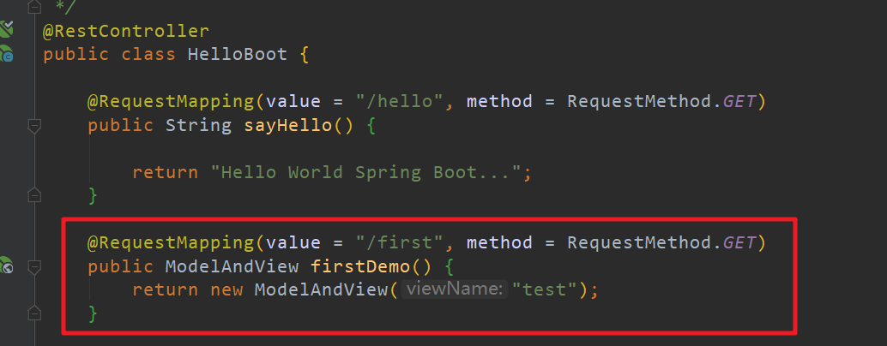

+ test.html

  ```html
  <!DOCTYPE html>
  <html lang="en">
  <head>
      <meta charset="UTF-8"/>
      <title>test</title>
  
      <!-- 引入 ECharts 文件 -->
      <script src="js/echarts.min.js"></script>
  </head>
  <body>
  
  <!-- 为 ECharts 准备一个具备大小（宽高）的 DOM -->
  <div id="main" style="width: 600px;height:400px;position: absolute; top:50%; left: 50%; margin-top: -200px;margin-left: -300px"></div>
  
  
  <script type="text/javascript">
      // 基于准备好的dom，初始化echarts实例
      var myChart = echarts.init(document.getElementById('main'));
  
      // 指定图表的配置项和数据
      var option = {
          title: {
              text: 'ECharts 入门示例'
          },
          tooltip: {},
          legend: {
              data:['销量']
          },
          xAxis: {
              data: ["衬衫","羊毛衫","雪纺衫","裤子","高跟鞋","袜子"]
          },
          yAxis: {},
          series: [{
              name: '销量',
              type: 'bar',
              data: [5, 20, 36, 10, 10, 20]
          }]
      };
  
      // 使用刚指定的配置项和数据显示图表。
      myChart.setOption(option);
  </script>
  </body>
  </html>
  ```

+ application.yml

  ```yaml
  server:
    port: 9999
    servlet:
      context-path: /imooc
  ```

  ==运行效果==

  ```
  http://localhost:9999/imooc/first
  ```

  

### 3.绘制静态数据饼图

+ 目录结构

  

+ HelloBoot

  ```java
  package com.jungle.spark.web;
  
  import org.springframework.web.bind.annotation.RequestMapping;
  import org.springframework.web.bind.annotation.RequestMethod;
  import org.springframework.web.bind.annotation.RestController;
  import org.springframework.web.servlet.ModelAndView;
  
  /**
   * 这是我们的第一个Boot应用
   */
  @RestController
  public class HelloBoot {
  
      @RequestMapping(value = "/hello", method = RequestMethod.GET)
      public String sayHello() {
  
          return "Hello World Spring Boot...";
      }
  
      @RequestMapping(value = "/first", method = RequestMethod.GET)
      public ModelAndView firstDemo() {
          return new ModelAndView("test");
      }
  
      @RequestMapping(value = "/course_clickcount", method = RequestMethod.GET)
      public ModelAndView courseClickCountStat() {
          return new ModelAndView("demo");
      }
  
  
  }
  
  ```

+ demo.html

  ```html
  <!DOCTYPE html>
  <html lang="en">
  <head>
      <meta charset="UTF-8"/>
      <title>imooc_stat</title>
  
      <!-- 引入 ECharts 文件 -->
      <script src="js/echarts.min.js"></script>
  </head>
  <body>
  
  <!-- 为 ECharts 准备一个具备大小（宽高）的 DOM -->
  <div id="main" style="width: 600px;height:400px;position: absolute; top:50%; left: 50%; margin-top: -200px;margin-left: -300px"></div>
  
  
  <script type="text/javascript">
      // 基于准备好的dom，初始化echarts实例
      var myChart = echarts.init(document.getElementById('main'));
  
      // 指定图表的配置项和数据
      var option = {
          title : {
              text: '慕课网实战课程实时访问量统计',
              subtext: '实战课程访问次数',
              x:'center'
          },
          tooltip : {
              trigger: 'item',
              formatter: "{a} <br/>{b} : {c} ({d}%)"
          },
          legend: {
              orient: 'vertical',
              left: 'left',
              data: ['Spark SQL项目实战','Hadoop入门','Spark Streaming项目实战','大数据面试题','Storm项目实战']
          },
          series : [
              {
                  name: '访问次数',
                  type: 'pie',
                  radius : '55%',
                  center: ['50%', '60%'],
                  data:[
                      {value:3350, name:'Spark SQL项目实战'},
                      {value:3100, name:'Hadoop入门'},
                      {value:2340, name:'Spark Streaming项目实战'},
                      {value:1350, name:'大数据面试题'},
                      {value:15480, name:'Storm项目实战'}
                  ],
                  itemStyle: {
                      emphasis: {
                          shadowBlur: 10,
                          shadowOffsetX: 0,
                          shadowColor: 'rgba(0, 0, 0, 0.5)'
                      }
                  }
              }
          ]
      };
  
  
      // 使用刚指定的配置项和数据显示图表。
      myChart.setOption(option);
  </script>
  </body>
  </html>
  ```

  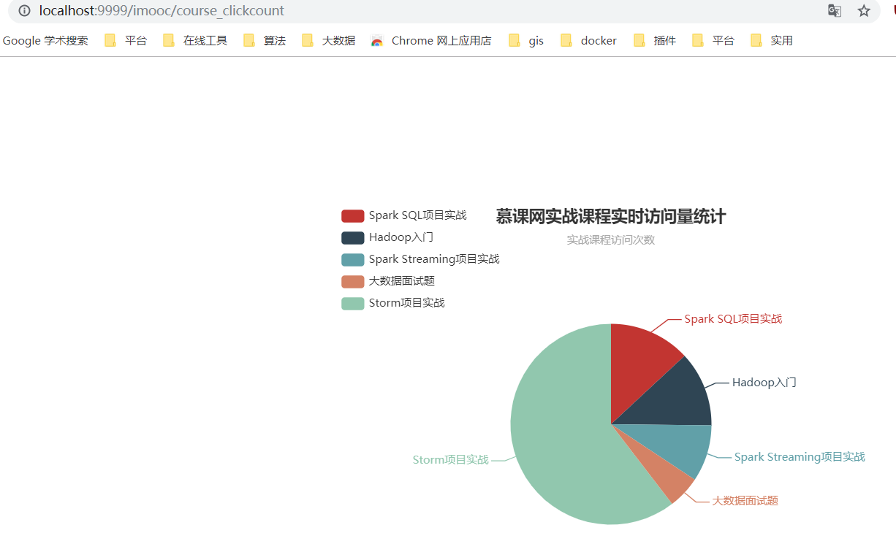

## 三、项目目录调整

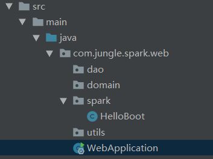

## 四、根据天来获取HBase表中的实战课程访问次数

### 1.准备

+ 后台运行flume

```
nohup flume-ng agent \
--conf $FLUME_HOME/conf \
--conf-file $FLUME_HOME/conf/streaming_project2.conf \
--name exec-memory-kafka \
-Dflume.root.logger=INFO,console &
```

==报错==

> stopping hbasecat: /tmp/hbase-jungle-master.pid: No such file or directory

```

造成上述错误的原因是，默认情况下hbase的pid文件保存在/tmp目录下，/tmp目录下的文件很容易丢失，所以造成停止集群的时候出现上述错误。解决方式是在hbase-env.sh中修改pid文件的存放路径，配置项如下所示：

# The directory where pid files are stored. /tmp by default.

export HBASE_PID_DIR=/var/hadoop/pids 
```

> 删表说无表，见表说有表

```
清除Zookeeper内存数据库中的相关数据
[root@node1]# zkCli.sh

[zk: localhost:2181(CONNECTED) 0] ls / 
[zookeeper, hadoop-ha, hbase]

[zk: localhost:2181(CONNECTED) 1] ls /hbase 
[replication, meta-region-server, rs, splitWAL, backup-masters, table-lock, flush-table-proc, region-in-transition, online-snapshot, master, running, balancer, recovering-regions, draining, namespace, hbaseid, table]

删除 /hbase/table-lock下的相关数据
[zk: localhost:2181(CONNECTED) 2] ls /hbase/table-lock 
[google, googlebook1, hbase:namespace, t1, googlebook] 
[zk: localhost:2181(CONNECTED) 4] rmr /hbase/table-lock/googlebook 
[zk: localhost:2181(CONNECTED) 7] ls /hbase/table-lock 
[google, googlebook1, hbase:namespace, t1]

删除 /hbase/table下的相关数据
[zk: localhost:2181(CONNECTED) 9] ls /hbase/table 
[google, googlebook1, hbase:namespace, t1, googlebook] 
[zk: localhost:2181(CONNECTED) 10] rmr /hbase/table/googlebook 
[zk: localhost:2181(CONNECTED) 7] ls /hbase/table 
[google, googlebook1, hbase:namespace, t1]
--------------------- 
最后重启hbase，同时需要查看一下运行的进程，需要把ZooKeeperMain进程也删掉
```

### 2.访问hbase

+ 添加依赖

  ```xml
  <repositories>
  		<repository>
  			<id>cloudera</id>
  			<url>https://repository.cloudera.com/artifactory/cloudera-repos/</url>
  		</repository>
  	</repositories>
  	
  	
  <dependency>
  			<groupId>org.apache.hbase</groupId>
  			<artifactId>hbase-client</artifactId>
  			<version>1.2.0-cdh5.7.0</version>
  		</dependency>
  ```

  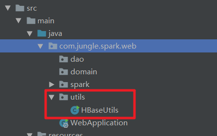

```java
package com.jungle.spark.web.utils;

import org.apache.hadoop.conf.Configuration;
import org.apache.hadoop.hbase.client.*;
import org.apache.hadoop.hbase.filter.Filter;
import org.apache.hadoop.hbase.filter.PrefixFilter;
import org.apache.hadoop.hbase.util.Bytes;

import java.io.IOException;
import java.util.HashMap;
import java.util.Map;

/**
 * HBase操作工具类
 */
public class HBaseUtils {


    HBaseAdmin admin = null;
    Configuration conf = null;


    /**
     * 私有构造方法：加载一些必要的参数
     */
    private HBaseUtils() {
        conf = new Configuration();
        conf.set("hbase.zookeeper.quorum", "192.168.1.18:2181");
        conf.set("hbase.rootdir", "hdfs://192.168.1.18:8020/hbase");

        try {
            admin = new HBaseAdmin(conf);
        } catch (IOException e) {
            e.printStackTrace();
        }
    }

    private static HBaseUtils instance = null;

    public static synchronized HBaseUtils getInstance() {
        if (null == instance) {
            instance = new HBaseUtils();
        }
        return instance;
    }

    /**
     * 根据表名获取到HTable实例
     */
    public HTable getTable(String tableName) {
        HTable table = null;

        try {
            table = new HTable(conf, tableName);
        } catch (IOException e) {
            e.printStackTrace();
        }
        return table;
    }


    /**
     * 根据表名和输入条件获取HBase的记录数
     */
    public Map<String, Long> query(String tableName, String condition) throws Exception {

        Map<String, Long> map = new HashMap<>();

        HTable table = getTable(tableName);
        String cf = "info";
        String qualifier = "click_count";

        Scan scan = new Scan();

        Filter filter = new PrefixFilter(Bytes.toBytes(condition));
        scan.setFilter(filter);

        ResultScanner rs = table.getScanner(scan);
        for(Result result : rs) {
            String row = Bytes.toString(result.getRow());
            long clickCount = Bytes.toLong(result.getValue(cf.getBytes(), qualifier.getBytes()));
            map.put(row, clickCount);
        }

        return  map;
    }


    public static void main(String[] args) throws Exception {
        Map<String, Long> map = HBaseUtils.getInstance().query("imooc_course_clickcount" , "20190810");

        for(Map.Entry<String, Long> entry: map.entrySet()) {
            System.out.println(entry.getKey() + " : " + entry.getValue());
        }
    }

}
```

==运行==

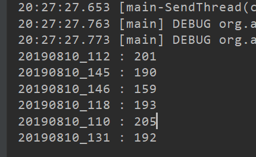

## 五、实战课程访问量domain以及dao开发

+ 目录结构

  

  + CourseClickCount

    ```java
    package com.jungle.spark.web.domain;
    
    import org.springframework.stereotype.Component;
    
    /**
     * 实战课程访问数量实体类
     */
    @Component
    public class CourseClickCount {
    
        private String name;
        private long value;
    
        public String getName() {
            return name;
        }
    
        public void setName(String name) {
            this.name = name;
        }
    
        public long getValue() {
            return value;
        }
    
        public void setValue(long value) {
            this.value = value;
        }
    }
    
    ```

  + CourseClickCountDAO

    ```java
    package com.jungle.spark.web.dao;
    
    import com.jungle.spark.web.domain.CourseClickCount;
    import com.jungle.spark.web.utils.HBaseUtils;
    import org.springframework.stereotype.Component;
    
    import java.util.ArrayList;
    import java.util.List;
    import java.util.Map;
    
    /**
     * 实战课程访问数量数据访问层
     */
    @Component
    public class CourseClickCountDAO {
    
    
        /**
         * 根据天查询
         */
        public List<CourseClickCount> query(String day) throws Exception {
    
            List<CourseClickCount> list = new ArrayList<>();
    
    
            // 去HBase表中根据day获取实战课程对应的访问量
            Map<String, Long> map = HBaseUtils.getInstance().query("imooc_course_clickcount","20190810");
    
            for(Map.Entry<String, Long> entry: map.entrySet()) {
                CourseClickCount model = new CourseClickCount();
                model.setName(entry.getKey());
                model.setValue(entry.getValue());
    
                list.add(model);
            }
    
            return list;
        }
    
        public static void main(String[] args) throws Exception{
            CourseClickCountDAO dao = new CourseClickCountDAO();
            List<CourseClickCount> list = dao.query("20190810");
            for(CourseClickCount model : list) {
                System.out.println(model.getName() + " : " + model.getValue());
            }
        }
    
    }
    
    ```

    ==运行CourseClickCountDAO==

    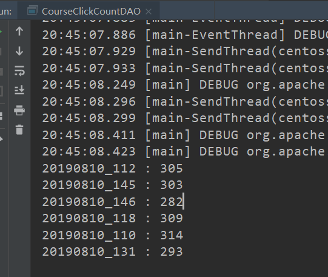

## 六、实战课程访问量Web层开发


+ 引入依赖

  ```xml
  <dependency>
  			<groupId>net.sf.json-lib</groupId>
  			<artifactId>json-lib</artifactId>
  			<version>2.4</version>
  			<classifier>jdk15</classifier>
  		</dependency>
  ```

+ ImoocStatApp

  ```java
  package com.jungle.spark.web.spark;
  
  import com.jungle.spark.web.dao.CourseClickCountDAO;
  import com.jungle.spark.web.domain.CourseClickCount;
  import org.springframework.beans.factory.annotation.Autowired;
  import org.springframework.web.bind.annotation.RequestMapping;
  import org.springframework.web.bind.annotation.RequestMethod;
  import org.springframework.web.bind.annotation.ResponseBody;
  import org.springframework.web.bind.annotation.RestController;
  import org.springframework.web.servlet.ModelAndView;
  
  import java.util.HashMap;
  import java.util.List;
  import java.util.Map;
  
  /**
   * web层
   */
  @RestController
  public class ImoocStatApp {
  
      private static Map<String, String> courses = new HashMap<>();
      static {
          courses.put("112","Spark SQL慕课网日志分析");
          courses.put("118","10小时入门大数据");
          courses.put("145","深度学习之神经网络核心原理与算法");
          courses.put("146","强大的Node.js在Web开发的应用");
          courses.put("131","Vue+Django实战");
          courses.put("110","Web前端性能优化");
      }
  
      @Autowired
      CourseClickCountDAO courseClickCountDAO;
  
       @RequestMapping(value = "/course_clickcount_dynamic", method = RequestMethod.GET)
      public ModelAndView courseClickCount() throws Exception {
  
          ModelAndView view = new ModelAndView("index");
  
          List<CourseClickCount> list = courseClickCountDAO.query("20171022");
          for(CourseClickCount model : list) {
              model.setName(courses.get(model.getName().substring(9)));
          }
          JSONArray json = JSONArray.fromObject(list);
  
          view.addObject("data_json", json);
  
          return view;
      }
  
     
  }
  ```

## 七、实战课程访问量实时查询展示功能实现及扩展

  ​	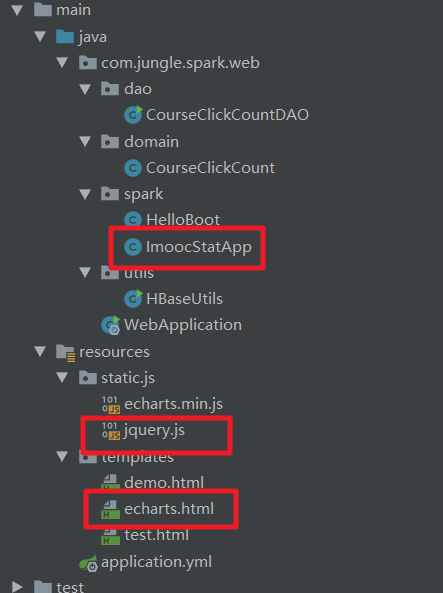

  + 引入jquery.js

  + charts

    ```HTML
    <!DOCTYPE html>
    <html lang="en">
    <head>
        <meta charset="UTF-8"/>
        <title>imooc_stat</title>
    
        <!-- 引入 ECharts 文件 -->
        <script src="js/echarts.min.js"></script>
    
        <!-- 引入 jQuery 文件 -->
        <script src="js/jquery.js"></script>
    </head>
    <body>
    
    
    <!-- 为 ECharts 准备一个具备大小（宽高）的 DOM -->
    <div id="main" style="width: 600px;height:400px;position: absolute; top:50%; left: 50%; margin-top: -200px;margin-left: -300px"></div>
    
    
    <script type="text/javascript">
        // 基于准备好的dom，初始化echarts实例
        var myChart = echarts.init(document.getElementById('main'));
    
        // 指定图表的配置项和数据
        var option = {
            title : {
                text: '慕课网实战课程实时访问量统计',
                subtext: '实战课程访问次数',
                x:'center'
            },
            tooltip : {
                trigger: 'item',
                formatter: "{a} <br/>{b} : {c} ({d}%)"
            },
            legend: {
                orient: 'vertical',
                left: 'left'
            },
            series : [
                {
                    name: '访问次数',
                    type: 'pie',
                    radius : '55%',
                    center: ['50%', '60%'],
                    data: (function(){ //<![CDATA[
                        var datas = [];
                        $.ajax({
                            type: "POST",
                            url: "/imooc/course_clickcount_dynamic",
                            dataType: 'json',
                            async: false,
                            success: function(result) {
                                for(var i=0; i<result.length; i++) {
                                    datas.push({"value":result[i].value, "name":result[i].name})
                                }
                            }
                        })
                        return datas;
                        //]]>
                    })(),
                    itemStyle: {
                        emphasis: {
                            shadowBlur: 10,
                            shadowOffsetX: 0,
                            shadowColor: 'rgba(0, 0, 0, 0.5)'
                        }
                    }
                }
            ]
        };
    
    
        // 使用刚指定的配置项和数据显示图表。
        myChart.setOption(option);
    </script>
    </body>
    </html>
    ```

    

  + 修改ImoocStatApp

    ```java
    package com.jungle.spark.web.spark;
    
    import com.jungle.spark.web.dao.CourseClickCountDAO;
    import com.jungle.spark.web.domain.CourseClickCount;
    import org.springframework.beans.factory.annotation.Autowired;
    import org.springframework.web.bind.annotation.RequestMapping;
    import org.springframework.web.bind.annotation.RequestMethod;
    import org.springframework.web.bind.annotation.ResponseBody;
    import org.springframework.web.bind.annotation.RestController;
    import org.springframework.web.servlet.ModelAndView;
    
    import java.util.HashMap;
    import java.util.List;
    import java.util.Map;
    
    /**
     * web层
     */
    @RestController
    public class ImoocStatApp {
    
        private static Map<String, String> courses = new HashMap<>();
        static {
            courses.put("112","Spark SQL慕课网日志分析");
            courses.put("118","10小时入门大数据");
            courses.put("145","深度学习之神经网络核心原理与算法");
            courses.put("146","强大的Node.js在Web开发的应用");
            courses.put("131","Vue+Django实战");
            courses.put("110","Web前端性能优化");
        }
    
        @Autowired
        CourseClickCountDAO courseClickCountDAO;
    
    
    //    @RequestMapping(value = "/course_clickcount_dynamic", method = RequestMethod.GET)
    //    public ModelAndView courseClickCount() throws Exception {
    //
    //        ModelAndView view = new ModelAndView("index");
    //
    //        List<CourseClickCount> list = courseClickCountDAO.query("20171022");
    //        for(CourseClickCount model : list) {
    //            model.setName(courses.get(model.getName().substring(9)));
    //        }
    //        JSONArray json = JSONArray.fromObject(list);
    //
    //        view.addObject("data_json", json);
    //
    //        return view;
    //    }
    
        @RequestMapping(value = "/course_clickcount_dynamic", method = RequestMethod.POST)
        @ResponseBody
        public List<CourseClickCount> courseClickCount() throws Exception {
    
            List<CourseClickCount> list = courseClickCountDAO.query("20190810");
            for(CourseClickCount model : list) {
                model.setName(courses.get(model.getName().substring(9)));
            }
    
            return list;
        }
    
        @RequestMapping(value = "/echarts", method = RequestMethod.GET)
        public ModelAndView echarts(){
            return new ModelAndView("echarts");
        }
    
    
    
    }
    
    ```

    
    
    + 可扩展
    
      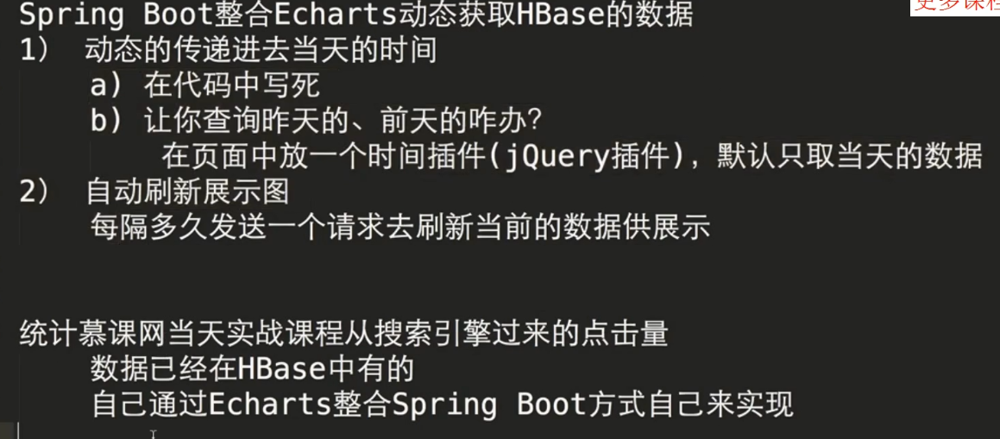
    
    
    
    ## 八、Spring Boot项目部署到服务器上运行
    
    1. 打包编译
    
       ```
       mvn clean package -DskipTests
       ```
    
    2. 上传服务器
    
       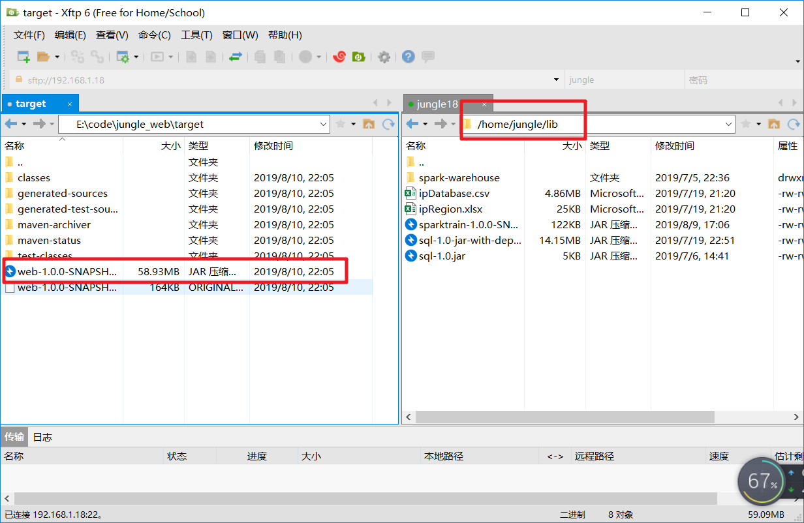
    
    3. 运行
    
       ```
       java -jar web-1.0.0-SNAPSHOT.jar
       ```
    
       